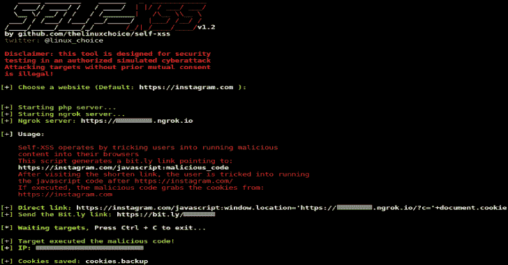
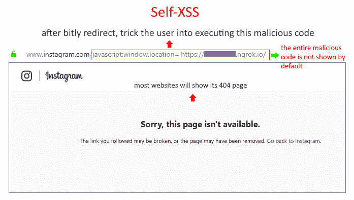

# 自我 XSS:抓取 Cookies 诱骗用户运行恶意代码

> 原文：<https://kalilinuxtutorials.com/self-xss/>

**自我 XSS** 利用 bit.ly 抓取 cookies 诱骗用户运行恶意代码的攻击。

它是如何工作的？

这是一种社会工程攻击，用于通过欺骗用户将恶意内容复制并粘贴到他们的浏览器中来控制受害者的网络帐户。

由于 Web 浏览器供应商和网站已经采取措施通过阻止粘贴 javascript 标签来缓解这种攻击，我想出了一种使用 Bit.ly 来实现这一点的方法，因此我们可以创建一个指向**" website . com/JavaScript:malicious _ code "的重定向。**

如果用户被诱骗在“website.com/”后运行 javascript 代码，其已验证/登录的 website.com 会话的 cookies 将被发送给攻击者。

**特性:**

使用 Ngrok 的端口转发和使用 Bitly.com 的 shortner(免费注册)

**另请阅读-[2020 年你需要定制电子商务网站的五大理由](https://kalilinuxtutorials.com/top-5-reasons-why-you-need-a-custom-e-commerce-website-in-2020/)**

**要求**

[https://bitly.com](https://bitly.com)账户(免费注册)

**免责声明:**

未经双方同意，使用自我 XSS 攻击目标是非法的。最终用户有责任遵守所有适用的地方、州和联邦法律。开发人员不承担任何责任，也不对本程序造成的任何误用或损坏负责

**用法:**

**git 克隆 https://github.com/thelinuxchoice/self-xss
CD self-XSS
bash self-XSS . sh**

[**Download**](https://github.com/thelinuxchoice/self-xss)