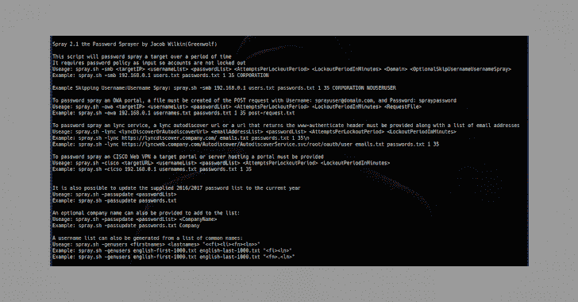

# Spray:用于活动目录凭证的密码喷射工具

> 原文：<https://kalilinuxtutorials.com/spray/>

**Spray** 是 Jacob Wilkin(Greenwolf)开发的一款针对 Active Directory 凭证的密码喷射工具。这些说明会告诉你使用它的要求和方法。

**先决条件**

所有要求都预装在 Kali Linux 上，要在其他风格或 Mac 上运行，只需确保使用 apt-get 或 brew 安装 curl(owa & lync)和 rpcclient(smb)。

**rpcclient
curl**

**使用喷雾**

该脚本将在一段时间内对目标进行密码喷射，它需要密码策略作为输入，因此帐户不会被锁定

伴随这个脚本的是一系列手工制作的多语言密码文件。这些密码是根据各种语言中最常见的活动目录密码精心制作而成的，并且都适合复杂的类别(1 个大写，1 个小写，1 个数字)。

**也可阅读-[wifi mpkin 3:流氓接入点攻击的强大框架](https://kalilinuxtutorials.com/wifipumpkin3/)**

**中小企业**

要对 SMB 门户进行密码喷涂，必须提供用户列表、密码列表、每次锁定期的尝试次数、锁定期长度和域。

用法:Spray . sh-SMB <targetip><usernamelist><passwordlist><attemptsperlockoutperiod><lockoutperiodinminutes><domain>示例:Spray . sh-SMB 192 . 168 . 0 . 1 users . txt passwords . txt 1 35 spider labs
可选跳过 Username % Username Spray:Spray . sh-SMB 192 . 168 . 0 . 1 users . txt passwords . txt 1 35 spider labs Skip uu</domain></lockoutperiodinminutes></attemptsperlockoutperiod></passwordlist></usernamelist></targetip>

**OWA**

要对 OWA 门户进行密码喷涂，必须为 POST 请求创建一个文件，用户名为:[sprayuser@domain.com](mailto:sprayuser@domain.com)，密码为:喷涂密码

**用法:**spray . sh-OWA<targetIP><username list><password list><attemptsperlockoutperiodinminutes><requests file>
**示例:**spray . sh-OWA 192 . 168 . 0 . 1 users . txt passwords . txt 1 35 post-request . txt

**Lync**

若要对 lync 服务进行密码喷涂，必须提供 lync 自动发现 url 或返回 www-authenticate 标头的 url 以及电子邮件地址列表。

**用法:**spray . sh-lync<targetIP><usernameList><password list><attemptsperlockoutperioduperiodinminutes><LockoutPeriodInMinutes>
示例:spray . sh-lync https://lyncdiscover.spiderlabs.com/ users . txt passwords . txt 1 35
**示例:**spray . sh-lync https://lync web . spider labs . com/auto

**思科网络虚拟专用网**

要对 CISCO Web VPN 服务进行密码喷射，必须提供目标门户或托管门户的服务器

**用法:**spray . sh-Cisco<targetURL><username list><password list><AttemptsPerLockoutPeriod><LockoutPeriodInMinutes>
**示例:**spray . sh-ciso 192 . 168 . 0 . 1 usernames . txt passwords . txt 1 35

**密码列表更新**

也可以将提供的 2016/2017 密码列表更新到当年

**用法:**spray . sh-pass update<password list>
**举例:**spray . sh-pass update passwords . txt

还可以提供可选的公司名称来添加到列表中

u**sage:spray . sh-pass update<password list><company name>
示例:spray . sh-pass update passwords . txt spider labs**

**用户名生成**

用户名列表也可以从常用名列表中生成

**用法:**spray . sh-genusers<first names><last names><<fi><李><fn><ln>>**举例:**spray . sh-genusers English-first-1000 . txt English-last-1000 . txt "<fi><ln< ln >

**鸣谢:** [**雅各布·威尔金**](https://github.com/Greenwolf)–*研发*–[Trustwave spider labs](https://github.com/SpiderLabs)

[**Download**](https://github.com/Greenwolf/Spray)