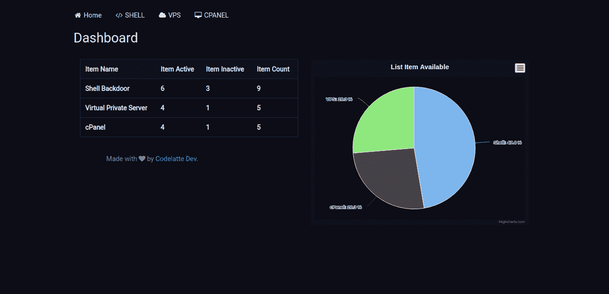
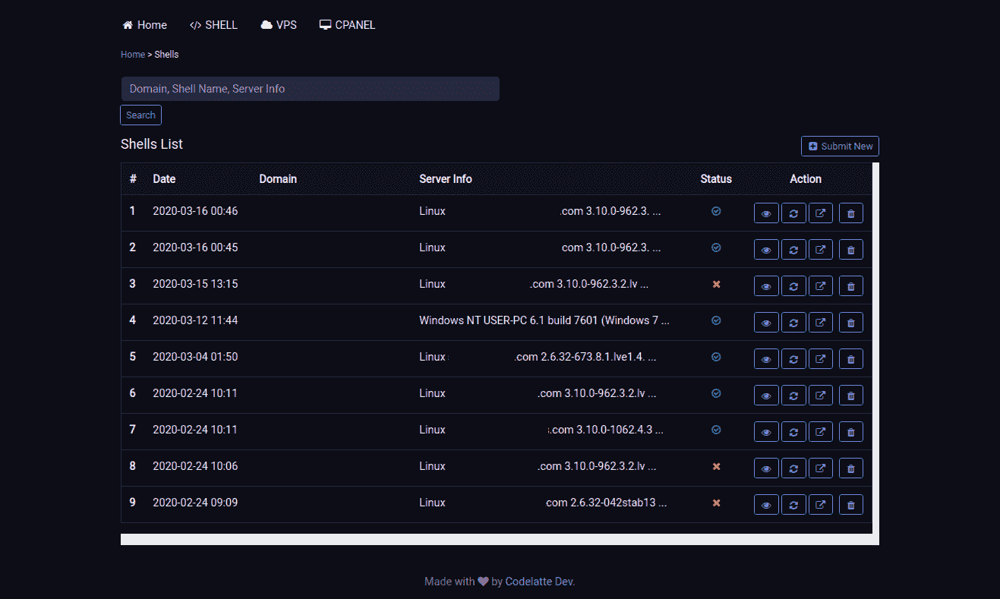
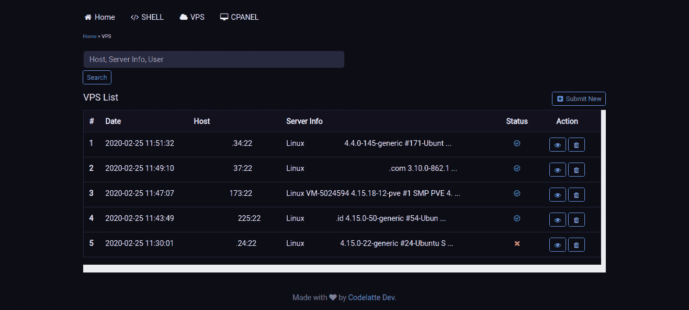
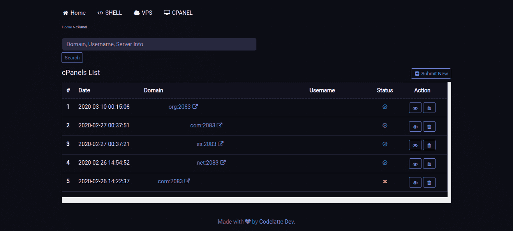

# Carina : Webshell、虚拟专用服务器(VPS)和 cPanel 数据库

> 原文：<https://kalilinuxtutorials.com/carina/>

[ & cPanel Database")](https://1.bp.blogspot.com/-QOMTirK38ds/XsjbSFSBLYI/AAAAAAAAGdM/r-FCx3MHxpgKU8auC_2vKPQQIKOeg1DkwCLcBGAsYHQ/s1600/Carina%25281%2529.png)

**Carina** 是一个 web 应用，用于存储 webshell、虚拟专用服务器(VPS)和 cPanel 数据。 **Carina** 是为了让我们不需要在**【奇怪的地方】**存储 webshell、VPS 或者 cPanel 数据。

**安装**

$ **git 克隆 https://github.com/c0delatte/carina&&CD carina
运行 composer 更新
Edit .env.example 与您的数据库配置
运行 php artisan migrate 以生成所需的表
运行 php artisan serve**

**也读作——[Kaiten:一个无法探测的有效载荷生成](https://kalilinuxtutorials.com/kaiten/)**

**截图**

[**Download**](https://github.com/c0delatte/carina)