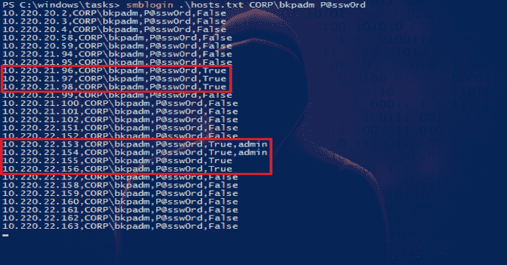
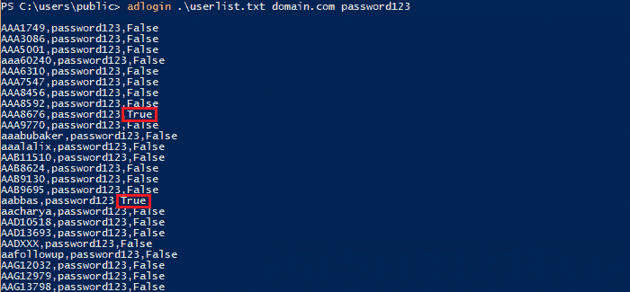

# 简约的攻击性安全工具

> 原文：<https://kalilinuxtutorials.com/minimalistic/>

**Minimalistic** 是一个简单的 SMB 登录攻击和密码喷洒工具。

它将目标列表和凭证(用户名和密码)作为参数，并尝试使用提供的凭证对每个目标进行身份验证。

尽管设计简约，该工具通过将每个结果写入文本文件来跟踪一切。这使得该工具在被中断时可以轻松恢复，或者跳过已经受损的目标。

详细描述见主文:[https://www . infosec matter . com/minimalistic-SMB-log in-brute forcer/](https://www.infosecmatter.com/minimalistic-smb-login-bruteforcer/)

**用法&举例**

导入模块。\ smblogin . PS1

**#用法:**
smblogin

**#示例:**
smblogin hosts.txt。\ Administrator P @ ss w0 rd
SMB login hosts . txt CORP \ bk admin P @ ss w0 rd

**注**:extra mini 版本缺少对 tcp/445 端口的检查，其他功能相同。

**截图**

通过网络喷洒 SMB 密码:

欲了解更多信息，请访问[https://www . infosec matter . com/minimalistic-SMB-log in-brute forcer/](https://www.infosecmatter.com/minimalistic-smb-login-bruteforcer/)

**极简广告登录 bruteforcer (adlogin.ps1)**

一个简单的活动目录登录攻击工具。

它获取用户名和密码列表，并尝试使用 LDAP (directoryservices)登录指定的 AD 域。

它还将结果保存在当前工作目录的一个文件中，因此它可以被中断和恢复(如果给定的用户已经受到威胁或尝试使用给定的密码，它将不会再次尝试登录)。

详细描述见主文:[https://www . infosec matter . com/minimalistic-ad-log in-brute forcer/](https://www.infosecmatter.com/minimalistic-ad-login-bruteforcer/)

**也读作——[Kaiten:一个无法探测的有效载荷生成](https://kalilinuxtutorials.com/kaiten/)**

**用法&举例**

导入模块。\ adlog in . PS1

**#用法:**
adlog in

**#示例:**
adlog in users . txt domain.com P @ ss w0 rd

**#检查结果(查找有效凭证):**
gc adlogin。*.txt | sls True

**截图**

针对域用户的密码登录攻击:

欲了解更多信息，请访问[https://www . infosec matter . com/minimalistic-ad-log in-brute forcer/](https://www.infosecmatter.com/minimalistic-ad-login-bruteforcer/)

[**Download**](https://github.com/InfosecMatter/Minimalistic-offensive-security-tools)