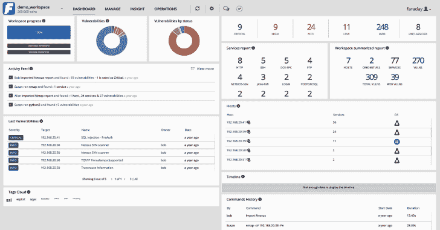
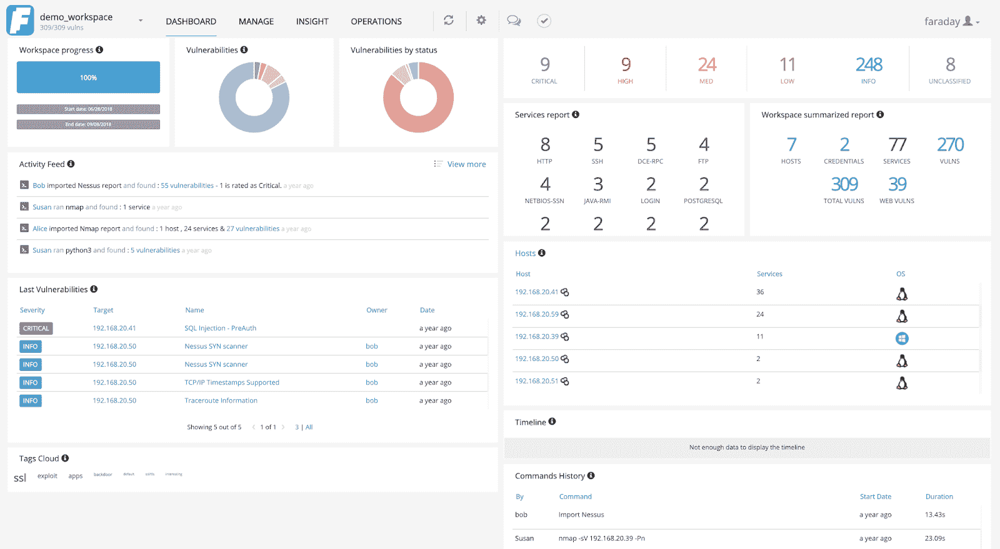
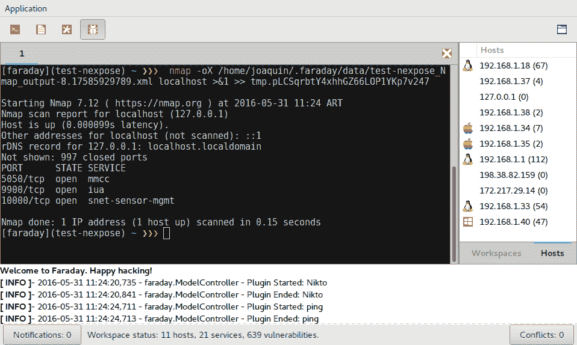

# Faraday:协作渗透测试和漏洞管理平台

> 原文：<https://kalilinuxtutorials.com/faraday/>

**法拉第**引入一个新概念——**IPE(集成渗透测试环境)**多用户渗透测试 IDE。设计用于分发、索引和分析安全审计期间生成的数据。

为真正的圣灵降临者而造！

它是为了让您以真正多用户的方式利用社区中可用的工具。

它处理你加载到不同可视化中的数据，这些数据对管理者和测试者都很有用。

为简单起见，用户应该注意到他们自己的终端应用程序和 Faraday 中包含的终端应用程序没有区别。开发了一套专门的功能，用户可以改进他们自己的工作。你还记得上一次不用 IDE 编程是什么时候吗？法拉第对于测试的重要性不亚于编程。

要了解最新特性，请查看[发行说明](https://github.com/infobyte/faraday/blob/master/RELEASE.md)！

**也读作——[Kaiten:一个无法探测的有效载荷生成](https://kalilinuxtutorials.com/kaiten/)**

**安装**

请参考[发布页面](https://github.com/infobyte/faraday/releases)了解所有支持的操作系统的最新预制安装程序。

查看我们的文档，了解如何在我们所有支持的平台上安装 Faraday 的详细信息:

要开始安装过程，请查看我们的[安装 Wiki](https://github.com/infobyte/faraday/wiki/Install-Guide) 。

**开发**

你需要 Python 3.6+和 postgres 来运行 faraday 服务器。

如果你想为 Faraday 开发，请遵循我们的 linux 的[开发设置或 OSX](https://github.com/infobyte/faraday/wiki/Development-setup) 的[开发设置。](https://github.com/infobyte/faraday/wiki/Development-Installation-OSX)

**快速入门**

安装 faraday 软件包后，您需要初始化 faraday 数据库:

**sudo 法拉第-管理 initdb**

这将给你一个*随机生成的密码*来登录 web UI。现在，您可以使用以下命令启动服务器:

**systemctl 启动法拉第-服务器**

在您的浏览器中，现在您可以转到 localhost:5985，以“faraday”作为用户名，使用 initdb 步骤中生成的密码登录。

**新功能！**

法拉第的所有最新功能和更新都可以在我们的[博客](https://medium.com/faraday)上获得。每隔几周就会有新的条目，不要忘了查看我们对其最新条目的惊人改进！

**API**

这是自动生成格式为 [OpenAPI/swagger](https://www.openapis.org/) 的 API 文档的 PoC 的一个分支。例如，要生成与 swagger UI 一起使用的 API 文档，请运行:

**法拉第-管理 openapi-yaml**

**插件列表**

你通过插件从你最喜欢的工具中获取数据给法拉第。现在有超过 70 个支持的工具，其中你会发现:

有三种插件类型:**控制台**插件，拦截并解释您执行的工具的输出，**报告**插件，允许您导入之前生成的 XML，以及**在线**插件，访问法拉第的 API 或允许法拉第连接到外部 API 和数据库。

[阅读更多关于插件的内容](http://github.com/infobyte/faraday/wiki/Plugin-List)。

法拉第插件代码可以在[法拉第插件库](https://github.com/infobyte/faraday_plugins)中找到

**特性**

*   **工作区**

信息被组织到不同的**工作区**。每个工作区包含一个 pentest 团队的任务和所有发现的情报。

*   **特工**

[Faraday Agents Dispatcher](https://github.com/infobyte/faraday_agent_dispatcher) 帮助用户开发用任何语言编写的与 Faraday 的集成。代理使用不同的工具从不同的网络位置收集信息。您可以使用[法拉第秒](https://www.faradaysec.com)来协调工具的执行。

*   **冲突**

如果两个插件为一个单独的元素产生冲突信息，用户将不得不解决冲突。一个例子是如果 **user1** 合并了主机 *127.0.0.1 OS:Linux* 和 **user2** 合并了*127 . 0 . 0 . 1 OS:Linux Ubuntu 13.10*。

在我们的 [GTK 界面](https://github.com/infobyte/faraday/wiki/Usage#gtk-gui)上，主窗口的右下角有一个按钮，显示当前工作区的冲突数量。要解决它们，只需点击按钮，一个窗口将会打开，您可以在其中编辑冲突的对象并选择要保留的对象。

*   **法拉第插件**

使用我们的插件，您可以使用命令行执行各种操作，例如:

$ cd faraday-dev/bin/
$。/fplugin create _ host 192.154.33.222 Android
1a 7b 2981 c 7 becbcb 3d 5318056 EB 29 a 58817 F5 e 67
$。/fplugin filter _ services http ssh-p 21-a
端口的过滤服务:21、22、80、443、8080、8443
192 . 168 . 20 . 1 ssh[22]TCP open None
192 . 168 . 20 . 1 http[443]TCP open None
192 . 168 . 20 . 7 ssh[22]TCP open Linux

阅读更多关于法拉第插件的信息。

**CSV 导出**

Faraday 支持从其 WEB UI 导出 CSV。[更多信息](https://github.com/infobyte/faraday/blob/master/Exporting-the-information)

**链接**

*   主页:[法拉第秒](https://www.faradaysec.com)
*   用户论坛:[法拉第论坛](https://forum.faradaysec.com)
*   用户手册: [Faraday Wiki](https://github.com/infobyte/faraday/wiki) 或查看我们的[支持门户](https://support.faradaysec.com/portal/home)
*   下载:[下载。deb/。发布页面的 rpm](https://github.com/infobyte/faraday/releases)
*   提交 RSS 源:[https://github.com/infobyte/faraday/commits/master.atom](https://github.com/infobyte/faraday/commits/master.atom)
*   问题跟踪器: [Github 问题跟踪器](https://github.com/infobyte/faraday/issues)
*   常见问题:[法拉第安全常见问题](https://github.com/infobyte/faraday/wiki/FAQ)
*   推特:[@法拉第秒](https://twitter.com/faradaysec)
*   [演示](https://github.com/infobyte/faraday/wiki/Demos)
*   IRC:ircs://IRC . freenode . net/Faraday-dev[WebClient](https://webchat.freenode.net/?nick=wikiuser&channels=faraday-dev&prompt=1&uio=d4)
*   释放:[法拉第释放](https://github.com/infobyte/faraday/releases/)

**[请求自定义演示](https://www.faradaysec.com/l/demo/?utm_source=Kitploit&utm_medium=kitploitadv1&utm_campaign=ad1)**

[**Download**](https://github.com/infobyte/faraday)