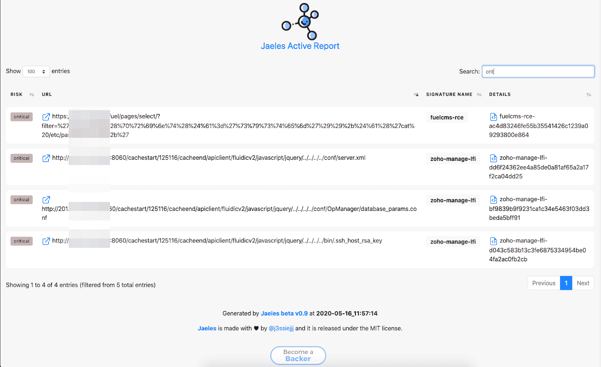
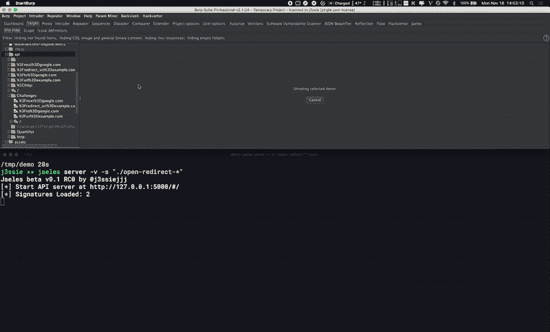

# Jaeles:自动化 Web 应用测试的瑞士军刀

> 原文：<https://kalilinuxtutorials.com/jaeles-2/>

Jaeles 是一个强大、灵活且易于扩展的框架，用 Go 编写，用于构建自己的 Web 应用程序扫描器。

**安装**

在这里下载[预编译版本](https://github.com/jaeles-project/jaeles/releases)。

如果您有一个 Go 环境，确保启用了 Go 模块的 **Go > = 1.13** ，并运行以下命令。

**GO111MODULE=on go 获得 github.com/jaeles-project/jaeles**

请访问[官方文件](https://jaeles-project.github.io/)了解更多详情。

**注**:签出[签名回购](https://github.com/jaeles-project/jaeles-signatures)安装签名。

**用途**

# **扫描使用示例:**
jaeles Scan-s-U
jaeles Scan-c 50-s-U-L
jaeles Scan-c 50-s-U
jaeles Scan-c 50-s-U-p ' dest = XXX . burpcollaborator . net '
jaeles Scan-c 50-s-U-f ' noti _ slack " {。vulnInfo } } " '
jaeles scan-v-c 50-s-U list _ target . txt-o/tmp/output
jaeles scan-s-s-U http://example.com
jaeles scan-G-s-s-x-U http://example.com
cat list _ target . txt | jaeles scan-c 100-s
#**示例:**
jaeles scan-s ' jira '-s ' ruby '-U target.com*'-U list _ of _ URLs . txt jaeles scan-v-s ' ~/my-signatures/products/WordPress/。*'-u ' https://WP . example . com '-p ' root =[[。URL]]'
cat urls.txt | grep '有趣' | jaeles scan -L 5 -c 50 -s 'fuzz/。* '-U list _ of _ URLs . txt–代理 http://127.0.0.1:8080

**另读-[evil reg:使用 Windows 注册表文件反转 Shell(。](http://Evilreg : Reverse Shell Using Windows Registry Files (.reg))reg)**

**展柜**

https://www.youtube.com/watch?v=nkBcIvzi3H4&feature=youtu.be

**Apache Server Status**

https://www.youtube.com/watch?v=EG7Qmt8kt58&feature=youtu.be

**Tableau DOM XSS CVE-2019-19719**

https://www.youtube.com/watch?v=ed4n1sCNu3s&feature=youtu.be

**RabbitMQ Default Credentials**

https://www.youtube.com/watch?v=JfihhEOEWSE&feature=youtu.be

**Jenkins XSS CVE-2020-2096**

**HTML 报告摘要**

**打嗝整合**

**计划功能**

*   添加更多签名。
*   添加更多输入源。
*   添加更多的 API 来访问请求的更多属性。
*   添加代理插件以直接从 http 客户端的浏览器接收输入。
*   ~~添加被动签名，用于被动检查每个请求。~~
*   在 Web 用户界面上添加更多动作。
*   与许多其他工具集成。

[**Download**](https://github.com/jaeles-project/jaeles)