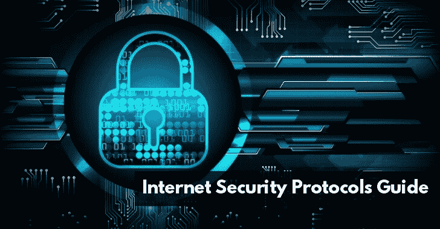
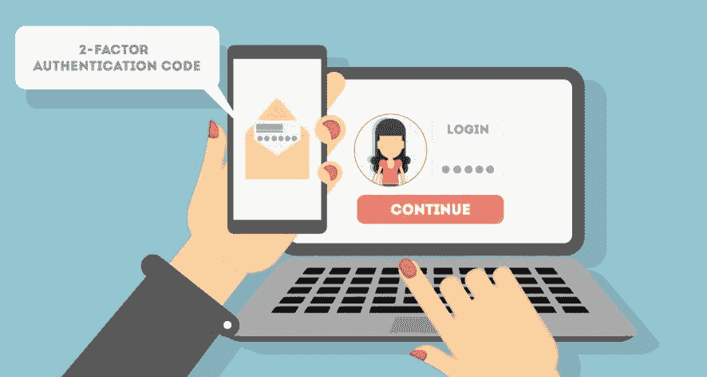
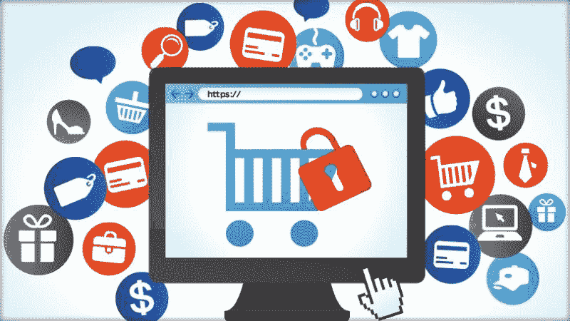

# 用于安全在线交易的完整安全协议指南

> 原文：<https://kalilinuxtutorials.com/complete-security-protocols-guide/>

在线安全比以往任何时候都更加重要。随着网络犯罪分子采用更新、更复杂的方式破坏您的保护并窃取您的数据，您需要保持领先。请记住，一次在线黑客攻击就足以毁掉你的声誉，损失金钱，并赶走客户。它甚至可能让你为你的用户和合作伙伴所遭受的损失负责——以至于你可能不得不关闭商店。

而且，不需要太多的时间就能被网络入侵击中。一些简单的事情，比如你的员工、客户或合作伙伴打开一封电子邮件或点击你网站或时事通讯上的链接，都可能导致难以想象的损失。在线交易更容易受到网络攻击，有人可能会获得正在交换的敏感数据，并将其用于恶意目的。

以下是一些有用且实用的安全协议，您必须考虑采用这些协议来确保您和您的客户的在线交易安全。

## **开启双因素认证**

对于在线交易来说，启用双因素身份认证至关重要，尤其是在金钱易手的情况下，例如金融交易和在线购物。即使密码泄露，双因素身份认证也能确保不会造成损害，因为还有第二层保护。没有人可以访问你的帐户，除非他们知道密码，并有权访问第二层，可以是你的电子邮件，短信或电话。如果有人试图从您不认识的设备访问您的帐户，您也会收到通知。

## **采用安全的电子商务平台**

永远不要在不安全的平台上建立你的在线服务或网站。您将有责任保护在线交易期间与您交换的数据。与不安全的电子商务平台打交道，不值得你心安理得，也不值得你损害商业声誉。使用安全平台意味着您可以依靠第三方来保护您和您的客户的安全，只要您遵循他们推荐的安全实践。不仅如此，如果你遭到攻击，使用安全的电子商务框架还能让你更好地从网络攻击中迅速恢复。

## **开启 TLS 数据加密**

[通过在您的 web 服务器](https://gbhackers.com/suprising-differences-tls-ssl-protocol/)上安装 SSL 证书来打开 TLS(传输层安全性)。SSL(安全套接字层)将流量切换到更安全的 HTTPS(安全超文本传输协议),并对用户浏览器和 web 服务器之间交换的数据进行加密。通过这种方式，即使网络犯罪分子插入通信双方之间以拦截通信(称为 MITM 或中间人攻击)，他们也无法理解正在传输的数据，从而使盗窃无效。

SSL 证书还有其他优势。你的客户会在他们的网络浏览器上看到一个绿色的挂锁，向他们保证该网站是安全的在线交易，这将最终导致更好的转换和更多的利润。此外，使用 SSL 的网站在 SERPs 上的排名更高，这意味着你将从互联网用户进行的搜索中获得更多免费的有针对性的有机流量，这些用户寻找你提供的产品和服务，增加了销售的机会。

如果你是一个企业主，想保护你的网站，那么你可以用安全证书来保护它。您可以从最好的经销商处获得 SSL 证书，如 [**点击 SL**](https://www.clickssl.net/) 认证经销商提供不同类型的 SSL 证书。

## **避免存储敏感信息**

避免数据被盗的最简单的方法之一就是不要将所有数据存储在一起。即使您无法避免存储一些客户数据，也不要保存支付信息等敏感信息。如果您的数据存储遭到破坏，很难说这种破坏会给您的业务带来多大的损失——想象一下，您要为金融欺诈和[身份盗窃](https://gbhackers.com/identity-thief/)承担法律责任！

## **与 3 个^(第三方)方**存储敏感数据

最好委托专业的第三方存储敏感的客户信息，如银行信息和个人身份数据(社会保险号、电话号码、驾照、护照等)。)与可信任的交易伙伴合作，让他们负责存储此类敏感信息。这减少了您的开销，并降低了与此类数据落入他人之手相关的风险。

## **购买网络责任保险**

随着您在在线交易中收集和存储更多的客户数据，您的业务风险也在不断上升。有时候，您可以避免存储此类敏感数据，或者让专业的第三方来处理，但您仍然有责任保护您的用户。无论您是否直接管理这些数据，您仍然可能要为导致信息泄露的安全漏洞所造成的任何损失承担责任。投资网络责任保险，同时采取积极的安全预防措施，将有助于抵消与受损情况相关的金钱影响和法律成本。

## **使用个人验证系统**

如果您处理的是高价商品，您可能需要考虑使用个人验证系统来认真验证在线交易。请不要在客户未使用有效身份证件(如护照或驾照)进行身份验证的情况下进行涉及巨额资金的互联网交易。对于已经在系统中验证过的客户，您可能希望放宽验证要求，这样他们就不必证明自己的身份。

## **确保 PCI DSS 合规性**

[PCI DSS](https://www.pcisecuritystandards.org/pci_security/) (支付卡行业数据安全标准)是你在网上办理信用卡时需要使用的安全标准。确保您的站点符合 PCI DSS 标准。这不仅会减少信用卡欺诈的机会，并为您提供更好的管理客户数据的方法，而且还会建立客户的信任。他们可以在你的网站上交易，而不用担心他们的财务数据被盗。遵守 PCI DSS 标准将使您的站点能够在数据泄露和在线攻击演变为 ADC(帐户数据泄露)事件之前识别并防止它们。

## **选择安全的虚拟主机提供商**

你永远不会比你的操作环境更安全，这是从你的虚拟主机提供商开始的。确保他们将安全放在首位，并准备好良好的防火墙、安全的网络和可靠的备份程序。询问他们的安全审计记录，确保他们保持警惕。他们必须有足够的安全措施来保护您免受 DDOS(分布式拒绝服务)攻击和其他常见的在线威胁，这样您就不必处理停机时间或成为常见网络攻击的受害者。您选择一个安全的虚拟主机提供商对您提供可靠安全的在线交易至关重要。

## **教育您的员工和用户**

大多数在线违规都是由于人为错误造成的。对你的新员工进行安全培训，并强制他们通过刷新，让他们了解你最新的安全政策和程序。

让您的客户了解最新的安全趋势，并鼓励他们使用诸如[VPN](http://kalilinuxtutorials.com/3-reasons-to-use-a-vpn-in-a-net-neutrality-free-world/)、最新的浏览器、安全软件等。此外，教育他们使用安全的互联网实践，以便他们能够在防止敏感数据被盗方面发挥自己的作用。考虑让在线保护信息成为您定期简讯的一部分。

## 结论

根据您所处的行业，您可能需要遵守更多的安全协议。重要的是继续寻找网络欺诈的模式。一发现漏洞就马上修补。保持频繁的安全审计并加强你的监控系统，这样你就能在网络攻击变成代价高昂的事件之前知道并采取预防措施。使用本文中介绍的技术来增强您的在线交易的安全性。保护您自己和您的客户获得在线业务的成功。