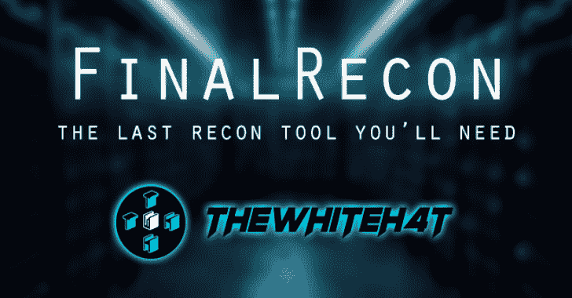

# 最终侦察:你需要的最后一个网络侦察工具

> 原文：<https://kalilinuxtutorials.com/finalrecon-the-last-web-recon-tool-youll-need/>

FinalRecon 是一个用于网络侦察的快速简单的 python 脚本。它遵循模块化结构，因此将来可以轻松添加新模块。

**精选**

*   **Python For OSINT**
    *   Hakin9 April 2020
    *   [https://hakin9.org/product/python-for-osint-tooling/](https://hakin9.org/product/python-for-osint-tooling/)
*   **零交换**
    *   [https://null-byte . wonder how to . com/how-to/conduct-recon-web-target-with-python-tools-0198114/](https://null-byte.wonderhowto.com/how-to/conduct-recon-web-target-with-python-tools-0198114/)
    *   [https://www.youtube.com/watch?v=F9lwzMPGIgo](https://www.youtube.com/watch?v=F9lwzMPGIgo)
*   **哈金 9**
    *   [https://hakin 9 . org/final-recon-osint-tool-for-all-in-one-web-connaission/](https://hakin9.org/final-recon-osint-tool-for-all-in-one-web-reconnaissance/)

**特性**

FinalRecon 提供详细信息，例如:

*   **标题信息**
*   是
*   **SSL 证书信息**
*   **爬虫**
    *   超文本标记语言
        *   半铸钢ˌ钢性铸铁(Cast Semi-Steel)
        *   java 描述语言
        *   内部链接
        *   外部链接
        *   形象
    *   机器人
    *   网站地图
    *   Javascripts 中的链接
    *   过去 1 年中来自 Wayback 机器的链接
*   **DNS 枚举**
    *   一、AAAA、任何、CNAME、MX、NS、SOA、TXT 记录
    *   DMARC 记录
*   **子域枚举**
    *   数据源
        *   小丑
        *   crt.sh
        *   威胁人群
        *   AnubisDB
        *   威胁矿工
        *   脸书证书透明度 API
            *   此源需要授权令牌，请阅读下面的配置
*   **Traceroute**
    *   协议
        *   用户数据报协议(User Datagram Protocol)
        *   传输控制协议（Transmission Control Protocol）
        *   网间控制报文协议(Internet Control Messages Protocol)
*   **目录搜索**
    *   支持文件扩展名
    *   过去 1 年中来自 Wayback 计算机的目录
*   **端口扫描**
    *   快的
    *   前 1000 个端口
    *   开放标准服务端口
*   **导出**
    *   格式
        *   文本文件（textfile）
        *   可扩展标记语言
        *   战斗支援车

**也可阅读-[网络黑客的武器:网络黑客使用的酷工具集](https://kalilinuxtutorials.com/web-hackers-weapons/)**

**配置**

*   **API 键**

一些模块使用 API 键从不同的资源获取数据，这些是可选的，如果你没有使用 API 键，它们将被简单地跳过。如果您对使用这些资源感兴趣，您可以将 API 密匙存储在 **keys.json** 文件中。

**路径—>final recon/conf/keys . JSON**

如果您不想对某个数据源使用键，只需将其值设置为`null`，默认情况下，所有可用数据源的值都为空。

*   **脸书开发者 API**

该数据源用于获取**子域枚举**中使用的**证书透明度**数据

密钥格式:**应用标识|应用密码**

了解更多:[https://developers . Facebook . com/docs/Facebook-log in/access-tokens](https://developers.facebook.com/docs/facebook-login/access-tokens)

**测试于**

*   Kali Linux
*   BlackArch Linux

> FinalRecon 是一款针对 **Pentesters** 的工具，它是为基于 **Linux** 的操作系统设计的，其他平台如 **Windows** 和 **Termux** 不支持**。**

**安装**

*   **BlackArch Linux**

吃豆人的最终侦查

*   **SecBSD**

**doas pkg_add finalrecon**

*   **卡莉 Linux**

**git 克隆 https://github.com/thewhiteh4t/FinalRecon.git
CD final recon
pip 3 install-r requirements . txt**

*   **码头工人**

**坞站拉 thewhite 4t/final recon
坞站运行-it–entry point/bin/sh thewhite 4t/final recon**

**用途**

**python 3 final Recon . py-h**

**用法:**final Recon . py[-h][–headers][–sslinfo][–whois][–crawl][–DNS][–sub][–trace][–dir][–PS][–T6][–full][-T T][-T T][-W W][-r][-D D][-E E E][-M M M][-P P][-P] –帮助显示此帮助消息并退出
–标头标头信息
–SSL info SSL 证书信息
–Whois Whois 查找
–爬网爬网目标
–DNS DNS 枚举
–子子域枚举
–trace Traceroute
–dir 目录搜索
–PS 快速端口扫描
–Full Full Recon

**额外选项:**
-t 线程数【默认
-W W word list 路径[默认:word lists/dirb _ common . txt]
-r 允许重定向[默认:False ]
-s 切换 SSL 验证[默认:True ]
-d D 自定义 DNS 服务器[默认:1.1.1.1]
-E E 文件扩展名[示例:txt、xml、php ]
-m M Traceroute 模式[默认:UDP ] [可用:TCP、 ICMP]
-Traceroute 的 p P 端口[默认:80 / 33434 ]
-tt TT Traceroute 超时[默认:1.0 ]
-o O 导出输出[默认:txt ] [可用:xml，csv ]

*   **检查标题**

**python 3 final recon . py–headers**

*   **检查 ssl 证书**

**python 3 final recon . py–sslinfo**

*   **检查 whois 信息**

**python 3 final recon . py–whois**

*   **抓取目标**

**python 3 final recon . py–crawl**

*   **目录搜索**

**python 3 final recon . py–dir-e txt，php -w /path/to/wordlist**

*   **全扫描**

**python 3 final recon . py–full**

**演示**

[https://www.youtube.com/embed/10q_CKnM3x4?feature=oembed&enablejsapi=1](https://www.youtube.com/embed/10q_CKnM3x4?feature=oembed&enablejsapi=1)

[**Download**](https://github.com/thewhiteh4t/finalrecon)