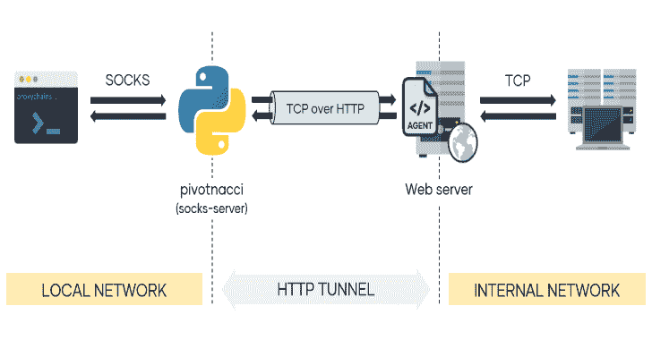
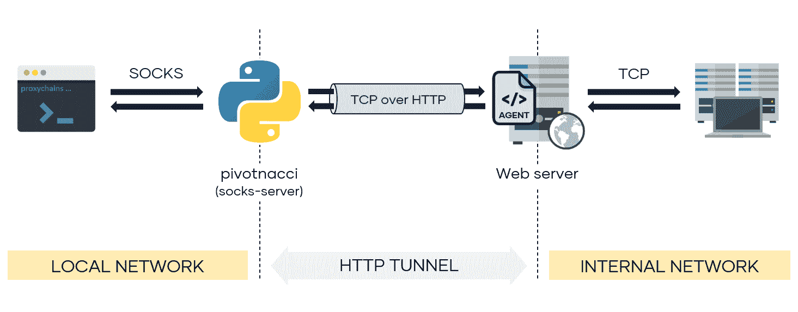

# Pivotnacci:通过 HTTP 代理建立 Socks 连接的工具

> 原文：<https://kalilinuxtutorials.com/pivotnacci/>

通过部署 HTTP 代理进入内部网络。 **Pivotnacci** 允许你创建一个与 HTTP `agents`通信的 socks 服务器。该架构如下所示:

这个工具的灵感来自伟大的 reGeorg。但是，它包括一些改进:

*   支持**平衡服务器**
*   可定制的轮询间隔，有助于降低**检测率**
*   服务器关闭的自动删除连接
*   模块化和更简洁的代码
*   通过 pip 安装
*   受密码保护的代理

**支持的 Socks 协议**

*   袜子 4
*   足球 5
    *   无认证
    *   用户口令
    *   GSSAPI

**又读-[Carina:Webshell，虚拟专用服务器(VPS) & cPanel 数据库](https://kalilinuxtutorials.com/carina/)**

**安装**

*   **来自 python 包:**

**pip3 安装 pivotnacci**

*   **来自储存库:**

**git 克隆 https://github.com/blackarrowsec/pivotnacci.git
CD pivotnacci/
pip 3 install-r requirements . txt #避免安装在 OS 上
python3 setup.py install #安装在 OS 上**

**用途**

1.  将所需的代理(php、jsp 或 aspx)上传到 web 服务器
2.  部署代理后，启动 socks 服务器
3.  配置 proxychains 或任何其他代理客户端(pivotnacci socks 服务器的默认监听端口是 1080)

**$ pivotnacci -h
用法:**pivotnacci[-h][-s addr][-p port][–verbose][–ack-message message]
[–password password][–user-agent user _ agent]
[–header][–proxy[protocol://]host[:port]]
[–type type][–polling-interval 毫秒]
[–request-tries number][–retry-interval 毫秒]
url
–source addr
默认监听地址(默认值:127.0.0.1)
-p port，–port port 默认监听端口(默认值:1080)
–verbose，-v
–ack-Message Message，-a message
代理网页返回的消息(默认值:
服务器错误 500(内部错误))
–Password Password 与代理通信的密码(默认值:
–User-Agent User _ Agent，-A user_agent 以' Name: Value'
(默认值:无)
–proxy[protocol://]host[:port]，-x [protocol://]host[:port]
的形式指定要使用的 HTTP 代理。(也支持环境变量
HTTP_PROXY 和 HTTPS _ PROXY)
(默认:无)
–type type，-t type 指定未自动检测到
时的代理类型。选项有['php '，' jsp '，' aspx'](默认值:
None)
–轮询间隔毫秒
轮询代理的间隔(用于 recv 操作)
(默认值:100)
–请求尝试次数
对代理的每个请求的重试次数。To
在平衡服务器的情况下使用(默认值:50)
–重试间隔毫秒
重试失败请求的间隔(由于平衡的
服务器)(默认值:100)

**例题**

*   使用密码为 s3cr3t 的代理(也必须在代理端修改 AGENT_PASSWORD 变量):

**https://domain.com/agent.php pivotnacci–密码“s3cr 3t”**

*   使用自定义 HTTP 主机头和自定义 CustomAgent 用户代理:

**pivotnacci https://domain.com/agent.jsp-H ' Host:vhost . domain . com '-A ' custom agent '**

*   设置不同的代理消息 418 我是茶壶(ACK_MESSAGE 变量也必须在代理端修改):

**https://domain.com/agent.aspx-确认消息“418 我是茶壶”**

*   通过将轮询间隔设置为 2 秒来降低检测率(例如 WAF ):

**https://domain.com/agent.php 民意调查-2000 年投票间隔**

**信用:**埃洛伊·佩雷斯

[**Download**](https://github.com/blackarrowsec/pivotnacci)