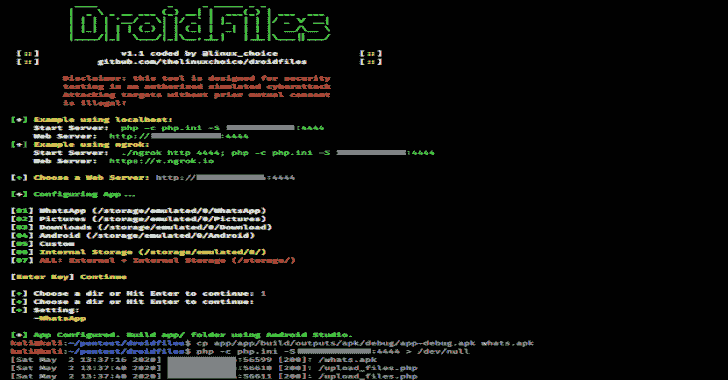

# DroidFiles:从 Android 目录中获取文件

> 原文：<https://kalilinuxtutorials.com/droidfiles/>

**DroidFiles** 是一款用于从 Android 目录、内部和外部存储中获取文件的工具(图片、下载、Whatsapp、视频……)

**要求**

*   安卓工作室([https://developer.android.com/studio](https://developer.android.com/studio))

**也读作-[定位器:地理定位器，IP 跟踪器，设备信息通过 URL (Serveo & Ngrok)](https://kalilinuxtutorials.com/locator/)**

**用途**

**# git 克隆 https://github.com/thelinuxchoice/droidfiles
# CD droid files
# bash droid files . sh**

[**Download**](https://github.com/thelinuxchoice/droidfiles)