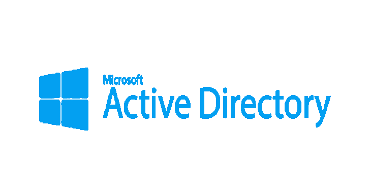

# ADCollector:从活动目录中快速提取有价值信息的工具

> 原文：<https://kalilinuxtutorials.com/adcollector/>

**ADCollector** 是一个轻量级工具，它枚举活动目录环境以识别可能的攻击媒介。作为起点，它将让您对环境的配置/部署有一个基本的了解。

**备注:**

它不是强大的 PowerView 的替代产品，它只是自动枚举以快速识别有趣的信息，而无需在早期侦察阶段考虑太多。

ADCollector 中实现的函数非常适合在拥有大量用户/计算机的大型企业环境中进行枚举，不会产生大量流量和占用大量时间。

它只关注于从最有价值的目标中提取有用的属性/特性/ACL，而不是枚举域中所有用户/计算机对象的所有可用属性。稍后您肯定会需要 PowerView 来进行更详细的枚举。

开发该工具的目的是帮助我从不同的角度了解更多关于 Active Directory 安全性的知识，并找出这些 PowerView 功能背后的东西。我刚开始学。NET 的代码可能真的**可怕** ~

它使用 S.DS 命名空间从域控制器(LDAP 服务器)检索域/林信息。它还利用 S.DS.P 名称空间进行 LDAP 搜索。

**枚举**

*   当前域/林信息
*   当前林中的域(带有域 sid)
*   当前域中的域控制器[GC/RODC](具有~~IP、OS 站点和~ ~角色)
*   域/林信任以及受信任的域对象[SID 筛选状态]
*   特权用户(目前在 DA 和 EA 组中)
*   不受约束的委托账户(不包括跟单信用证)
*   约束委托(S4U2Self、S4U2Proxy、基于资源的约束委托)
*   MSSQL/Exchange/RDP/PS 远程处理 SPN 帐户
*   设置了 set & password 的用户帐户不是过期帐户
*   机密属性()
*   asreqbroast(dontrequireprauth 帐户)
*   AdminSDHolder 受保护的帐户
*   域属性(MAQ、minPwdLength、maxPwdAge lockoutThreshold、gp link[链接到当前域对象的组策略])
*   LDAP 基本信息(支持的 LDAP 版本、支持的 ASL 机制、域/林/DC 功能)
*   Kerberos 策略
*   域对象上有趣的 ACL，解析 GUIDs(将来用户定义的对象)
*   异常的 DCSync 帐户
*   GPO 上有趣的 ACL
*   关于用户对象的有趣描述
*   敏感和非委托账户
*   SYSVOL/Cache 中的组策略首选项密码
*   当前用户/计算机上的有效 GPO
*   受限群体
*   嵌套组成员资格

**另请阅读-[EVI app:使用 Android 应用程序的网络钓鱼攻击](https://kalilinuxtutorials.com/evilapp/)**

**用途**

**C:\ Users>ADCollector.exe-h**

**用法:ADCollector.exe-h**
**–域(默认:当前域)**
枚举指定域
**–Ldaps(默认:LDAP)**
使用 LDAP over SSL/TLS
**–Spns(默认:不扫描 SPN)**
枚举 SPN
**–Term(默认:'上\ ad collector . exe–SPNs–Term key–ACL ' CN =域管理员，CN =用户，DC =实验室，DC =本地'**

**变更日志**

*   **v 1.1.1**
    *   它现在使用 S.DS.P 名称空间来执行搜索操作，使搜索更快、更容易实现。(还支持分页搜索。)
    *   它现在支持在其他领域的搜索。(命令行解析器尚未实现)。
    *   代码逻辑重构，代码更少，更易理解，更有凝聚力。
*   **v 1.1.2**
    *   分成三类。
    *   正确处理 ldap 连接。
    *   枚举:AdminSDHolder，域属性(MAQ，minPwdLengthm maxPwdAge，lockOutThreshold，链接到域对象的 GP)，账户不需要预认证。
    *   LDAP 基本信息(支持的 LDAP 版本、支持的 ASL 机制、域/林/DC 功能)
    *   SPN 扫描(MSSQL、Exchange、RDP 和 PS Remoting 的 SPN)
    *   受约束的委托枚举(S4U2Self、S4U2Proxy 以及基于资源的受约束委托)
    *   RODC(管理 RODC 的团体)
*   **v 1.1.3**
    *   已修复 SPN 扫描结果，特权帐户组成员
    *   密码不会使帐户过期；设置了 SPN 的用户帐户；
    *   Kerberos 策略
    *   域对象的有趣的 ACL 枚举，解析 GUIDs
    *   DC 信息回来了
*   **v 1.1.4**
    *   一些 bug 被杀，一些细节被改进
    *   SPN 扫描现在是可选的
    *   SYSVOL/缓存中的 GPP 密码
    *   GPO 上有趣的 ACLs 关于用户对象的有趣描述；
    *   不寻常的 DCSync 帐户；敏感和非代理账户
    *   用户/计算机上的有效 GPO
    *   受限群体
    *   嵌套组成员资格

[**Download**](https://github.com/dev-2null/ADCollector)