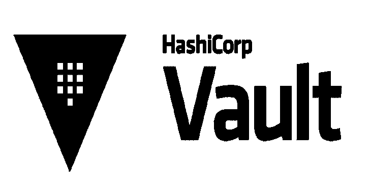

# Vault:用于秘密管理、加密即服务和特权访问管理的工具

> 原文：<https://kalilinuxtutorials.com/vault/>

**Vault** 是一个安全访问秘密的工具。秘密是您想要严格控制访问的任何东西，比如 API 密钥、密码、证书等等。Vault 为任何机密提供了统一的界面，同时提供了严格的访问控制并记录了详细的审核日志。

现代系统需要访问大量秘密:数据库凭证、外部服务的 API 密钥、面向服务架构通信的凭证等。了解谁在访问什么秘密已经非常困难，并且是特定于平台的。如果没有定制的解决方案，添加密钥滚动、安全存储和详细的审计日志几乎是不可能的。这就是 Vault 介入的地方。

Vault 的主要功能有:

*   **安全秘密存储**:任意密钥/值秘密可以存储在保险库中。Vault 会在将这些机密写入永久存储之前对其进行加密，因此获得原始存储的访问权限不足以访问您的机密。金库可以写磁盘，[执政官](https://www.consul.io)等等。
*   **动态机密** : Vault 可以为一些系统按需生成机密，比如 AWS 或者 SQL 数据库。例如，当应用程序需要访问 S3 存储桶时，它会向 Vault 请求凭据，Vault 会根据需要生成一个具有有效权限的 AWS 密钥对。创建这些动态机密后，Vault 还会在租约到期后自动撤销它们。
*   **数据加密** : Vault 可以对数据进行加密和解密，无需存储。这使得安全团队可以定义加密参数，开发人员可以将加密数据存储在 SQL 等位置，而无需设计自己的加密方法。
*   **租借和续约**:金库中的所有秘密都有一个与之关联的*租借*。租约结束时，Vault 将自动撤销该机密。客户端能够通过内置的续订 API 续订租约。
*   **撤销** : Vault 内置了对秘密撤销的支持。Vault 不仅可以撤销单个机密，还可以撤销机密树，例如特定用户读取的所有机密，或者特定类型的所有机密。撤销有助于密钥滚动以及在发生入侵时锁定系统。

**文档，入门&认证考试**

文档可在 [Vault 网站](https://www.vaultproject.io/docs/)上获得。

如果您是 Vault 新手，并且想要开始使用安全自动化，请查看 HashiCorp 学习平台上的[入门指南](https://learn.hashicorp.com/vault?track=getting-started#getting-started)。还有[附加导游](https://learn.hashicorp.com/vault?track=getting-started#operations-and-development)继续你的学习。

通过认证考试展示您的 Vault 知识。访问[认证页面](https://www.hashicorp.com/certification/#hashicorp-certified-vault-associate)了解考试信息，并在哈希公司的学习平台上找到[的学习资料](https://learn.hashicorp.com/vault/certification/vault-associate)。

**也可阅读-[S3 bucket list:Firefox 插件，列出了在请求中发现的亚马逊 S3 存储桶](https://kalilinuxtutorials.com/s3bucketlist/)**

**显影**

如果你想操作 Vault 本身或者它的任何内置系统，你首先需要在你的机器上安装 [Go](https://www.golang.org) 。Go 版本 1.13.7+是*必需的*。

对于本地开发，首先要确保 Go 安装正确，包括设置一个 [GOPATH](https://golang.org/doc/code.html#GOPATH) 。确保`$GOPATH/bin`在您的路径中，因为一些发行版捆绑了旧版本的构建工具。接下来，克隆这个存储库。Vault 使用 [Go 模块](https://github.com/golang/go/wiki/Modules)，因此建议您在 GOPATH 的 之外克隆存储库 ***。然后，您可以通过引导您的环境来下载任何需要的构建工具:***

**$制作自举…**

要编译 Vault 的开发版本，请运行`make`或`make dev`。这将把 Vault 二进制文件放在`bin`和`$GOPATH/bin`文件夹中:

**$ make dev …
$ bin/vault …**

要使用 UI 编译 Vault 的开发版本，请运行`make static-dist dev-ui`。这将把 Vault 二进制文件放在`bin`和`$GOPATH/bin`文件夹中:

**$ make static-dist dev-ui…
$ bin/vault…**

要运行测试，请键入`make test`。注意:这需要安装 Docker。如果退出状态为 0，那么一切正常！

**$进行测试…**

如果你正在开发一个特定的包，你可以通过指定`TEST`变量来运行这个包的测试。例如下面，将只运行`vault`包测试。

**$ make test TEST=。/金库…**

**验收测试**

Vault 拥有全面的[验收测试](https://en.wikipedia.org/wiki/Acceptance_testing)，涵盖了 secret 和 auth 方法的大部分特性。

如果您正在开发一个 secret 或 auth 方法的特性，并且想要验证它的功能(并且没有破坏其他任何东西)，我们建议运行验收测试。

**警告:**验收测试创建/破坏/修改*真实资源*，在某些情况下可能会产生真实成本。在出现 bug 的情况下，从技术上讲，中断的后端可能会留下悬空的数据。因此，请自担风险运行验收测试。至少，我们建议在他们自己的私人账户中运行他们，不管你测试的是什么样的后端。

要运行验收测试，调用`make testacc`:

**$ make testacc TEST=。/内置/逻辑/领事…**

`TEST`变量是必需的，您应该指定后端所在的文件夹。建议使用`TESTARGS`变量来筛选特定的资源进行测试，因为一次测试所有资源有时会花费很长时间。

验收测试通常需要为诸如访问键之类的东西设置其他环境变量。测试本身应该会在早期出错，并告诉您应该设置什么，所以这里不做说明。

有关 Vault Enterprise 功能的更多信息，请访问 [Vault Enterprise 网站](https://www.hashicorp.com/products/vault/?utm_source=github&utm_medium=referral&utm_campaign=github-vault-enterprise)。

[**Download**](https://github.com/hashicorp/vault)