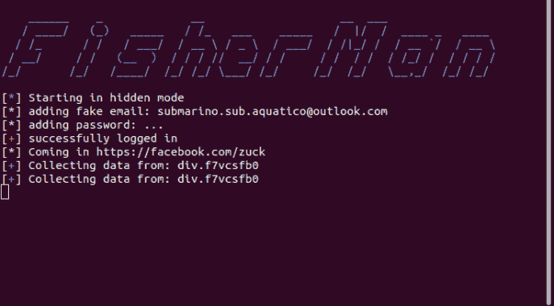
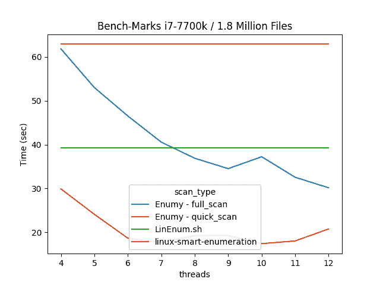

# Enumy : Linux 利用后权限提升枚举

> 原文：<https://kalilinuxtutorials.com/enumy/>

**Enumy** 是一个**超快速可移植可执行文件**，你可以在后期开发阶段的 pentest 或 CTF 中将其放在目标 Linux 机器上。运行 enumy 将为**常见安全漏洞**枚举框。

**安装**

您可以从发行版 x86 或 x64 选项卡下载最终的二进制文件。*静态链接到 musl* 将最终枚举二进制文件传输到目标机器。

*   [最新发布](https://github.com/luke-goddard/enumy/releases)

**。/enumey**

**谁应该使用枚举**

*   Pentester 可以在目标机器上运行，为其报告提出问题。
*   CTF 玩家可以用它来识别他们可能错过的东西。
*   好奇想知道在本地机器上找到多少 isues enumy 的人？

**选项**

**$。/Enumy 64-h
https://github.com/luke-goddard/enumy
Enumy-用于枚举目标目标环境&寻找
常见的安全漏洞和主机点**————————————————————————————————————
**输出**
-o 输出结果到位置(默认 enumy.json)

**行走文件系统【T13

**扫描选项**
-f 运行完全扫描(启用 CPU 密集型扫描)
-t 线程(默认为 4)

**打印选项**
-a 将所有安全审计问题打印到屏幕上(在 CTF 期间可能没有帮助)
无论是否设置了此标志，问题都会始终记录在结果文件中。
-d < 1|2 >打印调试模式(1 为低电平，2 为高电平)可将错误打印到屏幕上。
-g 打印到屏幕值大于或等于高、中&低
-p 不打印到屏幕高、中、低&信息问题(例如见下文)
-m 1-100 打印到屏幕的同名问题的最大数量默认(无限制)**

**又读-[sharing an:攻击性安全侦察工具](https://kalilinuxtutorials.com/sharingan/)**

**编译**

要在*开发*期间进行编译，make 和 libcap libary 就是所需的全部内容。

**sudo apt-get install lib cap-dev
make**

要删除 glibc 依赖项并静态链接所有库/用 musl 编译，请执行以下操作。注意要做到这一点，您必须安装 docker 来创建 apline 构建环境。

。/build.sh 64bit
。/build.sh 32bit
。/build.sh 所有
光盘输出

**扫描次数**

**已经实施的扫描**

下面是已经实施的扫描的不断增长的列表。

| 扫描类型 | 快速扫描 | 全扫描 | 执行 | 打印到屏幕 | 保存在日志中 |
| --- | --- | --- | --- | --- | --- |
| [内核漏洞检测器](https://github.com/luke-goddard/enumy#kernel-exploit-surgestor) | ✔️ | ✔️ | ✔️ | ✔️ | ✔️ |
| [SUID/GUID Scan](https://github.com/luke-goddard/enumy#suid-guid-scan) | ✔️ | ✔️ | ✔️ | ✔️ | ✔️ |
| [文件能力扫描](https://github.com/luke-goddard/enumy#file-capabilities-scan) | ✔️ | ✔️ | ✔️ | -好的 | ✔️ |
| [兴趣文件扫描](https://github.com/luke-goddard/enumy#intresting-files-scan) | ✔️ | ✔️ | ✔️ | ✔️ | ✔️ |
| [核心转储扫描](https://github.com/luke-goddard/enumy#coredump-scan) | ✔️ | ✔️ | ✔️ | ✔️ | ✔️ |
| [突破二进制扫描](https://github.com/luke-goddard/enumy#breakout-binary-scan) | ✔️ | ✔️ | ✔️ | ✔️ | ✔️ |
| [SSHD 配置扫描](https://github.com/luke-goddard/enumy#ssh-misconfiguration-scan) | ✔️ | ✔️ | ✔️ | -好的 | ✔️ |
| [Sysctl 扫描](https://github.com/luke-goddard/enumy#sysctl-parameter-hardening) | ✔️ | ✔️ | ✔️ | ✔️ | ✔️ |
| [靠土地为生扫描](https://github.com/luke-goddard/enumy#living-off-the-land-scan) | ✔️ | ✔️ | ✔️ | ✔️ | ✔️ |
| [当前用户扫描](https://github.com/luke-goddard/enumy#current-user-scan) | ✔️ | ✔️ | ✔️ | ✔️ | ✔️ |
| [*。所以注射扫描](https://github.com/luke-goddard/enumy#dynamic-shared-object-injection-scan) | -好的 | ✔️ | ✔️ | -好的 | ✔️ |
| [权限扫描](https://github.com/luke-goddard/enumy#permissions-scan) | -好的 | ✔️ | ✔️ | -好的 | ✔️ |
| [文件系统扫描](https://github.com/luke-goddard/enumy#file-system-scan) | -好的 | ✔️ | ✔️ | -好的 | ✔️ |
| Docker 扫描 | ✔️ | ✔️ | -好的 |  | ✔️ |
| 环境扫描 | ✔️ | ✔️ | -好的 |  | ✔️ |
| 特许访问扫描 | ✔️ | ✔️ | -好的 |  | ✔️ |
| 网络扫描 | ✔️ | ✔️ | -好的 |  | ✔️ |
| 系统信息扫描 | ✔️ | ✔️ | -好的 |  | ✔️ |
| 版本信息扫描 | ✔️ | ✔️ | -好的 |  | ✔️ |
| 默认弱凭据扫描 | ✔️ | ✔️ | -好的 |  | ✔️ |
| 弱加密扫描 | -好的 | ✔️ | -好的 |  | ✔️ |

注:要打印标记为❌的结果，使用`-a`标志启用审计模式。

**扫描类型**

*   **内核漏洞检测器**:该扫描将检查内核版本，看是否匹配任何已知漏洞的内核版本。
*   **SUID GUID 扫描**:这种扫描的思想是枚举系统寻找 [SUID](https://www.hackingarticles.in/linux-privilege-escalation-using-suid-binaries/) /GUID 二进制文件是否异常，或者具有可被利用的弱权限。
*   **文件能力扫描**:最近 Linux 内核支持[能力](https://www.man7.org/linux/man-pages/man7/capabilities.7.html)，这是给予文件 root 权限子集以降低风险的首选方式。尽管这是一种更安全的方式，但是如果您足够幸运地发现文件上设置了异常功能，那么您很有可能利用可执行文件来获得更高的访问权限。Enumy 将检查系统上所有可执行文件的功能设置。
*   **感兴趣的文件扫描**:这更像是一种通用扫描，它会尝试根据文件的内容、文件扩展名和文件名对文件进行分类。Enumy 将查找文件，如私钥、密码和备份文件。
*   **Coredump 扫描** : Coredump 文件是一种 ELF 文件，当程序意外终止时，它包含一个进程的地址空间。现在想象一下，如果这个过程的记忆是可读的，并且包含敏感的信息。或者更令人兴奋的是，这个 coredump 可以用于 seg faulted 内部开发的工具，允许您开发一个零日工具。
*   **突破二进制扫描**:有些文件不应该设置 SUID 位，懒惰的系统管理员给 docker、ionice、hexdump SUID 这样的文件使 bash 脚本工作或生活更容易是很常见的。该扫描试图找到一些已知的坏 SUID 二进制文件。
*   **Sysctl 参数加固** : [Sysctl](https://linux.die.net/man/8/sysctl) 用于在运行时修改内核参数。也可以查询这些内核参数，查看是否启用了重要的安全措施，如 ASLR。
*   依靠陆地生存扫描:依靠陆地生存是一种技术，攻击者利用它来攻击系统中已经存在的东西。他们这样做是为了保持隐秘，还有其他原因。这种扫描会列举出攻击者要寻找的文件。
*   **动态共享对象注入扫描**:该扫描将解析 ELF 文件的依赖关系。如果我们对这些依赖项中的任何一个具有写访问权限，或者对任何 DT_RPATH 和 DT_RUNPATH 值具有写访问权限，那么我们就可以在可执行文件中创建我们自己的恶意共享对象，这可能会危及系统的安全。
*   SSH 错误配置扫描 : SSH 是现实世界中最常见的服务之一。它也很容易被误解。该扫描将检查是否可以以任何方式加固它。
*   **当前用户扫描**:当前用户扫描只是解析/etc/passwd。通过这些信息，我们可以找到根帐户、未受保护的和丢失的主目录等。
*   **权限扫描**:该扫描将查找全局可写文件、不均衡权限和无主文件。扫描灵感见[此处](http://infosecisland.com/blogview/8494-Keeping-Linux-File-Systems-Clean-and-Secure.html)。
*   **文件系统扫描**:这种扫描对于那些试图加固他们的 Linux 机器的人来说很有用。它将突出诸如未加密的驱动器和不安全的装载配置等问题。