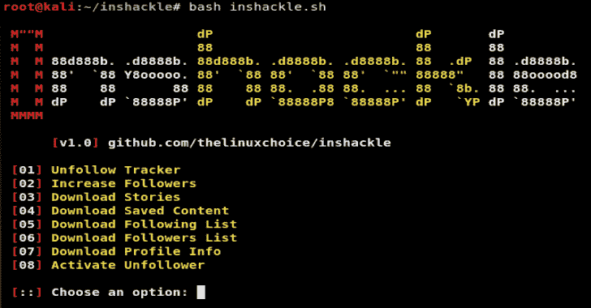

# Instagram 黑客

> 原文：<https://kalilinuxtutorials.com/inshackle/>

**Inshackle** 是一个用来黑 Instagram 和追踪未关注者、增加你的关注者、下载故事等的工具。

**特性**

*   取消跟踪跟踪器
*   增加关注者
*   下载:故事、保存的内容、关注/关注者列表、个人资料信息
*   放开你所有的追随者

**也读作-[guarded box:安全存储的在线客户端管理器&秘密共享](https://kalilinuxtutorials.com/guardedbox/)**

**用途**

**git 克隆 https://github.com/thelinuxchoice/inshackle
CD in shackle
bash in shackle . sh**

[**Download**](https://github.com/thelinuxchoice/inshackle)