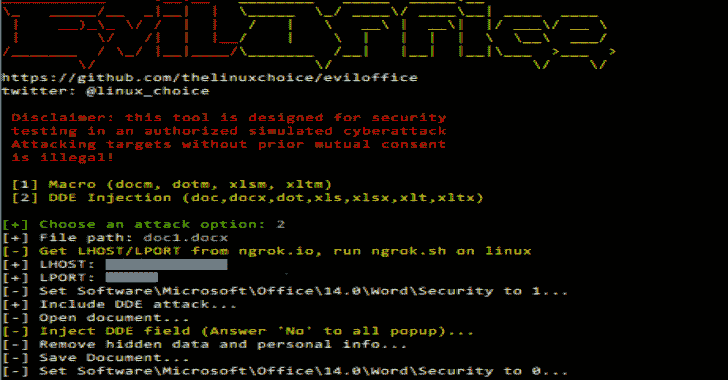

# Eviloffice:将宏和 DDE 代码注入 Excel 和 Word 文档

> 原文：<https://kalilinuxtutorials.com/eviloffice/>

**EVI office**是一个用于将宏和 DDE 代码注入 Excel 和 Word 文档的工具(反向外壳)。

**特性**

*   在格式上注入恶意宏:docm，dotm，xlsm，xltm
*   在格式上注入恶意 DDE 代码:doc，docx，dot，xls，xlsx，xlt，xltx
*   Python2/Python3 兼容
*   已测试:Win10 (MS Office 14.0)

**要求**

*   Microsoft Office (Word/Excel)
*   pywin32:python-m pip install-r requirements . txt

**也读作-[guarded box:安全存储的在线客户端管理器&秘密共享](https://kalilinuxtutorials.com/guardedbox/)**

**转发要求**

*   Ngrok Authtoken(用于 TCP 隧道):在:[https://ngrok.com/signup](https://ngrok.com/signup)注册
*   您的授权令牌可在您的仪表板上找到:[https://dashboard.ngrok.com](https://dashboard.ngrok.com)
*   安装您的 auhtoken:。/ngok authtype token

**用途**

git 克隆 https://github.com/thelinuxchoice/eviloffice
CD evil office
python-m pip install-r requirements . txt
python evil office . py

**免责声明**

未经双方事先同意，使用 EvilOffice 攻击目标是非法的。最终用户有责任遵守所有适用的地方、州和联邦法律。开发人员不承担任何责任，也不对本程序造成的任何误用或损坏负责。

[**Download**](https://github.com/thelinuxchoice/eviloffice)