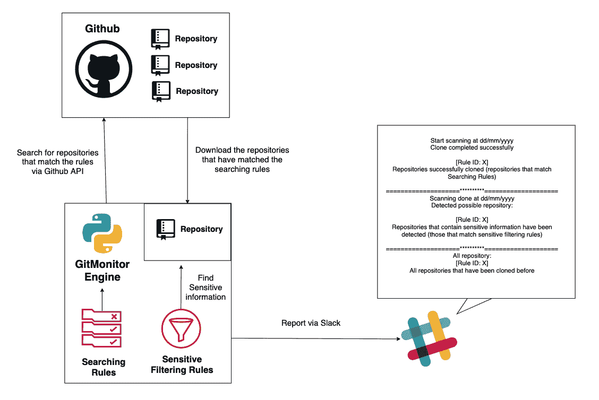

# GitMonitor:一个 Github 扫描系统，根据规则查找泄露的敏感信息

> 原文：<https://kalilinuxtutorials.com/gitmonitor/>

[](https://1.bp.blogspot.com/-8vvPSa8e9Ak/XuEvaP9WI5I/AAAAAAAAGlY/nUHHpx1l2qU354nerG0IlRiWOszv5bFEwCLcBGAsYHQ/s1600/GitMonitor-logo%25281%2529.png)

GitMonitor 是一个 Github 扫描系统，根据规则寻找泄露的敏感信息。我知道现在有很多很好的工具可以用来查找 Github 上泄露的敏感信息，我自己目前也在使用其中的一些。但是，我认为它们仍然缺少一些功能，例如:

*   基于规则的扫描工具。
*   规则机制允许我以最灵活的方式编写规则。这些规则允许我按品牌名称、文件格式和语言过滤信息。以及允许我跳过特定的文件格式和语言(搜索规则)。然后，在开始基于正则表达式(敏感过滤规则)查找存在于本地的敏感信息之前，克隆与本地规则匹配的存储库。您可以通过定义与您公司品牌名称相关的关键字、与您公司项目相关的关键字、电子邮件前缀或规则中的任何其他内容来实现。
*   该工具可以按时启动，并具有灵活的报告机制。

这就是为什么我创造了这个工具——git monitor。GitMonitor 使用两套不同的规则来查找您需要的内容。搜索规则将搜索可能与您的组织或内部项目相关的存储库，或者与本地匹配的克隆存储库。然后，敏感过滤规则检查那些存储库中是否存在敏感信息。最后，该工具将通过 Slack 进行报告。您可以将这个工具与 Cronjob 一起使用，创建一个监控系统来跟踪在 Github 上泄露的与您的组织相关的敏感信息，并通过 Slack 接收结果。

**特性**

*   基于规则搜索存储库(搜索规则)。您可以编写规则来搜索可能与您的公司相关的存储库。符合规则的存储库将被克隆到本地。
*   出于分类目的，使用 Regex(敏感过滤规则)搜索克隆存储库中存在的敏感信息。
*   通过时差报告。
*   规则和正则表达式是分开定义的
*   用户可以简单直观地定义规则和正则表达式。



也可理解为-[定位器:地理定位器、IP 跟踪器、通过 URL 的设备信息(Serveo & Ngrok)](https://kalilinuxtutorials.com/locator/)

**要求**

*   Python3，Python3-pip

在 Ubuntu 18.04 上测试。

**设置**

*   安装要求:

**Python3 -m pip 安装要求. txt**

请确保您安装了 Pyyaml 版本 5x 或更高版本

*   在配置文件(config.ini)中填写所需信息:

[git]
**user =**<username _ git>
**pass =**<password _ git>
**URL _ code =**https://api.github.com/search/code?q={}+in:file&sort = indexed&order = desc
**URL _ repos =**https://api.github.com/search/repositories?q={}+size:>0+is:public&sort = indexed&order = desc
**URL
**rule =** <路径到规则文件夹>
**source =** <路径到文件夹到克隆库>
**log =**<log =>
【msg】
Start = = = = = = = = = = = = = = = = = = =***= = = = = = = = = = =***** 

*   编写规则(搜索规则)。将您的规则放在规则目录中:

```
 id: Project_X_Matching
 key: X
 language:
   - java
 #filename:
 #  - LICENSE
 #extension:
 #  - py
 #  - md
 ignore:
 #  language:
 #    - php
   filename:
     - LICENSE
   extension:
     - html
     - txt

```

*   在 libs/regex.py 文件中定义正则表达式(敏感过滤规则)。
*   运行:

Python3 gitmonitor.py

*   您可以使用 Cronjob 为该工具安排自动运行。

[**Download**](https://github.com/Talkaboutcybersecurity/GitMonitor)