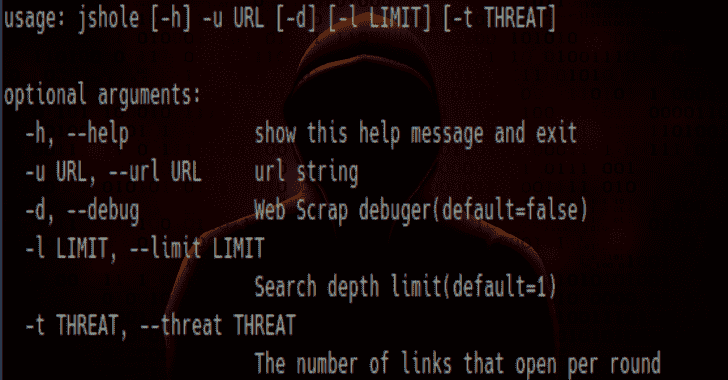

# Jshole:一个 JavaScript 组件漏洞扫描器

> 原文：<https://kalilinuxtutorials.com/jshole/>

Jshole 是一个简单的 JavaScript 组件漏洞扫描器，基于 RetireJS。

**为什么用 JShole 而不用 RetireJS？**

默认情况下，RetireJS 只搜索一个页面，但是 JShole 会尝试抓取所有页面。

**要求**

*   要求

**安装**

git 克隆 https://github.com/callforpapers-source/jshole.git
CD jshole
pip 3 install-r 需求
python3 jshole.py

用法:jshole[-h]-u URL[-d][-l LIMIT][-t THREAT]
可选参数:
-h，–help 显示此帮助消息并退出
-u URL，–URL URL 字符串
-d，–debug Web Scrap 调试器(默认值=false)
，–LIMIT
搜索深度限制(默认值=1)
-t THREAT，–THREAT THREAT
每轮打开的链接数

[**Download**](https://github.com/callforpapers-source/jshole)