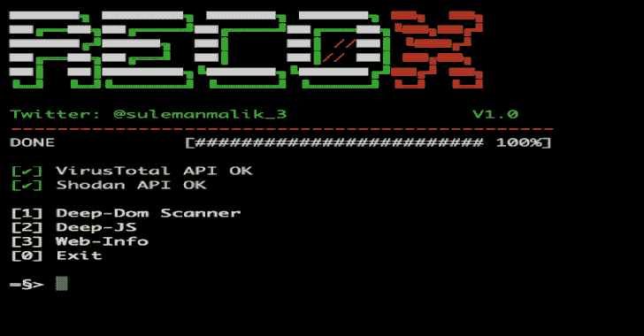
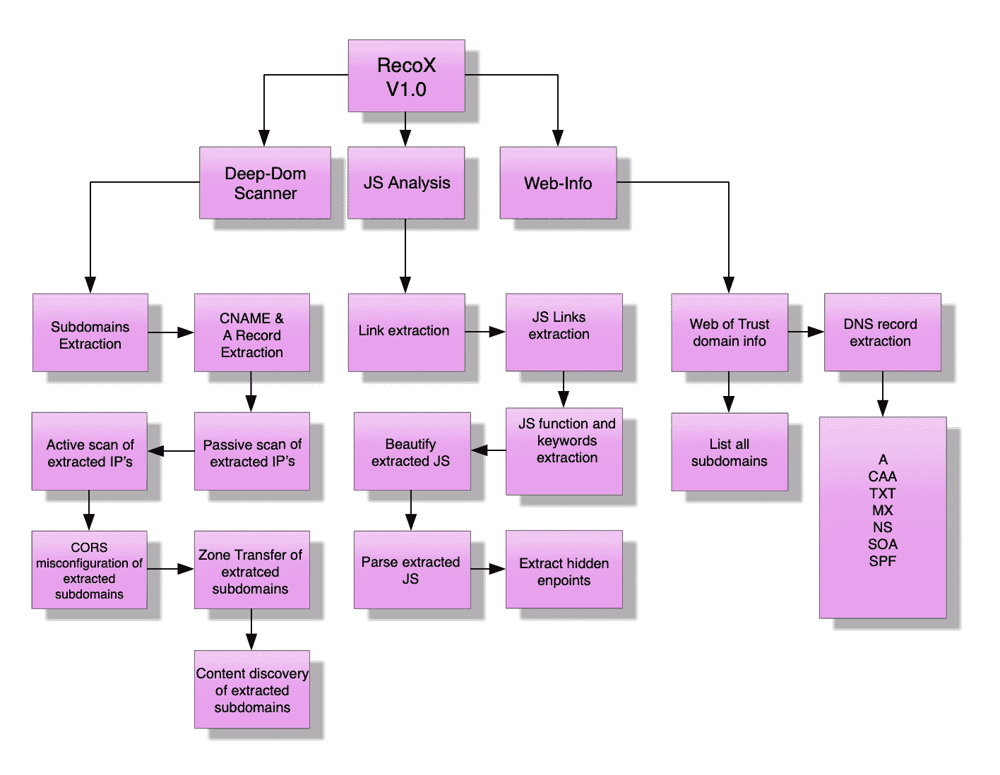

# Recox:网络侦察的主脚本

> 原文：<https://kalilinuxtutorials.com/recox/>

该脚本旨在帮助对 web 应用程序中的漏洞进行分类。RecoX 正在兴起的方法可以发现 OWASP 十大弱点之外的弱点。该脚本显示目标系统的信息。

它递归地收集每个子域的信息，以及复杂攻击的 IP 地址。RecoX 实现了几个功能的自动化，节省了大量手动渗透测试所需的时间。

更多详情，请阅读本[文档](https://drive.google.com/file/d/1oOshL5Fc3WiSy3SQFv26UE3YKo5N211i/view?usp=sharing)。

**也可阅读-[S3 bucket list:Firefox 插件，列出了在请求中发现的亚马逊 S3 存储桶](https://kalilinuxtutorials.com/s3bucketlist/)**

**用途**

git 克隆 https://github.com/samhaxr/recox
chmod+x recox . sh
/recox.sh

粘贴下面的命令，从终端的任何地方运行该工具。

mv recox.sh /usr/local/bin/recox

深度扫描程序包含许多检查，包括子域接管、记录、被动扫描、主动扫描、CORS 错误配置、区域转移测试和 web 内容发现。

**Youtube 教程**

[https://www.youtube.com/embed/rsl97682xXA?feature=oembed&enablejsapi=1](https://www.youtube.com/embed/rsl97682xXA?feature=oembed&enablejsapi=1)

[**Download**](https://github.com/samhaxr/recox)