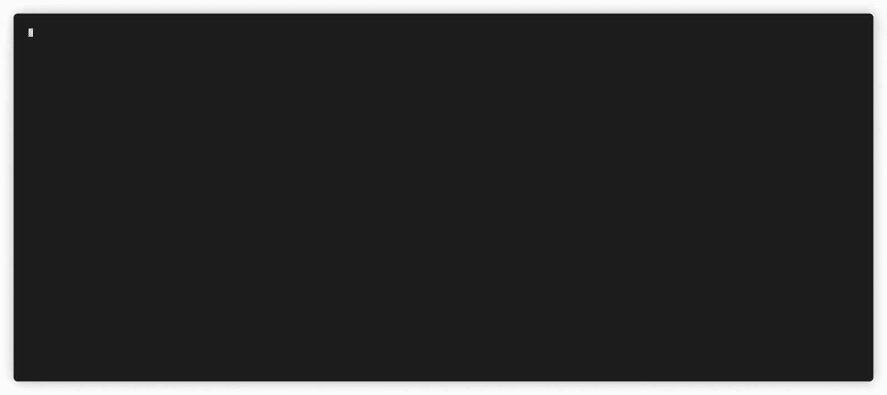
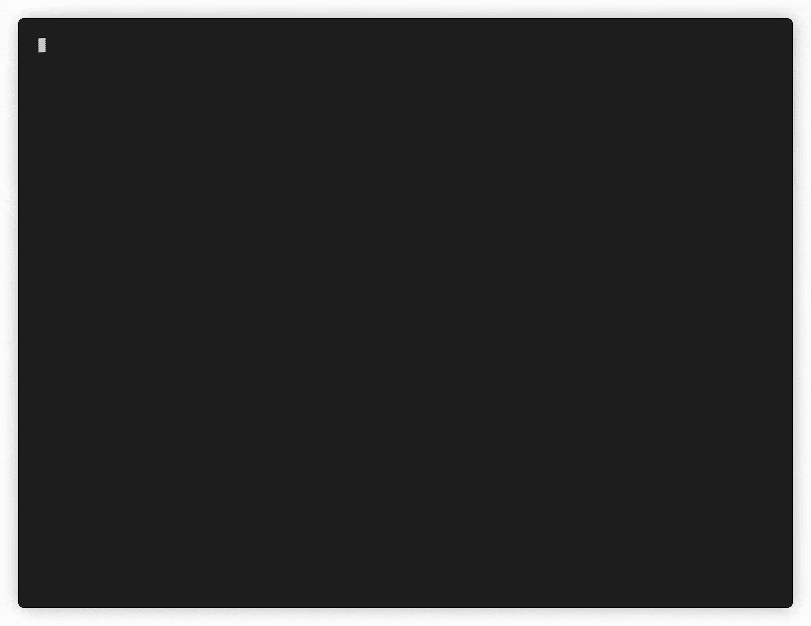

# URLCrazy:生成和测试域的工具

> 原文：<https://kalilinuxtutorials.com/urlcrazy/>

**URLCrazy** 是一款生成和测试域名错别字或变体的工具，用于检测或执行错别字域名抢注、URL 劫持、网络钓鱼和企业间谍活动。

**用例**

*   检测域名错别字抢注者从域名错别字中获利
*   通过注册流行的错别字来保护你的品牌
*   识别将接收发往另一个域的流量的错别字域名
*   在渗透测试期间实施网络钓鱼攻击

**特性**

*   生成 15 种类型的域变体
*   知道超过 8000 个常见的拼写错误
*   支持比特翻转攻击
*   多种键盘布局(qwerty、azerty、qwertz、dvorak)
*   检查域变体是否有效
*   测试是否正在使用域变体
*   估计领域变体流行度

**安装**

*   **从软件包管理器安装**

如果您使用的是 Kali Linux、Ubuntu 或 Debian，请使用:

**$ sudo 安装网址疯狂**

*   **安装最新版本**

参观[https://github.com/urbanadventurer/urlcrazy/releases](https://github.com/urbanadventurer/urlcrazy/releases)

*   **安装当前开发版本**

请注意，最新的开发版本可能不稳定。

**$ git 克隆 https://github.com/urbanadventurer/urlcrazy.git**

*   **安装 Ruby**

URLCrazy 已经过 Ruby 和 2.6 版本的测试。

如果您使用的是 Ubuntu 或 Debian，请使用:

**$ sudo 安装 ruby**

*   **安装捆扎机**

Bundler 为 Ruby 项目提供依赖管理

**$ gem 安装捆绑器**

*   **安装依赖关系**

**$捆绑安装**

或者，如果您不想安装 bundler，下面的命令将安装 gem 依赖项。

**$ gem 安装 JSON colorize async-DNS async-http**

**也可阅读-[droid Files:从 Android 目录中获取文件](https://kalilinuxtutorials.com/droidfiles/)**

**用途**

*   **简单用法**

默认情况下，URLCrazy 会检查超过 2000 个 google.com 的错别字。

**$ urlscrazy google.com**

*   **同人气估计**

**$ URL crazy-p domain.com**

*   **命令行用法**

**用法:**。/urlcrazy【选项】域
**选项**
-k，–键盘=布局选项有:qwerty、azerty、qwertz、dvorak(默认:qwerty)
-p，–人气检查域人气用 Google
-r，–no-resolve 不解析 DNS
-i，–Show-invalid 显示无效域名
-f，–format =类型人类可读或 CSV(默认:人类可读)
-o，–Output =文件输出这个版本是 0.7

**支持的域变体类型**

*   **字符省略**
    *   这些错别字是由漏掉域名的一个字母造成的，一次一个字母。比如[www.goole.com](http://www.goole.com)和[www.gogle.com](http://www.gogle.com)
*   **字符重复**
    *   这些错别字是由重复域名的一个字母造成的。比如[www.ggoogle.com](http://www.ggoogle.com)和[www.gooogle.com](http://www.gooogle.com)
*   **相邻字符交换**
    *   这些错别字是通过交换域名中相邻字母的顺序而产生的。比如[www.googel.com](http://www.googel.com)和[www.ogogle.com](http://www.ogogle.com)
*   **相邻字符替换**
    *   这些错别字是通过将域名的每个字母替换为键盘上紧靠左右的字母而产生的。比如[www.googke.com](http://www.googke.com)和[www.goohle.com](http://www.goohle.com)
*   **双字符替换**
    *   这些错别字是通过将域名中相同的连续字母替换为键盘上紧挨着左右两边的字母而产生的。比如[www.gppgle.com](http://www.gppgle.com)和[www.giigle.com](http://www.giigle.com)
*   **相邻字符插入**
    *   这些错别字是通过在键盘上每个字母的左右两边插入字母而产生的。比如[www.googhle.com](http://www.googhle.com)和[www.goopgle.com](http://www.goopgle.com)
*   **漏点**
    *   这些错别字是由于域名中省略了一个点造成的。例如，www.googlecom 和 [www.googlecom](http://www.googlecom)
*   **条形破折号**
    *   这些错别字是由于域名中省略了一个破折号造成的。比如，[www.domain-name.com](http://www.domain-name.com)变成了[www.domainname.com](http://www.domainname.com)
*   **单数或复数**
    *   这些错别字是通过把一个单数域变成复数而产生的，反之亦然。比如，[www.google.com](http://www.google.com)变成了 www.googles.comT2，[www.games.co.nz](http://www.games.co.nz)变成了 www.game.co.nz[T7](http://www.game.co.nz)
*   **常见拼写错误**
    *   维基百科中超过 8000 个常见的拼写错误。比如，[www.youtube.com](http://www.youtube.com)变成了 www.youtub.comT2，[www.abseil.com](http://www.abseil.com)变成了 www.absail.com[T7](http://www.absail.com)
*   **元音交换**
    *   交换域名中除第一个字母以外的元音字母。比如[www.google.com](http://www.google.com)变成了[www.gaagle.com](http://www.gaagle.com)。
*   **同音字**
    *   超过 450 组发音相同的单词。比如[www.base.com](http://www.base.com)变成了[www.bass.com](http://www.bass.com)。
*   **比特翻转**
    *   域名中的每个字母是一个 8 位字符。该字符被替换为在单次比特翻转后产生的一组有效字符。比如 facebook.com 变成 bacebook.com，dacebook.com，FAE book . com，fabebook.com，facabook.com 等。
*   **同形异义字**
    *   一个或多个看起来与另一个字符相似但不同的字符称为同音异义字符。一个例子是小写的 l 看起来与数字 1 相似，例如 l 对 1。例如，google.com 变成了 goog1e.com。
*   **错误的顶级域名**
    *   例如，[www.trademe.co.nz](http://www.trademe.co.nz)变成了【www.trademe.co.nz】T2 和[www.google.com](http://www.google.com)变成了[www.google.org](http://www.google.org)使用了 19 个最常见的顶级域名。
*   **错误的二级域名**
    *   对顶级域名使用替代的有效二级域名。比如[www.trademe.co.nz](http://www.trademe.co.nz)变成 [www.trademe.ac.nz](http://www.trademe.ac.nz) 和 [www.trademe.iwi.nz](http://www.trademe.iwi.nz)

**支持的键盘布局**

支持的键盘布局有:

*   QWERTY 键盘
*   阿泽蒂
*   标准英语打字键盘的
*   德沃夏克

**域名有效吗？**

URLCrazy 有一个有效的顶级和二级域名的数据库。这些信息来自维基百科和域名注册商。我们通过检查一个域名是否与顶级域名和二级域名相匹配来判断该域名是否有效。例如，[www.trademe.co.bz](http://www.trademe.co.bz)在伯利兹是一个有效的域名，允许任何二级域名注册，但 [www.trademe.xo.nz](http://www.trademe.xo.nz) 不是，因为 xo.nz 在新西兰不是允许的二级域名。

**人气预估**

URLCrazy 开创了从搜索引擎结果数据中估计一个错别字的相对流行度的技术。通过测量一个错别字在网页中出现的次数，我们可以估计当用户键入一个 URL 时，这个错别字会有多流行。

这种技术的固有限制是，一个域名的错别字本身就是一个合法的域名。例如，googles.com 是 google.com 的一个错别字，但它也是一个合法的域名。

例如，考虑以下 google.com 的错别字。

| 数数。 | 排印错误 |
| --- | --- |
| Twenty-five thousand four hundred and twenty-four | gogle.com |
| Twenty-four thousand and thirty-one | googel.com |
| Twenty-two thousand four hundred and ninety | gooogle.com |
| Nineteen thousand one hundred and seventy-two | googles.com |
| Nineteen thousand one hundred and forty-eight | goole.com |
| Eighteen thousand eight hundred and fifty-five | googl.com |
| Seventeen thousand eight hundred and forty-two | ggoogle.com |

**已知问题**

*   **Macos 文件描述符限制**

如果在 Macos 下 DNS 解析失败，这可能是由于小的默认文件描述符限制。

要显示当前文件描述符限制，请使用:

**$ ulimit -a**

要增加文件描述符限制，请使用:

**$ ulimit -n 10000**

**urlscrazy 出场**

*   **卡莉 Linux**
    *   URLCrazy 是 BackTrack 5 以及后来的 Kali Linux 中的默认工具。[https://tools.kali.org/information-gathering/urlcrazy](https://tools.kali.org/information-gathering/urlcrazy)
*   **浏览器黑客手册**
    *   作者是韦德·奥尔康、克里斯蒂安·弗里乔特和米歇尔·奥鲁。
    *   URLCrazy 包含在这个主题的开创性工作的第二章中。

**PTES 技术指南**

渗透测试执行标准(PTES)是一项旨在为执行渗透测试(即安全评估)提供通用语言和范围的标准。URLCrazy 包含在所需工具部分。

[http://www . pentest-standard . org/index . PHP/PTES _ 技术 _ 指南](http://www.pentest-standard.org/index.php/PTES_Technical_Guidelines)

**网络安全工具包**

网络安全工具包是一个可引导的 Linux 发行版，旨在提供对最佳开源网络安全应用程序的轻松访问。[https://www.networksecuritytoolkit.org/](https://www.networksecuritytoolkit.org/)

**参见**

URLCrazy 于 2009 年首次发布，多年来一直是研究域名抢注的最先进的开源工具。从那时起，infosec 社区开发了多种其他工具。

**水务**

DNSTwist 由 Marcin Ulikowski 开发，于 2015 年首次发布。DNSTwist 在当时与 URLCrazy 有显著的功能重叠，并引入了许多新功能。

语言:Python

[https://github.com/elceef/dnstwist](https://github.com/elceef/dnstwist)

**非人类**

URLInsane 是由 Rangertaha 在 2018 年开发的，并声称可以匹配 URLCrazy 和 DNSTwist 的功能。

语言:去吧

[https://github.com/cybint/urlinsane](https://github.com/cybint/urlinsane)

**DomainFuzz**

DomainFuzz 由 monkeym4sterin 于 2017 年开发。语言:节点。射流研究…

[https://github.com/monkeym4ster/DomainFuzz](https://github.com/monkeym4ster/DomainFuzz)

[**Download**](https://github.com/urbanadventurer/urlcrazy/)