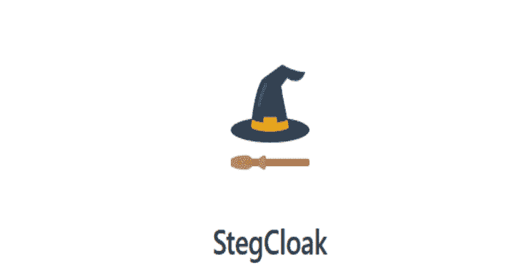

# 隐密斗篷:使用密码在纯文本中安全地隐藏不可见字符的秘密

> 原文：<https://kalilinuxtutorials.com/stegcloak-hide-secrets-with-invisible-characters-in-plain-text-securely-using-passwords/>

[](https://1.bp.blogspot.com/-NIUyPq6hNIs/XuuGQ_OjPFI/AAAAAAAAGqA/xFwQelE5R4wV7CPfKMHleYbOVHqBbwC2wCLcBGAsYHQ/s1600/Capture%25281%2529.png)

**steg coapt**是一个纯 JavaScript 隐写术模块，以函数式编程风格设计，在用特殊的 unicode 不可见字符隐藏秘密之前，通过压缩和加密秘密来隐藏文本中的秘密。

它可以用来安全地为字符串、网页上的不可见脚本、社交媒体上的文本或任何其他隐蔽通信添加水印。完全隐形！。在这篇文章中深入了解它是如何工作的，或者观看我们的[演示](https://www.youtube.com/watch?v=RBDqZwcGvQk)来了解它的功能。

**特性**

*   使用密码和 HMAC 完整性保护您的隐形秘密
*   通过使用 AES-256-CTR 加密不可见的秘密来确保密码安全。
*   在 unicode 字符中使用 6 个不可见的字符，这些字符在网站上随处可见。包括最重要的推文、Gmail、Whatsapp、Telegram、Instagram、脸书等。
*   最大压缩减少有效载荷(LZ，Huffman)。
*   完全不可见，使用零宽度字符代替空格或制表符。
*   超级快！在不到一秒钟的时间内，将用于隐写术的维基百科页面源(800 行和 205362 个字符)隐藏在 3 个单词的封面文本中。
*   将文件隐藏在字符串中可以通过将文件上传到云并隐藏字符串中的链接来实现
*   以纯函数式风格编写。
*   用途–可作为 API 模块、CLI 以及 [Web 界面](https://stegcloak.surge.sh)使用(针对 web workers 进行了优化)。


**安装**

使用 npm，

**$ NPM install-g steg coap**

使用 npm(在您的程序中本地使用)，

**$ npm 安装隐写斗篷**

它是如何工作的？


CLI 用法

*   **隐藏**

**$ steg coal hide**

*   **选项:**

hide[options][secret][cover]

-fc，–fcover 从文件中提取封面文本
-fs，–f secret 从文件中提取秘密文本
-n，–no crypt 如果不需要加密(默认值:false)
-i，–integrity 如果需要额外的防止篡改的安全性(默认值:false)
-o，–将结果输出到输出文件
-c，–Config 配置文件
-h，–help 显示命令的帮助

*   **揭示**

**$ steg 斗篷揭秘**

*   **选项:**

**显示【消息】**

-f，–file 从文件
-cp 中提取消息，–clip 直接从剪贴板中复制消息
-o，–output Stream 将秘密输出到输出文件
-c，–Config 配置文件
-h，–help 显示命令的帮助

**附加支持**

*   **steg coap _ PASSWORD**环境变量如果设置，将默认用作密码
*   **配置文件**支持配置 Stegcloak CLI 和避免提示。[在这里阅读配置文件](https://github.com/KuroLabs/stegcloak/wiki/Stegcloak---configuration-file)

**API 使用**

```
const StegCloak = require('stegcloak');

const stegcloak = new StegCloak(true, false);  // Initializes with encryption true and hmac false for hiding

// These arguments are used only during hide

// Can be changed later by switching boolean flags for stegcloak.encrypt and stegcloak.integrity
```

什么是 HMAC，我需要它吗？

HMAC 是针对篡改文本和验证所接收的消息是否实际上是由预期发送者发送的而采取的附加指纹安全步骤。如果数据是通过 WhatsApp、Messenger 或任何社交媒体平台发送的，这已经被处理了！但是，如果您在程序中使用 steg cape 来安全地传输和检索，则可以启用此选项，steg cape 会处理它。

**隐藏**

`stegcloak.hide(secret,password,cover) -> string`

```
const magic = stegcloak.hide("Voldemort is back", "mischief managed", "The WiFi's not working here!");

// Uses stegcloak.encrypt and stegcloak.integrity booleans for obfuscation

console.log(magic);  // The WiFi's not working here!
```

**揭示**

`stegcloak.reveal(data, password) -> string`

```
const secret = stegcloak.reveal(magic, "mischief managed");

// Automatically detects if encryption or integrity checks were done during hide and acts accordingly

console.log(secret); // Voldemort is back
```

**重要**

隐写斗篷没有解决爱丽丝-鲍勃-沃顿问题，它只有在人们不寻找它的时候才是强大的，并且它真的很好地帮助你实现这一点，鉴于它在网络上的无形属性！它可以安全地用于论坛、不可见推文、社交媒体等的水印。当您知道有人正在积极地嗅探您的数据时，请不要使用它——通过数据分析工具查看 unicode 字符。在这种情况下，即使秘密编码无法破译，事实是监狱长(中间人)知道一些秘密通信发生了，因为他会注意到一个不寻常的特殊隐形字符的数量。

**资源**

为了深入了解和理解在隐写术中使用零宽度字符，参考了以下论文。

*   Milad Taleby Ahvanooey、Li、、Ahmed Raza Rajput 和陈

**现代文本隐藏、文本隐写分析和应用:比较分析**

*   塔莱比·阿瓦诺伊，米拉德&李，&侯，君&达纳·马兹雷，哈桑&张，景。

**AITSteg:一种创新的文本隐写技术，用于通过社交媒体隐藏传输文本消息。IEEE 接入**

[**Download**](https://github.com/kurolabs/stegcloak)