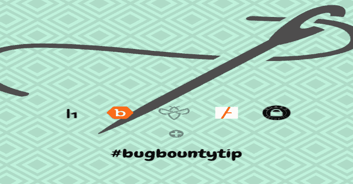
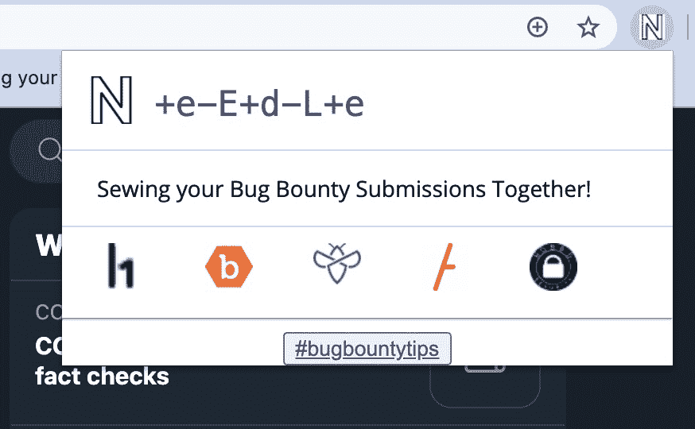

# Needle:即时访问各种平台上的 Bug Bounty 提交仪表板

> 原文：<https://kalilinuxtutorials.com/needle/>

Needle 是唯一的 chrome 扩展，你可以一键访问你在不同平台上提交的 bug。不需要创建任何书签，在地址栏输入，并有麻烦的自动完成问题。

**目前包含的列表是-**

*   哈克龙
*   Bugcrowd
*   integriti
*   是的，我们黑

**并添加了支持 as-**

*   H1 公开披露的报告。(来自 h1.nobbd.de)
*   链接到#bugbountytips(通过@TheBugBot)

**截图**

单击上面的任何一项，它都会打开该站点的 bug 提交仪表板。前任。对于 h1:[https://hackerone.com/bugs](https://hackerone.com/bugs)

**用途**

将 repo 作为 zip 文件，通过“Load unpacked extension”提取并加载 needle 文件夹。(先在 chrome 中启用 dev 模式吧。)

仅供参考，请确保您已经登录到您的帐户，否则该网站将重定向登录。

[**Download**](https://github.com/humblelad/Needle)