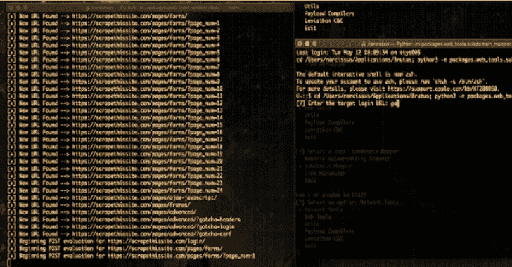

# 你应该购买廉价手机的 6 个理由

> 原文：<https://kalilinuxtutorials.com/6-reasons-you-should-buy-a-budget-phone/>

围绕预算工具的想法有一个不幸的误解。人们认为它们价格低是因为它们制造成本低，而且所用的材料质量差。这在过去可能是对的，但我们现在已经过了那个阶段。

当新型号进入市场时，大多数品牌都会降低价格。此外，由于智能手机的整体消费者基础在全球范围内有所增加，他们可以降低费率，但仍能盈利。所以不要因为价格标签而看不起一个设备，你应该寻找一个价格标签低的设备。这有很多原因。

## **旗舰被高估了**

别误会，像素和 iPhones 都很棒。他们给你最好的和最新的功能。但鉴于目前的市场状况，这些功能不会保持很长时间。竞争如此激烈，以至于一款旗舰手机推出后不久，就有五款功能相同或相似的廉价手机进入市场。

以指纹扫描仪为例。几年前，这个独特的功能让 iPhone 5S 如此吸引人。然后它出现在大受欢迎的 Nexus 手机中。现在，[这个特性](https://www.mtechreview.com/best-budget-smartphones-with-fingerprint-sensor/)无处不在。这个不断发展的行业不会停滞不前。

还有，旗舰值得吗？想想吧。Pixel 3a 和 Pixel 4 在价格上有着天壤之别。但鉴于 Pixel 3a 现在运行最新的 Android 版本，你在它身上获得的体验与 Pixel 4 非常相似。同系列的新型号通常升级较少，但价格会大幅上涨。这看起来合理吗？对我们来说不是。

## **钱包上的灯**

这是不言而喻的——预算设备更容易放在你的钱包里。你可能会每天使用智能手机进行许多活动，但你愿意在一件物品上花很多钱吗？你能付多少钱是有限度的。

通常，如果你的旧手机丢失、损坏或被盗，你会立即得到一部新机。不是每个人都能在短时间内购买高价商品。这就是廉价手机拯救你一天的地方。

此外，如果你在一个设备上花费更少，你可以在其他事情上节省更多——甚至可能是多个设备。买一部便宜的手机，存点钱，然后再买一个 tab！

## **种类更广**

如果你根据价格范围搜索手机，你会意识到这一点。与高端手机相比，中档和经济型手机的种类要多得多。然而，并不是所有的预算设备都那么好。

这里有个问题。您不会在一个设备中获得所有内容。详情看评论。在 ConvergedDevices.net，大卫·卡斯塔诺已经审查了许多预算设备。他在文章中解释了这些品牌在中档手机上使用的策略。他说，“这些品牌专注于一两个主要功能，并对它们的设备进行分类。例如，你可能得到一个很长的电池寿命，但性能一般，或者，一个很好的相机，但电池寿命低。你挑你更需要的。”因此，你得到了一个伟大的和平均的功能组合，这使得一个整体令人满意的设备。

## **易于维护！**

好吧，廉价手机的确制造成本更低。但这并不是因为它们质量低。五年前只有一家供应商提供这项技术，现在其他三家供应商都可以提供。这导致了价格竞争。这使得手机制造商可以讨价还价，以更低的成本获得材料。

此外，当该技术或组件的更新版本可用时，对旧版本的需求就会减少。这也导致价格下降。

你为什么需要知道这个？嗯，较低的材料费用意味着修理你的设备花费较少。而这些被认为“非优质”的材料往往更耐用，也更容易获得。你认为哪个后盖容易破裂——塑料的还是玻璃的？(我们都知道答案)。

## **聚焦电池**

一些中档手机的电池寿命非常好。有些电池容量很大(超过竞争对手)，有些电池容量一般，但寿命较长。没人知道为什么品牌倾向于给廉价手机增加大电池。但廉价手机通常内存较低，处理器功能较弱。这就是为什么即使在平均容量下，电池也能使用更长时间的原因。

是的，很多高端和旗舰手机也有很好的电池寿命，但它们的价格更高。如果你比较电池寿命，你会在中端类别中看到好得多的选项。

## **厌倦了？再拿一个！**

这是个人观点，但我们相信许多用户都会同意这一点:

*   使用同一个设备很容易让人厌倦。系统升级并不总是给手机带来很多变化。
*   更新的设备上市太频繁了。

即使您的设备没有受到任何损坏，您也可能想要更换它。这可能不合理，但我们很多人确实厌倦了使用相同的设备。如果你在一个上花了很多钱，你可能不能很快得到另一个。

即使你对此不感到厌烦，你的手机也会很快开始显得陈旧。虽然这并不适用于 iPhone 用户，但这正是谷歌现在正在做的事情。手机被设计成只能在 2 到 3 年内获得软件更新。过一段时间，当你的软件太过时，你就不能使用更新的应用了。更不用说，你将停止获得安全更新和漏洞修复。这使得您的设备容易受到恶意软件的攻击。有几款[手机不会获得 Android 10 更新](https://www.bgr.in/top-products/android-10-update-these-xiaomi-samsung-realme-phones-will-not-get-the-latest-os-is-yours-on-the-list-864790/)。如果一两年后你不得不买一台新的，为什么不把它控制在预算之内呢？

## **最后**

当你降低预算时，你有更多的选择。然而，你不必降低你的期望。一定要做好调查——找出你想要的，尽可能多地阅读评论。你会了解利弊。即使是旗舰也不是没有瑕疵。但一些品牌在平衡预算智能手机方面做得很好，可以提供很好的性价比！