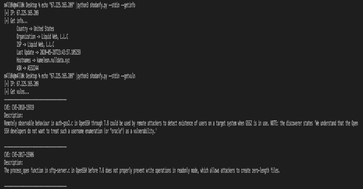

# Shodanfy.py:获取端口、漏洞、信息、横幅

> 原文：<https://kalilinuxtutorials.com/shodanfy-py/>

**Shodanfy.py** 是一款获取端口、漏洞、信息、横幅、..etc 对于任何带 Shodan 的 IP(没有 apikey！没有速率限制！)

**用途**

**又读-[针:即时访问你在各种平台上的 Bug 赏金提交仪表盘](https://kalilinuxtutorials.com/needle/)**

【10】 python 3 shodanfy . py 选项]
e . g:
python 3 shodanfy . py 111 . 111 . 111
python 3 shodanfy . py 111 . 111 . 111–get ports
python 3 shodanfy . py 111 . 111 . 111–get vun
python 3 shodanfy-什么
**【echo】或 cat IPS . txt | python 3 shodanfy . py–stdin[options]**
e . g:
echo " 111 . 111 . 111 | python 3 shodanfy . py–stdin
echo " 111 . 111 . 111 . 111 | python 3 shodanfy . py–stdin–proxy 127 . 0 . 0 . 1[0-9]{ 1.3 }。[0-9]{ 1.3 }。[0-9]{1，3 } | python 3 shodanfy . py–stdin–共享

[**Download**](https://github.com/m4ll0k/Shodanfy.py)