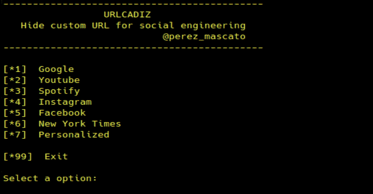

# URLCADIZ:为社会工程生成隐藏 URL 的简单脚本

> 原文：<https://kalilinuxtutorials.com/urlcadiz/>

一个简单的脚本来为社会工程生成一个隐藏的 url。

**安装(在 Kali Linux 2020.2 上测试):**

**git 克隆 https://github.com/PerezMascato/URLCADIZ
sudo pip 3 安装 pyshorteners
CD URLCADIZ
python 3 URLCADIZ . py**

**也可阅读-[git monitor:一个 Github 扫描系统，根据规则](https://kalilinuxtutorials.com/gitmonitor/)寻找泄露的敏感信息**

**演示**

[https://www.youtube.com/embed/LwVc4-JkdfA?feature=oembed&enablejsapi=1](https://www.youtube.com/embed/LwVc4-JkdfA?feature=oembed&enablejsapi=1)

**免责声明**

未经双方事先同意，使用 URLCADIZ 攻击目标是非法的。最终用户有责任遵守所有适用的地方、州和联邦法律。开发人员不承担任何责任，也不对本程序造成的任何误用或损坏负责。

[**Download**](https://github.com/PerezMascato/URLCADIZ)