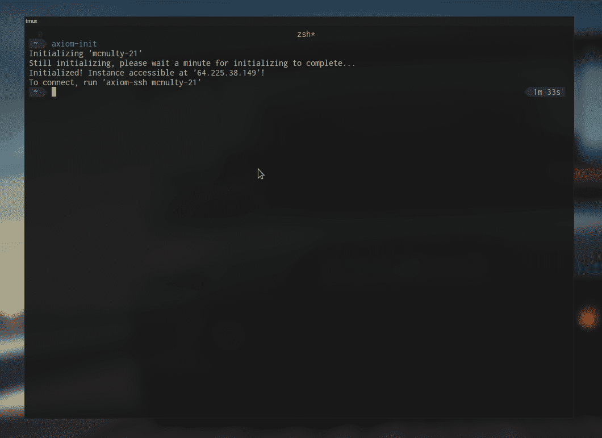
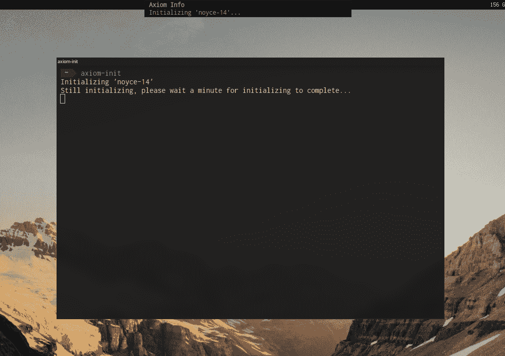
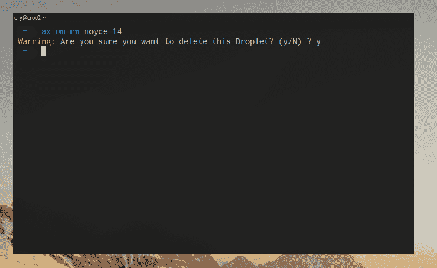
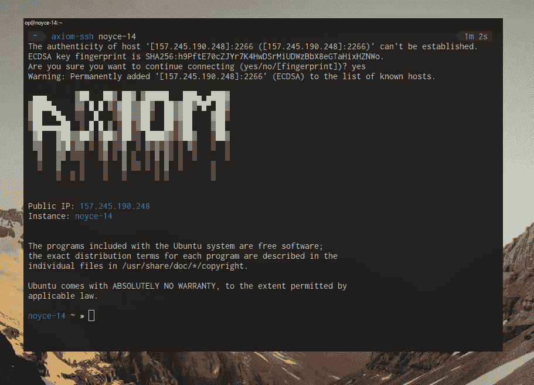
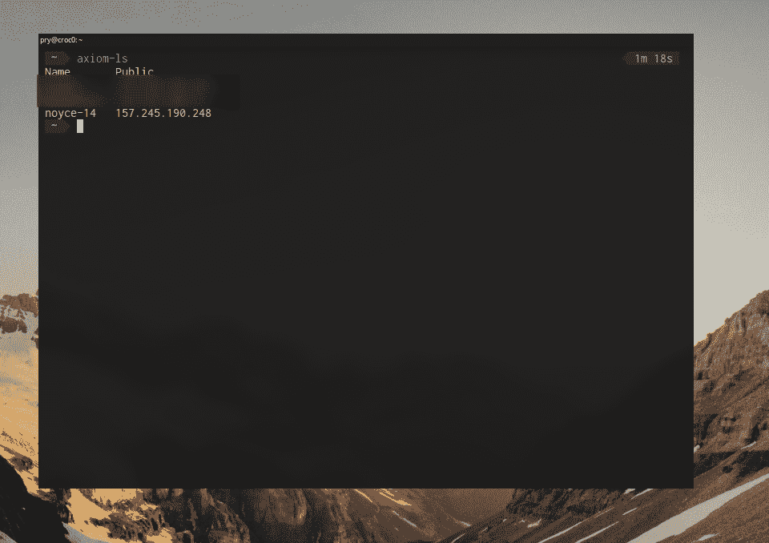
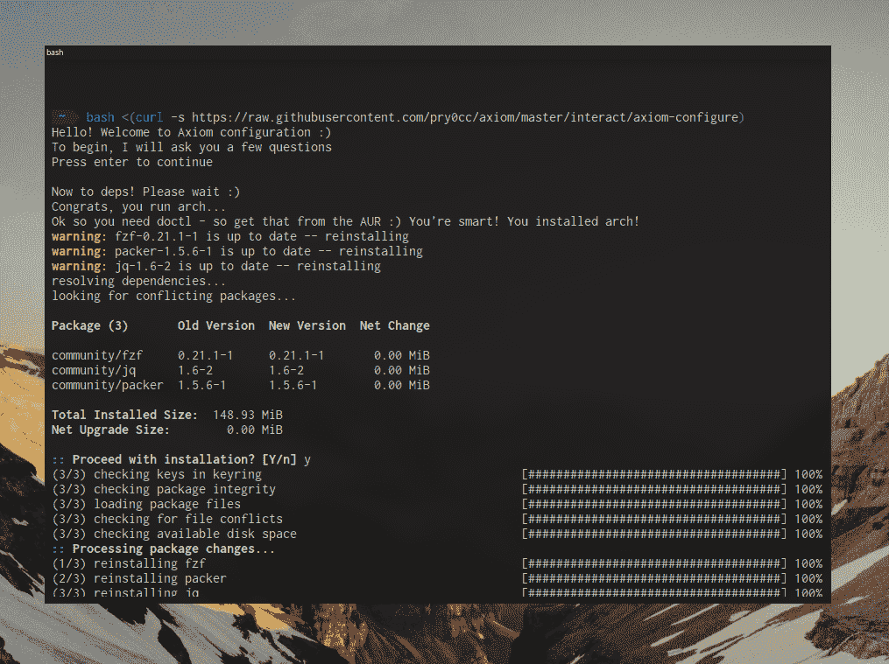
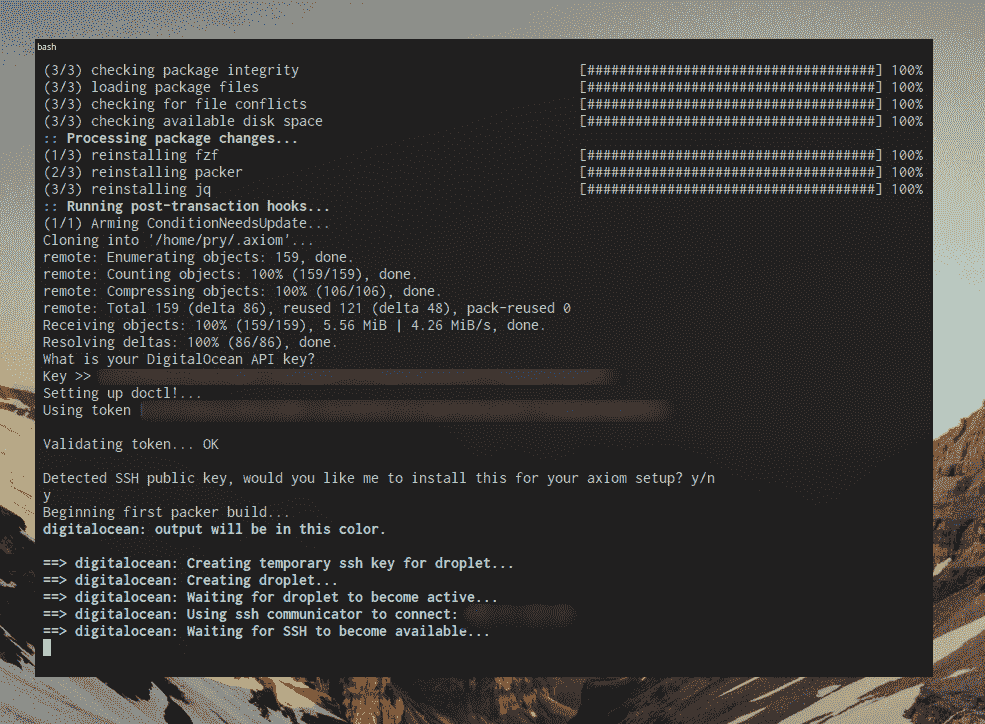
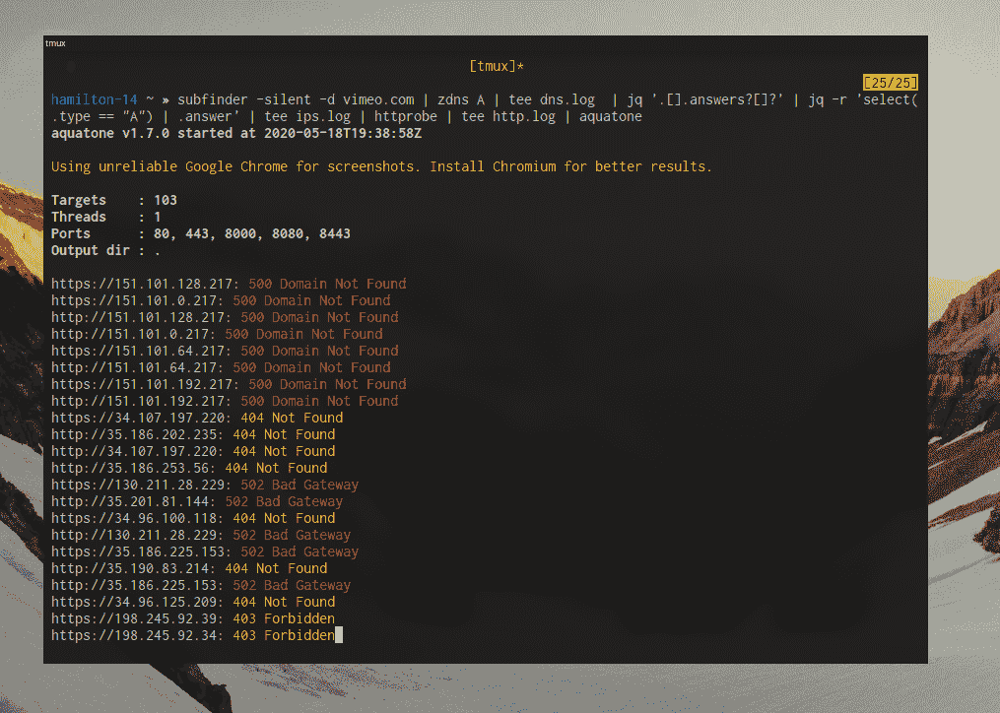

# Axiom:红队队员和臭虫赏金猎人的动态基础设施工具包

> 原文：<https://kalilinuxtutorials.com/axiom/>

Project **Axiom** 是一组用于管理 bug bounty 和 pentesting 的小型动态基础设施设置的实用程序。

Axiom 现在非常适合一个人的小团队，而不需要你花费太多去管理**。**我的意思是，如果你负责任地使用，一个月不到 5 美元，下面是我的推荐链接，可以免费使用两个月。阅读更多关于底层经济学的内容。

**敲打一个内胆**

(你将需要 curl，Ubuntu 20.04 上默认不安装，如果你得到一个“找不到命令”的错误，运行 **`sudo apt update && sudo apt install curl` )**

**bash<(curl-s https://raw . githubusercontent . com/pry 0 cc/axiom/master/interact/axiom-configure)**

当我第一次开始尝试运行我自己的动态云黑客设置时，我注意到工具和生态系统的阵列是如此之大，并且有 50 种不同的方式来做几乎所有的事情，我是否在服务器启动时使用 ansible 进行配置，我是否用 packer 加载 ansible？我需要为映像构建配置多少？有一些“红队”的基础设置工具和辅助设备，但它们都需要大量的跑腿工作才能起飞。感觉在很多情况下，人们只是发布他们使用的东西，而没有任何帮助/文档。

我面临的另一个情况是，在查看其他 pentesting 发行版时，它们对我在日常 bug bounty 和 red team 工作中使用的许多常用工具的支持很少。像 Kali 这样的发行版对于传统的 netsec 来说是很棒的，但是对于 bug bounty 和大型基础设施项目来说，它们缺少很多优秀的东西

特别是围棋工具，许多非常棒的小型围棋实用程序，如汤姆·哈德森、T2、卢克·斯蒂芬斯和 T4 的杰作。Bug bounty 已经被 bash one liners 中常见的花哨而聪明的 Go 实用程序淹没了。

建立你自己的“黑客 vps ”,捕捉外壳，运行枚举工具，扫描，让事情在 tmux 窗口的后台运行，曾经是一个下午的项目。您将手动运行并安装您需要的所有工具，配置您的 ZSH，配置 vim，配置 tmux。

有了 Axiom，您只需要运行一个命令来设置，然后您可以使用 Axiom toolkit 脚本来启动和关闭您的新黑客 VPS。

运行`axiom-init`并观察一个新实例在不到 2 分钟的时间内被创建，它包含您可能想要或需要的一切，以便为您的 pentest 运行侦察，在 netcat 中捕获一个 shell，或者您可能想要通过 VPN(axiom 附带了对 openvpn、`axiom-deploy openvpn`之类的一键部署配置文件的支持，您很快就有了一个完全配置的 openvpn 服务器。

当你完成时，只需用`axiom-rm your-instance-12`快速确认对话框关闭实例，你的盒子就没了！运行它不再花费你任何东西。

带有`notify-send`钩子的 init 脚本可以在启动你选择的机器时完全无标题地运行。

在这个工具包中，我试图尽可能简单地设置你自己的云黑客箱，只需要你尽可能少的接触。

为了帮助您，我创建了一组 bash 包装器作为开始。axiom 基础映像是由 bug 猎人和精益团队开发的，用于快速初始化和处理基础设施(实际上已经预装了他们日常使用的工具)。

`axiom-ssh host`用于连接到您的机器，要查看您有哪些机器可用，请使用`axiom-ls`

**带 Axiom-Configure 的单行设置**

**又读-[Recox:网络侦察](https://kalilinuxtutorials.com/recox/)主脚本 **

**安装**

*   **数字海洋 API 键**

要获得数字海洋 API 密钥，你可以注册我的推荐链接[https://m.do.co/c/bd80643300bd](https://m.do.co/c/bd80643300bd)并获得 100 美元的免费积分来试用它！

我也得到一点回扣，所以如果你喜欢这个项目，请使用我的链接🙂

[https://m.do.co/c/bd80643300bd](https://m.do.co/c/bd80643300bd)

黑客快乐！🙂

**敲打一个内胆**

(你需要 curl，Ubuntu 20.04 默认不安装，如果你得到一个“命令未找到”的错误，运行`sudo apt update && sudo apt install curl`)

**bash<(curl-s https://raw . githubusercontent . com/pry 0 cc/axiom/master/interact/axiom-configure)**

**操作系统支持**

我正试图添加尽可能多的不同操作系统来支持，主要是针对*nix，如 MacOS、Ubuntu、Debian、Arch Linux，将来可能还有 Kali。

这里的主要问题是依赖性。

*   支持 MacOS
*   Ubuntu 支持
*   debian–半支持–计划中
*   arch Linux–半支持–计划中
*   卡利-未知

**依赖关系**

*   封隔器-用 v1.5.6 测试
*   fzf–用 0.21.1 测试
*   doctl–用 1.43 测试
*   jq–用 1.6 测试(最新的更好)

打包在任何地方都很容易，尽管是手动的(获得正确的版本真的很重要，如果版本太旧，那么 var-file 语法将会失败。

fzf 也无处不在，doctl 可能有点棘手(在 ubuntu、ew 上使用 snap 来做这件事)。jq 需要是最近的，他们更新了命令语法！

**趣味截图**

一个有趣的开箱即用的一行程序，它用 subfinder 获取子域名，查找并解析它们，传递已解析的 HTTP prob 响应以截图供进一步查看！

**经济学**

有些人来找我，他们说，撬，数字海洋是这么多比使用一个德迪或裸机，你为什么要使用它，你怎么能说它便宜？

而是你如何使用它。很多黑客爱好者或 bug 赏金人只是兼职，他们可能是周末战士，也可能是学生。因此，他们的预算可能是有限的，每月支付 5-20 美元的 VPS 听起来并不特别诱人，尤其是如果你只需要“我现在需要一个公共 IP 来捕捉外壳”的问题。

有了 Axiom，你可以上下旋转盒子，并且只为你使用的东西付费。您可以运行如下命令:

**axiom-init 哈迪斯–restore =哈迪斯&axiom-ssh–tmux&axiom-RM 哈迪斯-f**

假设您有一个以前的 hades 机器备份，使用`axiom-backup hades`命令执行，所有 go 二进制文件、ZSH 设置、工作目录文件和 tmux/nvim 配置都将被备份。使用上面的一个命令行程序，它将初始化一台新机器，恢复 hades 备份，使用 tmux 进行 ssh，然后当您分离时，终止实例。

如果你计划做 2 个小时的 bug bounty，并且你在周末的黑客会议上使用这个命令，使用 Axiom 的默认实例大小，这将花费你总共$0.014。现在，我不知道你，但考虑到如果我是一名学生，我可以洗一次别人的车，有几个月的 VPS 时间。相当不错。

**预装历史功能**

既然我们有 ZSH，有一些非常糟糕的向后查找功能，我计划构建一个广泛的一行 ZSH 历史，这样你就可以`ctrl+r`搜索一个命令，得到一个已经在通配符 bug bounty 平台上测试过的演示命令。

这样，你只需键入“sub[up arrow]”，就可以在一个全新的盒子上自动完成一个巨大的子 finder one liner，这给机器带来了一种家的感觉，可以大大提高你的生产率。

**部署配置文件**

这是一项正在进行的工作，我对部署配置文件的设想是，在您的机器已经启动并运行后，快速部署您可能想要部署的“可选附加组件”。比如 openvpn 和 covenant(两者都有现成的设置脚本)。

**实例概要选择器**

给超级用户一点小提示，我已经添加了`axiom-select`和`axiom-connect`脚本。Axiom-select 允许您选择一个实例名，并将其存储在~/中名为‘profile . JSON’的状态文件中。公理/目录。当您初始化新服务器时，也会出现此选择。现在，选择一个实例后，您可以从任何地方运行`axiom-connect`,并进入 SSH shell。这对于创建到你的 VPS hackbox 的“透明”连接非常有用，并且可以连接到用于打开新终端窗口的按键绑定。

由于 notify-send 的高度集成，您基本上可以随意使用整个生态系统(也即将变得更好)。

提示，如果你运行的是 MacOS，把这个放到你的 bin 路径中:

**`notify-send`
#！/bin/bash osascript -e "显示标题为\ " $ 1 \ " \ "的通知\ " $ 2 \】**

**所有命令–解释**

*   **公理-备份**

`axiom-backup`是一个用于备份你选择的实例的命令，该命令的工作方式如下:

**公理-备份<实例>**

这将在后端执行的操作是，针对`op`用户的`~/`目录运行 rsync 传输。这种 rsync 传输将排除当前的主目录和预装文件。因此，您将只转移您放在主目录中的文件。我建议制作一个`work`目录，存放你可能在里面积累的任何文本文件/侦查战利品。你可以根据需要定期运行`axiom-backup <instance>`，并近乎实时地同步。

这样，如果您需要快速关闭该实例，您可以这样做，并且可以使用下一个命令快速恢复。

*   **公理-恢复**

`axiom-restore`将恢复一个先前备份的盒子(如上图命令所示)。备份箱存储在`~/.axiom/boxes/<box-name>`中，如果您想在恢复时将自定义文件添加到您的箱中，您可以在`~/.axiom/boxes/<box>`中的目录下创建一个自定义文件/文件夹结构。一种情况是同步定制的单词表。我正在考虑将来也备份$GOPATH/bin 路径，这样你就可以同步定制的二进制文件和 go 工具。如果你觉得这是个好主意，请打开一个问题！

`axiom-restore`是另一个使用轮廓选择器的命令。当你使用`axiom-init`命令初始化一台新机器时，该实例的名称将被输入到`~/.axiom/profile.json`文件中。该文件描述了配置文件选择器的状态。您可以使用`axiom-select`命令修改“选择”的机器(见下文)。

`axiom-restore`命令的典型示例如下:

**axiom-init
axiom-restore original box-13
#选择不同的盒子
axiom-select another box-5
axiom-restore original box-13**

*   **公理-选择**

`axiom-select`是负责执行手动轮廓选择的命令。当您运行`axiom-select <instance>`时，它会将配置文件设置为该实例，并且当您运行`axiom-connect`、`axiom-restore`和`axiom-deploy`等命令时，它会记住您指的是哪个实例。

当您初始化一个新实例时，配置文件选择器会自动设置为该新实例。但是，如果您想在另一个机器上部署某些东西，该怎么办呢？或者，如果您想将一个配置从一台机器恢复到另一台机器，该怎么办？

**公理-选择实例-32**

*   **axiom-deploy**

`axiom-deploy`是一个可用于在机器初始化后部署配置文件的命令。您可能不想要开箱即用的 openvpn 服务器或 covenant team 服务器，但是您可能想在以后部署它！

使用`axiom-deploy`，一旦您选择了一个实例，您就可以如下部署概要文件:

**axiom-选择实例-32
axiom-部署 openvpn**

然后就这样了！当你的描述文件被安装的时候，它将从这里完全不用手🙂我将感谢任何想在这里添加更多配置文件的人，在我写这篇文章的时候，只有`covenant`和`openvpn`，但是我们没有理由不写一个 Wireguard 安装配置文件或一个 cobalt strike c2 配置文件！

如果你想要一些例子，看看~/。axiom/profiles/openvpn/manifest . JSON 文件

*   **公理-更新**

非常简单，它只是为 axiom 运行一个完整的系统范围的更新。Cd 放入~/。axiom/ directory，运行 git pull。轻松点。

*   **公理构建**

一旦用`axiom-update`更新了 axiom 设置，就可以用`axiom-build`重建图像。定期构建新映像很重要，因为可能会有安全改进或新功能！

*   **公理连接**

`axiom-connect`是另一个可以用于 SSH 到 Axiom 实例的命令。然而，这个命令的有趣之处在于它绝对不需要参数，它将只读取当前选择配置文件中的任何实例，并且它将连接！

就我个人而言，我用`termite -e axiom-connect`将它映射到一个 keybinding，所以在我初始化了一个新实例之后，我可以打开一个新的到机器的 SSH 连接(就像它的本地！).

*   **axiom-ls** 的缩写形式

`axiom-ls`用于列出您当前的实例(以及您正在运行的任何其他 droplets)。

这不需要争论。

*   **公理-rm**

`axiom-rm`用于移除一台机器，如果您有一台已初始化的机器，您可以使用`axiom-rm <instance>`将其完全移除

*   **axiom VPN**

`axiom-vpn`用于连接到部署 openvpn 服务器(使用部署脚本)。

运行`axiom-deploy openvpn`之后，您可以运行`axiom-vpn <instance>`，它将下载 openvpn 连接文件，并对其运行 openvpn。

*   **公理-配置**

`axiom-configure`是一个可以用于配置的命令，理想情况下它应该只运行一次，如果你犯了一个错误，搞乱了你的配置，我建议运行`sudo rm -rf ~/.axiom/`,然后运行 bash one liner 来安装在^^之上

这个命令将安装 deps，下载并克隆 axiom 存储库，将 interact/文件夹添加到您的$PATH 中，然后运行您的第一个构建。您将需要一个数字海洋 API 密钥。

*   **axiom-ssh**

`axiom-ssh`用于连接到您的机器，您可以按如下方式使用:

**axiom-ssh <实例>axiom-ssh<实例>–tmux**

如果您使用`--tmux`标志，它会将您带入 axiom box 上名为`main`的 tmux 会话。但是，如果 tmux 会话已经存在，它将简单地重新连接您。这对于在旅途中或在一个可能连接不良的地方工作(飞机！)或运行多个任务。

**贡献者**

以下是对这个项目做出贡献的了不起的人的名单！感谢名单上的每一个人！如果我错过了你，只要为这个自述做一个公关，我会确保你被添加！这里有一些了不起的人🙂

*   navericknerd
*   t3chbits
*   百烈刹
*   猴子先生
*   razcodesdotdev
*   icyphox
*   丹·GITC
*   myrdn
*   cgbolo
*   ericho
*   也
*   kpcyrd
*   s0mdev(做了 logo！！！)

**迄今为止的套餐**

*   用有感光胶的金属板做套色印刷的方法
*   http probe
*   子 finder
*   资产查找器
*   重力
*   masscan
*   sn0int
*   kxss
*   japan quarterly 日本季刊
*   秘书
*   gobuster
*   nmap
*   waybackurls
*   积累
*   反毛刺
*   Golang(设置、路径配置、最新版本)
*   哈克罗勒
*   zdns
*   zmap
*   ffuf
*   高斯
*   dirb
*   subjack
*   sqlcmap
*   f 探针
*   getjs
*   openvpn
*   projectdiscovery 混沌-客户端
*   项目发现原子核
*   混沌探索计划
*   项目发现洗牌
*   dnsprobe
*   dnsvalidator
*   urlprobe
*   oh-my-zsh
*   tmux
*   masscan
*   亚属
*   代理链 w/ Tor 设置
*   剧烈摇摆
*   码头工人
*   metasploit
*   达尔福克斯
*   subjack

[**Download**](https://github.com/pry0cc/axiom)