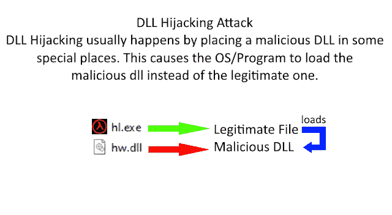

# evil DLL–用于 DLL 劫持的恶意 DLL(反向外壳)生成器

> 原文：<https://kalilinuxtutorials.com/evildll/>

[ Generator For DLL Hijacking")](https://1.bp.blogspot.com/-vhhAPnZ91tQ/XwKgLK3TsHI/AAAAAAAAGyI/JlH8A_d2jfsDhvcej_CDnsRQk6PmXirjACLcBGAsYHQ/s1600/EvilDLL%25281%2529.png)

**EvilDLL** 是一个用于 DLL 劫持的恶意 DLL(反向 Shell)生成器。

**特性**

*   使用 Ngrok.io 反向 TCP [端口转发](https://www.kitploit.com/search/label/Port%20Forwarding)
*   自定义端口转发选项(LHOST，LPORT)
*   包含 DLL [劫持](https://www.kitploit.com/search/label/Hijacking)的示例(半衰期启动器文件)
*   在 Win7 (7601)、Windows 10 上测试

**要求**

*   Mingw-w64 编译器:apt-get 安装 mingw-w64
*   Ngrok Authtoken(用于 TCP 隧道):在:[https://ngrok.com/signup](https://ngrok.com/signup)注册
*   您的身份验证令牌可在您的仪表板上找到:[https://dashboard.ngrok.com](https://dashboard.ngrok.com/)
*   安装您的 auhtoken:。/ngok 认证令牌<your_authtoken></your_authtoken>

**免责声明**

未经双方事先同意，使用 EvilDLL 攻击目标是非法的。最终用户有责任遵守所有适用的地方、州和联邦法律。开发人员不承担任何责任，也不对本程序造成的任何误用或损坏负责。

[**Download**](https://github.com/thelinuxchoice/evildll)