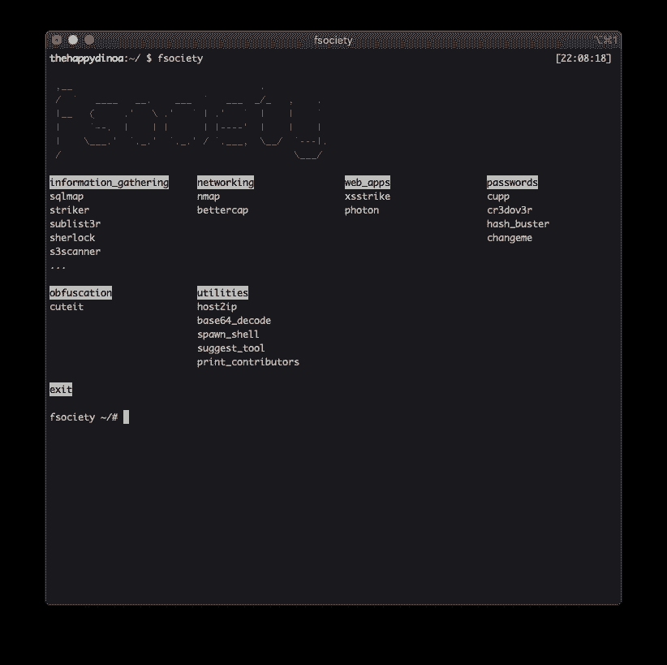

# FSociety:模块化渗透测试框架

> 原文：<https://kalilinuxtutorials.com/fsociety/>

FSociety 是一个模块化的渗透测试框架。

**安装**

**pip 安装速度**

**更新**

**pip 安装–升级速度**

**用途**

用法:fsociety [-h] [-i] [-s]

一个渗透测试框架

**可选参数:**

-h，–帮助显示此帮助信息并退出
-i，–info 获取 fsociety 信息
-s，–建议一个工具

**开发**

git 克隆 https://github.com/fsociety-team/fsociety.git。[dev]"

**码头工人**

**坞站拉 fsocietem/fsociety
坞站运行-it fsocietem/fsociety**

[**Download**](https://github.com/fsociety-team/fsociety)