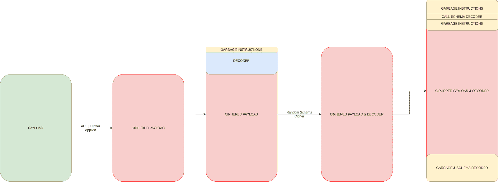
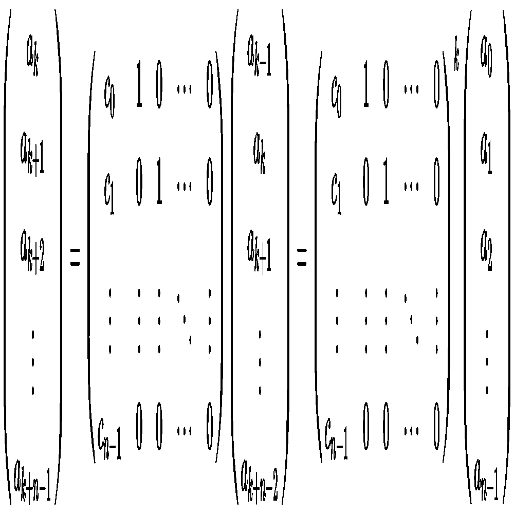

# SGN:用于攻击性安全目的的多态二进制编码器

> 原文：<https://kalilinuxtutorials.com/sgn/>

[](https://1.bp.blogspot.com/-W7N3I_9okH0/XwKj-UYe36I/AAAAAAAAGys/KzbNrSI4aXYs9hjfGaMasbiDC-APN26TACLcBGAsYHQ/s1600/SGN.gif)

SGN 是一个多态二进制编码器，用于攻击性的安全目的，例如生成静态不可检测的二进制有效载荷。它使用一个附加反馈环来编码给定的二进制指令，类似于 [LSFR](https://en.wikipedia.org/wiki/Linear-feedback_shift_register) 。

这个项目是对 golang 的[原始 Shikata ga nai](https://github.com/rapid7/metasploit-framework/blob/master/modules/encoders/x86/shikata_ga_nai.rb) 的重新实施，有许多改进。

**如何？&为什么？**

对于攻击性安全社区，shikata ga nai 编码器的原始实现被认为是最好的 shellcode 编码器(直到现在)。但是多年来，安全研究人员发现了静态检测编码器的几个陷阱(相关工作 [FireEye 文章](https://www.fireeye.com/blog/threat-research/2019/10/shikata-ga-nai-encoder-still-going-strong.html))。这个项目的主要动机是创建一个更好的编码器，它将给定的二进制编码到与完全随机的数据相同的程度，并且不可能检测到解码器的存在。在 [keystone](http://www.keystone-engine.org/) 汇编程序库的帮助下，实现了以下改进。

*   64 位支持。`Finally properly encoded x64 shellcodes !`
*   新的更小的解码器存根。`LFSR key reduced to 1 byte`
*   使用伪随机模式编码的存根。`Decoder stub is also encoded with a psudo random schema`
*   无可见回路条件`Stub decodes itself WITHOUT using any loop conditions !!`
*   解码器存根混淆。`Random garbage instruction generator added with keystone`
*   安全寄存器选项。`Non of the registers are clobbered (optional preable, may reduce polimorphism)`

**安装**

*   **依赖关系:**

唯一需要的依赖项是 keystone 和 capstone 库。为了方便安装拱顶石和拱顶石图书馆，请查看下表；

| 操作系统（Operating System） | 安装命令 |
| Ubuntu/Debian | sudo apt-get 安装 libcapstone-dev |
| Arch Linux | 苏多·帕克曼的拱顶石 |
| 苹果个人计算机 | brew 安装 keystone 顶石 |
| 一种男式软呢帽 | sudo yum 安装拱顶石 |
| 窗口/所有其他… | [查看此处](https://www.capstone-engine.org/documentation.html) |

keystone 库的安装在某些情况下可能有点棘手。如果您的数据包管理器有任何问题，请点击此处。

那就去拿吧，ツ

去找 github.com/egebalci/sgn

**用途**

如果你想了解幕后发生的事情`( ͡° ͜ʖ ͡°)_/¯`，使用`-v`是非常简单的

**用法:sgn【选项】**
-a int
二进制体系结构(32/64)(默认为 32)
-asci
生成完整的 asci 可打印有效负载(需要很长时间才能生成)
-badchars 字符串
不使用十六进制格式中指定的坏字符(\x00\x01\x02…)
-c int
对二进制编码的次数(增加整体大小)(默认为 1)
-h
-o 字符串
编码输出二进制名称
-普通解码器
不编码解码器存根
-安全
不修改寄存器值
-v 更详细的输出

**用作库**

警告！！SGN 软件包仍在开发中，以获得更好的性能和一些改进。大多数功能可能会有变化。

```
package main

import (
	"encoding/hex"
	"fmt"
	"io/ioutil"

	sgn "github.com/egebalci/sgn/lib"
)

func main() {
	// First open some file
	file, err := ioutil.ReadFile("myfile.bin")
	if err != nil { // check error
		fmt.Println(err)
		return
	}
	// Create a new SGN encoder
	encoder := sgn.NewEncoder()
	// Set the proper architecture
	encoder.SetArchitecture(64)
	// Encode the binary
	encodedBinary, err := encoder.Encode(file)
	if err != nil {
		fmt.Println(err)
		return
	}
	// Print out the hex dump of the encoded binary
	fmt.Println(hex.Dump(encodedBinary))

} 
```

**执行流程**

下图是编码器的基本工作流程图。但是请记住，在每次迭代中，垃圾指令、解码器和模式解码器的大小、位置和顺序都会发生变化。



就概率空间而言，LFSR 本身非常强大。对于更多的多态，垃圾指令被附加在未编码的原始有效载荷的开头。下图显示了 LFSR 特征多项式的伴随矩阵，并将种子表示为列向量，k 步后 Fibonacci 配置中的寄存器状态。

[**Download**](https://github.com/EgeBalci/sgn)