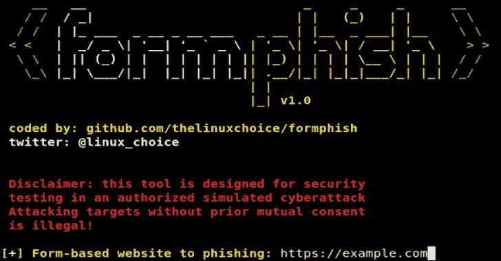

# 表单钓鱼–基于表单的自动网络钓鱼网站

> 原文：<https://kalilinuxtutorials.com/formphish/>

**Formphish** 是一个自动[钓鱼](https://www.kitploit.com/search/label/Phishing)的基于表单的网站。该工具可以自动检测基于 html 表单的网站上的输入，以创建网络钓鱼页面。

**特性**

*   自动检测设备
*   通过 Ngrok 进行端口转发
*   IP 跟踪器

**依赖关系(Httrack 和 Beautifulsoup)**

**apt-get-y install httrack
python-m pip install-r requirements . txt**

**用途**

**git 克隆 https://github.com/thelinuxchoice/formphish
CD formphish
bash formphish . sh**

**免责声明**

未经双方事先同意，使用 Formphish 攻击目标是非法的。最终用户有责任遵守所有适用的地方、州和联邦法律。开发人员不承担任何责任，也不对本程序造成的任何误用或损坏负责。

[**Download**](https://github.com/thelinuxchoice/formphish)