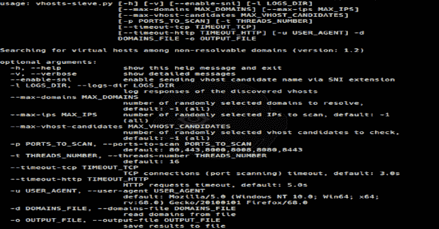

# VHosts-Sieve:在不可解析的域中搜索虚拟主机

> 原文：<https://kalilinuxtutorials.com/vhosts-sieve/>

[](https://1.bp.blogspot.com/-J9NzKTm_kiI/XwKqj-5oj0I/AAAAAAAAGzU/-Zt7TYtk5YIeewdoVAozQyNegfH2hlm4ACLcBGAsYHQ/s1600/Vhosts-Sieve%25281%2529.png)

VHosts-Sieve 是在不可解析的域中搜索虚拟主机。

**安装**

**git 克隆 https://github.com/dariusztytko/vhosts-sieve.git
pip 3 install-r vhosts-sieve/requirements . txt**

**用途**

获取子域列表(例如，使用[聚集](https://github.com/OWASP/Amass))

**$ amass enum-v-passive-o domains . txt-d example.com-d example-related.com**

使用 vhosts-sieve.py 查找虚拟主机

```
$ python3 vhosts-sieve.py -d domains.txt -o vhosts.txt
Logs dir: None
Max domains to resolve: -1
Max IPs to scan: -1
Max vhost candidates to check: -1
Ports to scan: [80, 443, 8000, 8008, 8080, 8443]
SNI enabled: False
Threads number: 16
Timeout HTTP: 5.0s
Timeout TCP: 3.0s
Verbose: False
User agent: Mozilla/5.0 (Windows NT 10.0; Win64; x64; rv:68.0) Gecko/20100101 Firefox/68.0

Resolving 12 domains...

Scanning 1 IPs...

Finding vhosts (active IPs: 1, vhost candidates: 7)...

Saved results (4 vhosts) 
```

输出文件包含以下格式的已发现虚拟主机

**165.22.264.81 80 http 假 zxcv.example.com 301
165 . 22 . 264 . 81 443 https 假 zxcv.example.com 200 dev.example.com 200 admin.example.com 401**

每行包含以下信息:

*   国际电脑互联网地址
*   通道数
*   检测到的协议(HTTP 或 HTTPS)
*   “停止”标志(请参见[它是如何工作的](https://github.com/dariusztytko/vhosts-sieve#how-it-works)
*   发现的虚拟主机列表(带有响应状态代码)

**日志**

可以记录发现的虚拟主机的响应( *-l* 、*–logs-dir*选项)。

它是如何工作的？

要发现虚拟主机，请执行以下步骤:

1.  输入文件中的域被解析为 IP 地址(IPv4)
2.  根据解析结果，域分为两组:
    *   解析的域
    *   未解析的域(**候选虚拟主机**
3.  扫描解析域的 IP 地址以查找 web 端口(默认值:80、443、8000、8008、8080、8443)
4.  虚拟主机候选在每个开放端口上进行验证

**虚拟主机候选验证**

虚拟主机候选验证按如下方式执行:

1.  发送带有随机(无效)虚拟主机(主机标头)的请求
2.  响应被保存为参考
3.  将候选虚拟主机的响应与参考响应进行比较
    *   如果响应为“相似”，则跳过虚拟主机候选
    *   否则(响应不是“相似”)，虚拟主机候选被标记为有效的虚拟主机
4.  为了增加成功的机会，会发送以下额外的标头:
    *   x-转发对象:127.0.0.1
    *   x-始发 IP: [127.0.0.1]
    *   x 远程 IP: 127.0.0.1
    *   x 远程地址:127.0.0.1
5.  此外，如果发现太多有效的虚拟主机(例如，任何子域都是有效的)，验证将停止，结果将标记为“已停止”

请注意，不考虑响应状态代码。主要的假设是，除了参考响应之外，其他都值得详细分析。甚至 4xx 和 5xx 响应。

**SNI**

对于 HTTPS 协议，通过主机报头和 SNI (TLS 扩展)发送虚拟主机候选名称可能很有用。这可能允许通过配置不良的 SNI 代理。使用*–enable-sni*选项启用 sni 模式。

**优化**

对于拥有数千个子域的大型网络，检查所有候选虚拟主机可能需要数小时。以下选项可用于加速该过程:

*   可以限制默认扫描的端口 80、443、8000、8008、8080、8443，例如仅 443(-p，–扫描端口)
*   可以增加线程的数量(-t，–threads-number)
*   可以限制要解析的域的数量(–max-domains)
*   可以限制要扫描的 IP 地址数量(–max-IPS)
*   可以限制要检查的候选虚拟主机的数量(–max-vhost-candidates)
*   超时可以减少(–time out-TCP，–time out-http)

此外，建议使用-v (verbosity)选项来连续查看结果。

[**Download**](https://github.com/dariusztytko/vhosts-sieve)