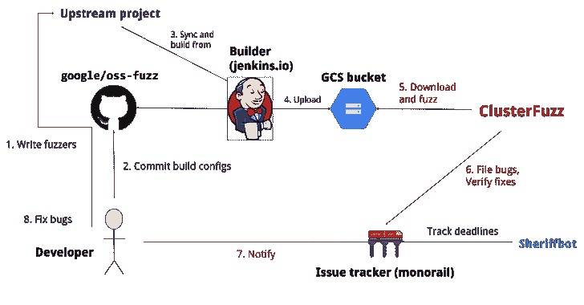
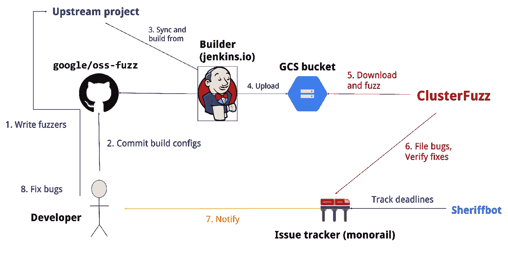

# Open 模糊:开源软件的持续模糊化

> 原文：<https://kalilinuxtutorials.com/oss-fuzz/>

在与[核心基础设施倡议](https://www.coreinfrastructure.org/)的合作中，open 模糊旨在通过将现代模糊技术与可扩展的分布式执行相结合，使通用开源软件更加安全和稳定。

[模糊测试](https://en.wikipedia.org/wiki/Fuzz_testing)是一种众所周知的揭露软件编程错误的技术。许多这些可检测的错误，像[缓冲区溢出](https://en.wikipedia.org/wiki/Buffer_overflow)，可能有严重的安全隐患。谷歌通过部署 Chrome 组件的[引导进程内模糊化](https://security.googleblog.com/2016/08/guided-in-process-fuzzing-of-chrome.html)发现了[数千个](https://bugs.chromium.org/p/chromium/issues/list?q=label%3AStability-LibFuzzer%2CStability-AFL%20-status%3ADuplicate%2CWontFix&can=1)安全漏洞和稳定性错误，我们现在希望与开源社区分享这项服务。

我们支持 [libFuzzer](http://llvm.org/docs/LibFuzzer.html) 、 [AFL](https://lcamtuf.coredump.cx/afl/) 和 [Honggfuzz](https://github.com/google/honggfuzz) fuzzing 引擎结合[杀毒软件](https://github.com/google/sanitizers)，以及 [ClusterFuzz](https://github.com/google/clusterfuzz) ，一个分布式 Fuzzer 执行环境和报告工具。

目前支持 C/C++、Rust、Go 代码。由 LLVM 支持的其他语言也可以工作。它支持模糊 x86_64 和 i386 版本。

**概述**

**文档**

阅读我们的[详细文档](https://google.github.io/oss-fuzz)来学习如何使用它。

**也可理解为-[攻击者群体预测工具:预测攻击者群体的工具](https://kalilinuxtutorials.com/attacker-group-predictor/)**

**奖杯**

截至 2020 年 6 月，已在 [300](https://github.com/google/oss-fuzz/tree/master/projects) 个开源项目中发现超过[20000](https://bugs.chromium.org/p/oss-fuzz/issues/list?q=-status%3AWontFix%2CDuplicate%20-component%3AInfra&can=1)个 bug。

**博文**

*   2016-12-01-[宣布 OSS-Fuzz:开源软件持续 fuzzing】](https://opensource.googleblog.com/2016/12/announcing-oss-fuzz-continuous-fuzzing.html)
*   2017-05-08-[OSS-模糊:五个月后，奖励项目](https://opensource.googleblog.com/2017/05/oss-fuzz-five-months-later-and.html)
*   2018-11-06—[OSS-模糊的新篇章](https://security.googleblog.com/2018/11/a-new-chapter-for-oss-fuzz.html)

[**Download**](https://github.com/google/oss-fuzz)