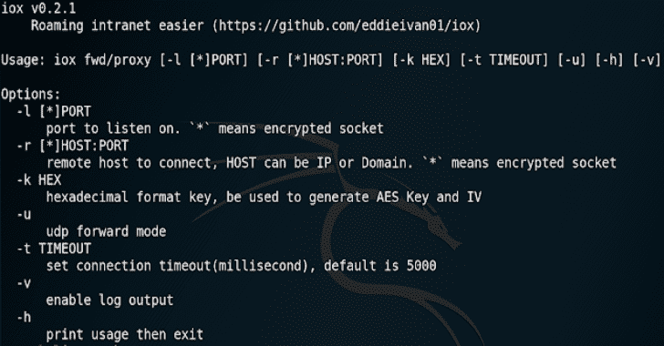

# IOX:端口转发和内部网代理工具

> 原文：<https://kalilinuxtutorials.com/iox/>

**是端口转发&内网代理的工具，就像 **`lcx` / `ew`** 一样，但是更好。**

 ****为什么要写？**

`lcx`和`ew`很牛逼，但是可以改进。

第一次用的时候，这些复杂的参数我已经记不清很久了，比如 **`tran, slave, rcsocks, sssocks...`。**工作模式明确，为什么他们要这样设计参数(尤其是`ew`的 **`-l -d -e -f -g -h` )**

此外，我认为网络编程逻辑可以优化。

例如，当运行`**lcx -listen 8888 9999**`命令时，客户端必须先连接到`:8888`，然后连接到 **`:9999`，在`iox`** 中，两个端口的顺序没有限制。当运行`**lcx -slave 1.1.1.1 8888 1.1.1.1 9999**`命令时，`**lcx**`将串行连接两台主机，但是并发连接效率更高，就像`iox`一样。

更重要的是，`**iox**`提供流量加密功能。其实你可以把`iox`当简单的影袜用。

并且`**iox**`还提供 UDP 流量转发。

当然，因为`**iox**`是用 Go 写的，静态链接程序有点大，raw 程序是 2.2 MB(UPX 压缩后 800KB)

**功能**

*   流量加密(可选)
*   人性化 CLI 选项
*   逻辑优化
*   UDP 流量转发

**用途**

你可以看到，所有的参数都是一致的。`**-l/--local**`表示监听本地端口；`**-r/--remote**`表示连接到远程主机

*   **两种模式**
    *   前轮驱动(Front-Wheel Drive)

监听`**0.0.0.0:8888**`和`**0.0.0.0:9999**`，在 2 个连接之间转发流量

**。/iox fwd -l 8888 -l 9999

对于 lcx:
。/lcx -listen 8888 9999**

监听`0.0.0.0:8888`，将流量转发到`1.1.1.1:9999`

**。/iox FWD-l 8888-r 1.1.1.1:9999**

**对于 lcx:
。/lcx-tran 8888 1.1.1.1 9999**

连接`1.1.1.1:8888`和`1.1.1.1:9999`，正向连接两者之间

**。/iox FWD-r 1.1.1.1:8888-r 1.1.1.1:9999**

**对于 lcx:
。/lcx-从 1.1.1.1 8888 1.1.1.1 9999**

*   **代理**

在`0.0.0.0:1080`上启动 Socks5 服务器

**。/iox proxy -l 1080

用于 ew:
。/ew -s ssocksd -l 1080**

在受控主机上启动 Socks5 服务器，然后转发到 internet VPS

VPS 转发`**0.0.0.0:9999**`到`**0.0.0.0:1080**`

您必须成对使用，因为它包含一个简单的协议来控制连接返回

**。/iox proxy-r 1.1.1.1:9999
。/iox proxy -l 9999 -l 1080 //通知，两个端口依次为

为
。/ew -s rcsocks -l 1080 -e 9999
。/ew-s RS socks-d 1.1.1.1-e 9999**

然后连接内部网主机

**# proxy chains . conf
# socks 5://1 . 1 . 1 . 1:1080
$ proxy chains rdesktop 192 . 168 . 0 . 100:3389**

**启用加密**

例如，我们将内部网中的 3389 端口转发到我们的 VPS

**//be-控制器主机
。/iox FWD-r 192 . 168 . 0 . 100:3389-r * 1 . 1 . 1 . 1:8888-k 656565

//我们的 VPS
。/iox FWD-l * 8888-l 33890-k 656565**

这很好理解:被控主机和我们 VPS:8888 之间的流量会被加密，预共享的密钥是‘AAA’，`iox`会用它生成种子密钥和 nonce **(一般情况下，nonce 不应该被重用。但考虑到 iox 的加密只是为了绕过 IDS，为了不分配额外的空间，TCP 流加密会重用 nonce)** ，然后用 Xchacha20 加密(v0.3 版本用 Xchacha20 替换 AES-CTR)

所以，`*`应该成对使用

**。/iox FWD-l 1000-r * 127 . 0 . 0 . 1:1001-k 000102
。/iox FWD-l * 1001-r * 127 . 0 . 0 . 1:1002-k 000102
。/iox FWD-l * 1002-r * 127 . 0 . 0 . 1:1003-k 000102
。/iox proxy-l * 1003-k 000102

$ curl google.com-x socks 5://127 . 0 . 0 . 1:1000**

使用`iox`作为简单的影子袜子

//服务器
。/iox proxy-l * 9999-k 000102

//SSL ocal
。/iox FWD-l 1080-r * VPS:9999-k 000102

**UDP 转发**

只需要添加 CLI 选项`-u`

**。/iox FWD-l 53-r * 127 . 0 . 0 . 1:8888-k 000102-u
。/iox FWD-l * 8888-l * 9999-k 000102-u
。/iox FWD-r * 127 . 0 . 0 . 1:9999-r 8.8.8.8:53-k 000102-u**

**注意:**进行多级连接时，`Remote2Remote-UDP-mode`必须最后启动，也就是上面例子中的第 3 条命令

UDP 转发可能会有与您预期不同的行为。其实现在的 GitHub 上，只有转发本地监听器到远程主机的例子，所以我只能用我的理解来实现

你可以在源代码中找到原因。如果您有任何想法，欢迎 PR / issue。

[**Download**](https://github.com/EddieIvan01/iox)**