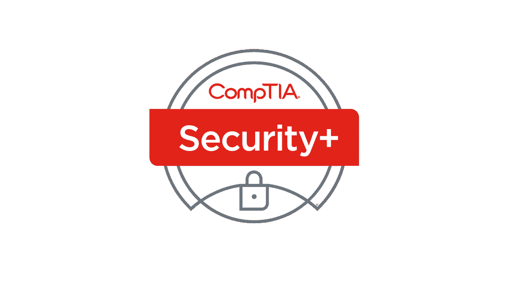

# 为什么考卷是你 CompTIA SY0-501 考试的最佳学习材料？

> 原文：<https://kalilinuxtutorials.com/why-are-exam-dumps-the-best-study-material-for-your-comptia-sy0-501-test/>

如果你想帮助解决一些信息安全问题，基本的网络安全技能和技术是非常重要的。要成为一名合格的专家，能够有效地执行这些任务，你必须拥有该领域的最新技能。它们是风险缓解、入侵检测以及风险和威胁管理。好在你可以获得所有这些重要的知识，甚至更多，这要感谢 CompTIA 为安全+证书提供的 [CompTIA A+ 220-1002 模拟试题](https://www.certbolt.com/220-1002-dumps)。

在本文中，我们将帮助您探索所有可以为您提供适当的网络安全技能和知识的考试细节。我们将为您提供参加该认证考试之前需要了解的所有信息，以及 braindumpscan 在考试准备过程中的重要性。

**一些关键的 CompTIA SY0-501 考试细节**

[220-1001 考试:CompTIA A+认证实践考试](https://www.certbolt.com/comptia-a-plus-practice-test)旨在评估考生在相关领域的技能和知识，如渗透测试、威胁检测、漏洞扫描概念、风险管理最佳实践，以及使用相关工具和技术支持组织的安全。该测试还评估他们实施各种安全系统和网络框架设计概念的能力。在参加 [CompTIA SY0-501](https://ethicalhackersacademy.com/collections/comptia-1/products/comptia-security) 之前，建议你有 2 年或 2 年以上的管理员实践经验，主要关注安全。

准备和参加 [CompTIA 认证考试](https://www.certbolt.com/comptia-certification-dumps)的整个过程主要是为了获得 CompTIA Security+认证。这意味着你必须达到适当的及格分数，即 100-900 分制中的 750 分。当谈到考试功能时，还必须提到它持续 90 分钟，由总共 90 个问题组成，采用多项选择和基于表现的形式。注册 SY0-501 测试将花费你 349 美元。参加该考试之前需要学习的技能如下:

*   威胁、攻击和漏洞；
*   技术和工具；
*   建筑与设计；
*   身份和访问管理；
*   密码学和公钥基础设施；
*   [网络+认证实践考试考试(N10-007)](https://www.certbolt.com/comptia-network-plus-exam-dumps)

您可以选择以下语言参加认证考试:英语、简体中文、日语或葡萄牙语。至于注册程序，可在皮尔逊 VUE 公司的网站上查阅。

**考试转储是你最好的准备工具**

在为 Certbolt.com 做准备时，头脑风暴是最有效的准备资源。因为它们是来源于过去考试的真题，并且预计在未来的版本中也会再次出现，所以学习这些材料有助于你自信地面对真题。知道你已经经历和掌握的是那些你将被要求在实际考试中回答的问题会有所不同。有了有效的转储，考生们甚至不必死记硬背整个教学大纲。

这个准备工具可以通过使用实践测试来加强。在经历了几次考试之后，你也可以选择一些练习题来看看这些材料是否对你有所帮助，以及它们是否为你现在在 CertBolt 上阅读[做好了准备。](https://www.certbolt.com/sy0-501-dumps)

**结论**

CompTIA Security+是一项全球公认的认证，旨在验证持有者的基本技能和知识。你只需要通过 SY0-501 考试就可以获得这个证书。因此，在你成为认证专家的过程中，在准备阶段要充分利用练习测试和考试资料。