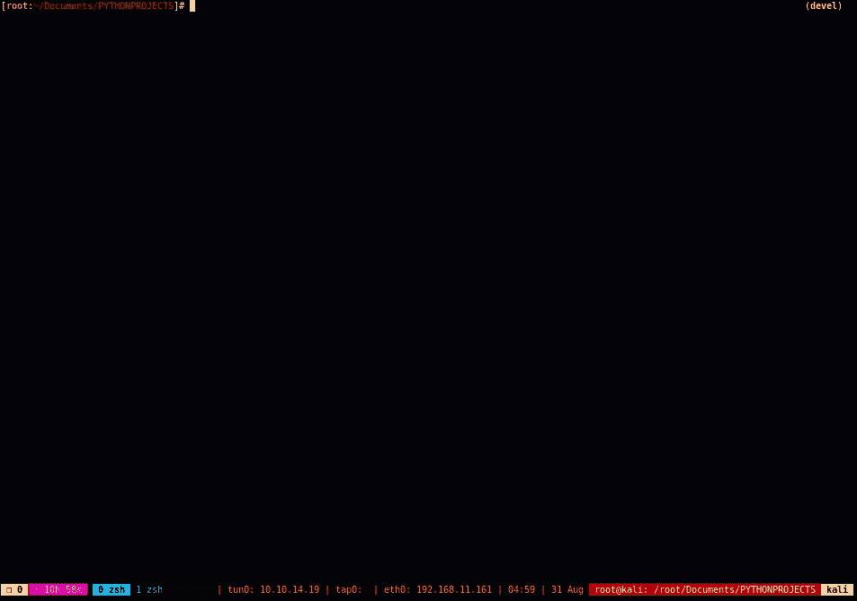
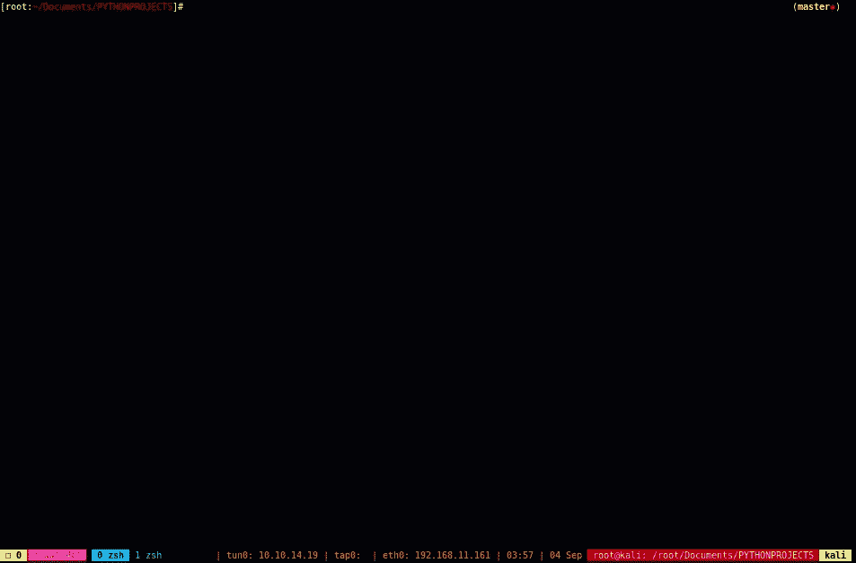

# 侦察:根据 Nmap 结果列举一个目标

> 原文：<https://kalilinuxtutorials.com/recon/>

**Recon** 根据 Nmap 结果列举目标。

**特性**

*   O.G. Auto-Recon 的目的是使初始信息收集阶段自动化，然后尽可能多地基于这些结果进行列举。
*   这个工具是为 CTF 氏症设计的，可能相当吵。(不是最具隐秘意识的工具……)
*   这个项目中的所有工具都符合 OSCP 考试规则。
*   可以在[配置](https://github.com/Knowledge-Wisdom-Understanding/recon/blob/master/config/config.yaml)设置中轻松修改命令语法。$变量名应该保持不变。
*   如果检测到虚拟主机路由， **O.G. Auto-Recon** 会将主机名添加到您的/etc/hosts 文件中，并继续枚举新发现的主机名。
*   DNS 枚举被忽略。com。欧盟委员会。英国域名等。因为这个工具是为 CTF 设计的，例如，“黑盒子”。它会努力找到最多的。如果检测到 dns 服务器，则为 htb 域..
*   该项目使用的各种独立和定制工具来枚举基于 nmap 结果的目标。
*   所有命令和输出都记录在 users ~/中的报告文件夹中。本地/共享/自动恢复/报告目录，使用命名上下文“report/IP-ADDRESS/”，类似于 report/10.10.10.108/

**安装**

**cd /opt
git 克隆 https://github.com/Knowledge-Wisdom-Understanding/recon.git
CD recon
chmod+x setup . sh
。/setup.sh
python3 setup.py 安装**

**用途**

**用法**:autorecon-t 10 . 10 . 10 . 10 . 10

**一个信息收集和枚举框架**

**可选参数** :
-h，–帮助显示此帮助消息并退出
-t TARGET，–TARGET TARGET
要扫描的单个 IPv4 目标
-F，–FUZZ 自动 FUZZ 找到以结尾的 URL。php for params
-v，–Version Show Current Version
-f FILE，–FILE FILE 要扫描的 IPv4 目标的文件
-w [WEB]，–WEB[WEB]
获取 IPv4 地址的开放端口，然后只枚举
Web &和 Dns 服务。-t，–必须指定目标。
-w，–web 将 URL 作为参数。即 python 3
recon . py-t 10 . 10 . 10 . 10-w secret
-I { http，httpcms，ssl，sslcms，aquatone，smb，dns，ldap，removecolor，oracle，source，sort_urls，proxycms，fulltcp，topports，remaining，searchsploit，peaceout，ftpAnonDL，winrm} [{http，httpcms，ssl，sslcms，aquatone，smb
-s {http，httpcms，ssl，sslcms，aquatone，smb，dns，ldap，removecolor，oracle，source，sort_urls，proxycms，fulltcp，topports，remaining，searchsploit，peaceout，ftpAnonDL，winrm} [{http，httpcms，ssl，sslcms，aquatone，smb，dns，ldap，removecolor，oracle，source，sort_urls，proxycms，fulltcp，top–强力 ssh、smb、ftp 或 http。-t，
–目标是必需的。一次只能提供一个协议。对于 ssh，当没有用户或
密码作为选项提供时，在启动密码破解之前，将首先枚举有效用户
。
-p 端口，–PORT PORT 端口用于强力参数。如果未指定端口，
将使用默认端口
-u 用户，–用户用户单个用户名进行暴力破解，对于 SSH，如果未指定
用户，将默认使用
单词列表/用户名. txt 和暴力破解用户名
-U 用户，–用户用户
尝试暴力破解的用户名列表。尚未
实现的
-P 密码，–密码密码
要尝试的密码列表。对于 SSH 是可选的，默认情况下将使用
wordlists/probable-v2-top 1575 . txt。

要扫描单个目标并基于 nmap 结果进行枚举，请执行以下操作:

autorecon -t 10.10.10.10

要枚举具有较大单词列表的网站

*   如果不想指定目录，只需输入' '作为–web 的参数

autorecon-t 10 . 10 . 10 . 10-w secret
autorecon-t 10 . 10 . 10 . 10-w some directory
autorecon-t 10 . 10 . 10 . 10 . 10-w "

通常，在第一次运行时，您应该只指定-t–target 选项(autorecon -t 10.10.10.10)。在使用-s–service 选项指定特定模块之前，您必须已经运行了 topports 模块。例如，如果您真的想在第一次运行时跳过所有其他模块，并且只在 topports 之后扫描 web，您可以这样做，

autorecon-t 10 . 10 . 10 . 10-s top ports DNS http http CMS SSL SSL CMS sort _ URLs aquatone source

或者完全跳过 web 枚举，但扫描所有其他内容。

autorecon-t 10 . 10 . 10 . 10-I DNS http http CMS SSL SSL CMS sort _ URLs aquatone source

剩余的服务模块也依赖于 topports 和/或 fulltcp 模块。现在，如果目标很慢，你可以跳过进行完整的 tcp 扫描。但是，请注意，UDP nmap 扫描目前与 fulltcp 模块捆绑在一起，因此跳过 fulltcp 模块将导致丢失一些 UDP 枚举。

扫描+枚举 ips.txt 文件中的所有 IPv4 地址

autorecon -f ips.txt

要模糊所有找到的 php urls 的参数，可以使用不带参数的-F–Fuzz 标志。

autorecon-t 10 . 10 . 10 . 10–模糊

默认端口 22 上的强力 ssh 用户，如果找到唯一有效的用户，强力密码

autorecon -t 10.10.10.10 -b ssh

同上，但用于端口 2222 上的 ssh 等…

autorecon-t 10 . 10 . 10 . 10-b ssh-p 2222

要忽略某些被扫描的服务，您可以指定-i，–ignore 标志。
指定要忽略的多个服务时，服务必须用空格分隔。如果您已经运行了此模块，请仅忽略顶部端口，因为大多数其他模块都依赖于 nmap 的初始顶部端口输出。所有可用的模块如下:

http，httpcms，ssl，sslcms，aquatone，smb，dns，ldap，oracle，source，sort_urls，proxycms，fulltcp，topports，remaining，searchsploit，peaceout，ftpAnonDL，winrm

autorecon-t 10 . 10 . 10 . 10-I http
autorecon-t 10 . 10 . 10 . 10-I http SSL
autorecon–target 10 . 10 . 10 . 10 . 10–忽略完整的 tcp http

您还可以指定只希望扫描的服务，类似于–ignore 选项，-s，–service 选项将只扫描指定的服务。请注意，在使用-s，–服务选项之前，您必须已经运行了顶端 nmap 扫描，因为大多数模块都依赖于 nmap 的输出。

autorecon -t 10.10.10.10 -s 剩余端口

autorecon-t 10 . 10 . 10 . 10-s http httpcms
autorecon-t 10 . 10 . 10 . 10-维修 oracle

**重要**

*   请务必查看[配置](https://github.com/Knowledge-Wisdom-Understanding/recon/blob/master/config/config.yaml)文件，以满足您所有的定制需求
*   setup.sh 中包含了所有必需的非默认 kali linux 依赖项。

**演示**

该程序旨在用于 kali linux。如果您注意到一个错误或有一个功能请求。请创建一个问题或提交一个提取请求。谢谢！

**有趣的事实**

*   我知道有另一个非常相似的同名项目自动侦察。
*   最初，这个项目是以 bash 脚本 [Auto-Recon-Bash-Version](https://github.com/Knowledge-Wisdom-Understanding/Auto-Recon) 开始的，很快就失去了维护方面的控制。
*   不要扭曲它😈自动侦察这个名字没被咬过。🍏
*   bash 版本的原始第一次提交[自动重检原始提交](https://github.com/Knowledge-Wisdom-Understanding/Auto-Recon/commit/2c03459fa0c9844a66ba58097b326340bb4ef662)
*   Tib3rius 第一次参与他的项目 [Tib3rius 自动侦察](https://github.com/Tib3rius/AutoRecon/commit/a08eeed021df9025e15361914c7332ef1f37b04e)
*   巧合的是，两个项目都是 2019 年 3 月 1 日创作的。
*   别担心博扎克。😎

**免责声明**

使用 recon.py 测试或利用网站而没有事先相互一致可被视为非法活动。该工具仅适用于 CTF 机器。最终用户有责任遵守所有适用的地方、州和联邦法律。作者不承担任何责任，也不对该程序造成的任何误用或损害负责。

[**Download**](https://github.com/Knowledge-Wisdom-Understanding/recon)