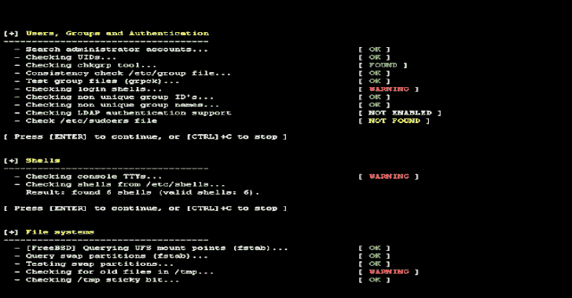

# lynis 3 . 0 . 0–适用于 Unix/Linux 系统的安全审计工具

> 原文：<https://kalilinuxtutorials.com/lynis/>

我们很高兴地宣布审计工具 [Lynis](https://www.kitploit.com/search/label/Lynis) 的重大发布。Lynis 的核心功能已经做了几个大的改变。这些变化是我们所做的简化改进的下一步。存在破坏现有配置的风险。

Lynis 是一款开源的安全审计工具。由系统管理员、安全专家和审计员用来评估其基于 Linux 和 UNIX 的系统的安全防护。它运行在主机本身上，因此它比漏洞扫描器执行更广泛的安全扫描。

**支持的操作系统**

该工具几乎没有依赖性，因此可以在几乎所有基于 Unix 的系统和版本上运行，包括:

*   [计]高级交互执行程序（Advanced Interactive Executive）
*   FreeBSD
*   HP-UX
*   Linux 操作系统
*   mac 操作系统
*   NetBSD
*   OpenBSD
*   Solaris
*   以及其他等等

它甚至可以在像 Raspberry Pi 这样的系统和一些存储设备上运行！

**安装可选**

Lynis 重量轻，易于使用。安装是可选的:只需将其复制到一个系统，并使用"。/lynis audit system”来启动安全扫描。它是用 shell 脚本编写的，并作为开源软件(GPL)发布。

**工作原理**？

Lynis 执行数百次单独测试，以确定系统的安全状态。安全扫描本身包括执行一系列步骤，从程序初始化到报告。

**步骤**

*   确定操作系统
*   搜索可用的工具和实用程序
*   检查 Lynis 更新
*   从启用的插件运行测试
*   按类别运行安全性测试
*   报告安全扫描的状态

除了屏幕上显示的数据之外，关于扫描的所有技术细节都存储在日志文件中。任何发现(警告、建议、数据收集)都存储在报告文件中。

**机会扫描**

Lynis 扫描是机会主义的:它使用它能找到的东西。例如，如果它发现您正在运行 Apache，它将执行第一轮 Apache 相关的测试。当在 Apache 扫描期间它还发现了一个 [SSL/TLS](https://en.wikipedia.org/wiki/Transport_Layer_Security) 配置时，它将对其执行额外的审计步骤。在这样做的同时，它将收集发现的证书，以便以后也可以对它们进行扫描。

**深度安全扫描**

通过执行机会扫描，该工具可以在几乎没有依赖性的情况下运行。发现的越多，审计就越深入。换句话说，Lynis 将始终执行为您的系统定制的扫描。没有审计会一样！

**用例**

由于 Lynis 是灵活的，它被用于几种不同的目的。Lynis 的典型使用案例包括:

*   安全审计
*   合规性测试(例如 PCI、HIPAA、SOx)
*   漏洞检测和扫描
*   系统硬化

**用于测试的资源**

许多其他工具使用相同的数据文件来执行测试。由于 Lynis 并不局限于几种常见的 Linux 发行版，它使用标准测试和许多其他工具中没有的定制测试。

*   最佳实践
*   独联体
*   美国国家标准技术研究所(National Institute of Standards and Technology)
*   美国国家安全局
*   OpenSCAP 数据
*   供应商指南和建议(例如 Debian Gentoo、Red Hat)

lynis 插件

插件使工具能够执行额外的测试。它们可以被看作是 Lynis 的扩展(或附加),增强其功能。一个例子是符合性检查插件，它执行仅适用于某些标准的特定测试。

[**Download**](https://cisofy.com/downloads/lynis/)