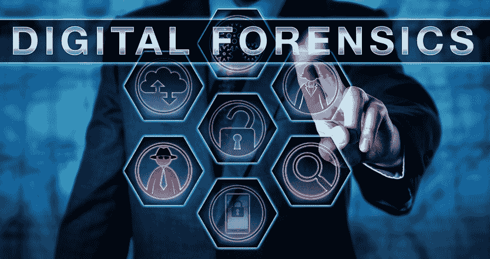
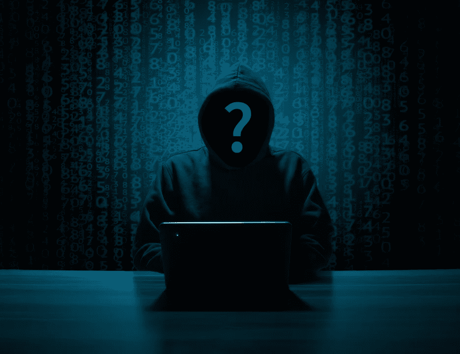
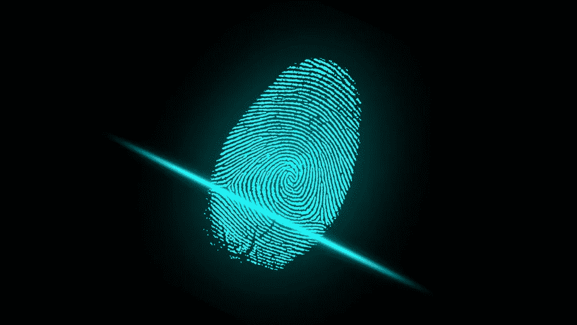
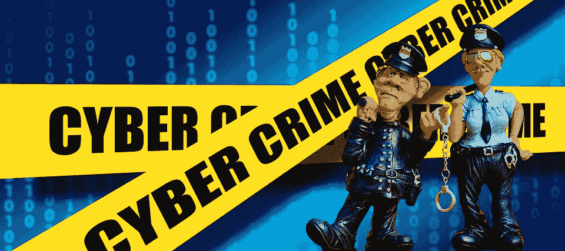

# 数字取证在解决网络犯罪中的作用

> 原文：<https://kalilinuxtutorials.com/the-role-of-digital-forensics-in-solving-cyber-crimes/>

今天，您的移动应用程序开发人员需要理解的不仅仅是简单地组合一些代码。他们必须了解网络安全实践，这样才能防止他们的应用程序被黑客攻击和破坏。

今天的犯罪分子已经很快意识到互联网已经打开了一些非常丰富的机会。从收集您个人数据的[网络钓鱼](https://cybersecuritynews.com/phishing-attack/)电子邮件，到改变网站和应用运行方式的实际黑客攻击，他们可以通过许多方式获取个人和银行信息，甚至实施更复杂的欺诈。

数字取证是调查技术在解决数字犯罪中的应用。从病毒控制你的计算机和其中包含的数据到勒索，再到黑客将客户重定向到其他网站。法医科学家可以分析现有的证据，以帮助解决这些犯罪。

您的数字法医科学家将能够帮助您识别实际发生了什么，并有望识别肇事者。执法机构甚至私人公司可能会雇佣数字取证专业人员来帮助他们了解他们是如何受到攻击的，以及他们可以做些什么来弥补他们的安全漏洞。

## **数字取证调查有哪些不同的阶段？**

数字取证现在是一门独立的科学。如同所有的科学调查一样，如果结果可信，就需要有条不紊地进行。这些领域现在有很多学位，在进行调查时可以使用几个框架。然而，以下可能是最常用和最容易理解的:

*   识别:在你开始调查之前，你需要准确地知道你需要看哪里。第一阶段是确定您需要的数据可能保存在哪里。这可以是从移动设备到服务器的任何东西。您还需要考虑这些设备可能在哪里，以及谁将持有它们。
*   保存:您需要保存调查所需的信息。这可能意味着从物理上保护设备不被进一步使用，以及拍摄照片和关于犯罪现场的其他信息。你需要记录所有的事情，包括证据是如何收集的。
*   收集:这可以包括从复制数据到打印出来的一切。通常，这实际上需要移除驱动器或便携式设备，以便您能够访问您的调查所需的信息。
*   分析:这就是你的法医专家发挥作用的地方。他们利用自己的技能和经验来审查可用的数据和证据，以确定实际发生了什么。他们将能够得出完全基于现有数据的结论。
*   报告:如果调查是刑事调查的一部分，那么重要的是信息要以正式的方式呈现，不能被他人怀疑。已经使用的方法应该能够为任何其他将对现有数据进行审查的研究者重现相同的结果。

## **数字取证如何解决网络犯罪？**

我们都使用数字设备，许多人会雇佣应用程序开发人员来创建工具，人们将使用这些工具进行通信和玩游戏。然而，总有一些人想让[应用开发者](https://mobilunity.com/blog/how-to-find-top-web-app-developers-for-hire/)去完成更邪恶的任务。有些人会开发应用程序，意图在我们不知情的情况下窃取我们的信息。代码可能隐藏在复杂的应用程序中，人们可能很难发现。可以使用取证来发现这种使用，并帮助识别从收集的数据中受益的人。

其他人可能会使用现成的应用程序来实施犯罪。例如传播儿童色情甚至恐怖主义。虽然你可能会雇佣应用程序开发人员来创建一些你觉得完全无害的东西，但你必须意识到，有些人可能会找到方法将该应用程序用于其他目的。从地方警察到联邦调查人员，越来越多的人转向使用数字取证。我们的设备上保存了大量信息，可以用来显示某人的意图，提供犯罪发生时他们在哪里的信息。

无论罪犯认为自己有多聪明，他们通常都会留下一些信息，而这些信息是优秀的数字法医科学家能够发现的。他们可以做任何事情，从破解密码到恢复被认为已被删除或加密的信息。这可以提供所需的信息，以帮助定罪的罪犯。

但是，正如任何可能在法庭上使用的信息一样，它必须是可靠的。如何恢复已删除的文件或如何读取加密信息会对该信息能否被使用产生重大影响。这就是为什么真正需要合格的法医调查人员。

合格的调查人员被视为各自领域的专家，他们的报告可以用于从欺诈到谋杀的各种案件。取证不再仅仅是为了找到安全漏洞的原因，对于那些想在 IT 领域做点不一样的事情的人来说，这是一条快速增长和受人尊敬的职业道路。

## 你想从事抓捕网络罪犯的职业吗？

无论你是想在一家公司的互联网安全部门工作，还是想在执法部门工作，数字取证领域都有很多机会。这是一个不断发展的领域，有越来越多的机会。

犯罪分子在网上实施欺诈和其他犯罪的方式变得越来越复杂。这使得数字取证团队的角色更具挑战性。因此，如果你正在寻找一份真正能挑战你的职业，那么这可能是你真正感兴趣的领域。