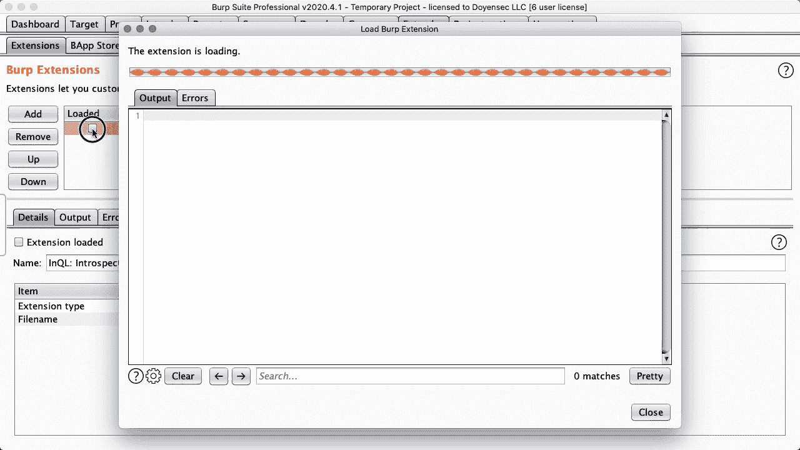
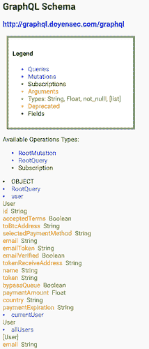

# InQL:graph QL 安全测试的 Burp 扩展

> 原文：<https://kalilinuxtutorials.com/inql-2/>

InQL 是一个安全测试工具，帮助 [GraphQL](https://graphql.org/) 技术安全审计工作。InQL 可以作为一个独立的脚本使用，也可以作为一个[打嗝套件](https://portswigger.net/burp)的扩展。

**InQL 独立 CLI**

从 Python 运行`inql`将向目标 GraphQL 端点发出一个[自省](https://graphql.org/learn/introspection/)查询，以便获取以下元数据信息:

*   查询、突变、订阅
*   它的字段和参数
*   对象和自定义对象类型

InQL 可以检查自省查询结果，并生成不同格式的干净文档，比如 HTML 和 JSON schema。InQL 还能够为所有已知的基本数据类型生成模板(带有可选的占位符)。

对于所有支持的选项，请查看命令行帮助:

**用法:**inql[-h][–nogui][-t TARGET][-f SCHEMA _ JSON _ FILE][-k KEY][-p PROXY][–header HEADERS][-d][–generate-html]
[–generate-SCHEMA][–generate-queries][–unsecured]
[-o OUTPUT _ DIRECTORY]

I**nQL 扫描器**

**可选参数:【T12 –帮助显示此帮助消息并退出
–nogui 在没有独立 gui 的情况下在 QL 中启动【仅 Jython】
-t 目标远程 GraphQL 端点(https:///graph QL)
-f SCHEMA _ JSON _ FILE JSON 格式的 SCHEMA 文件
-k KEY API 身份验证密钥
-p 要通过的 web 代理的代理 IP(http://127 . 0 . 0 . 1:8080)
–header HEADERS
-d**

**InQL Burp 套件扩展**

从该工具的 1.0.0 版本开始，InQL 被扩展到在 Burp Suite 中运行。在这种模式下，该工具将保留独立脚本的所有功能，并添加一个方便的用户界面来操作查询。

使用 Burp Suite 的`inql`扩展，您可以:

*   搜索已知的 GraphQL URL 路径；该工具将 grep 和匹配已知值，以检测目标网站中的 GraphQL 端点
*   搜索公开的 GraphQL 开发控制台(*graph QL*、 *GraphQL Playground* 以及其他常见控制台)
*   使用包含 GraphQL 的每个 HTTP 请求/响应上显示的自定义 GraphQL 选项卡
*   通过将这些请求发送到 Burp 的中继器工具(“发送到中继器”)来利用模板生成
*   通过将这些请求发送到嵌入式 GraphIQL(“发送到 GraphiQL”)，利用模板生成和编辑器支持
*   使用自定义设置选项卡配置工具

要在 Burp Suite 中使用`inql`,请导入 Python 扩展:

*   下载 Jython Jar
*   启动打嗝套件
*   扩展器选项卡>选项> Python 环境>设置 Jython 独立 JAR 的位置
*   扩展器选项卡>扩展>添加>扩展类型>选择 Python
*   下载最新`inql_burp.py`发布[这里](https://github.com/doyensec/inql/releases)
*   扩展名文件>设置`inql_burp.py`的位置>接下来
*   输出现在应该显示以下消息:`InQL Scanner Started!`

将来，我们可能会考虑在 Burp 的 BApp 商店中整合扩展功能。

**打嗝分机用法**

开始使用`inql`打嗝扩展很容易:

1.  在顶部输入字段中加载 GraphQL 端点或 JSON 模式文件位置
2.  按下“加载”按钮
3.  几秒钟后，左侧面板将刷新加载选定端点的目录结构，如下例所示:

*   全球资源定位器(Uniform Resource Locator)
    *   询问

4.  选择任意*查询* / *突变* / *订阅*将在主文本区加载相应的模板

**InQL 独立 UI**

从版本 2.0.0 开始，InQL UI 现在可以在不需要打嗝的情况下运行。现在可以为`jython`独立安装 InQL 并运行扫描仪 UI。

在这种模式下，InQL 保留了大部分的 BURP 扫描仪功能，但高级交互除外，如“发送到中继器”和自动授权头生成，可通过 Burp 获得。

使用`**inql**`独立用户界面:

*   下载并安装 [Jython](https://www.jython.org/download) 。这可以通过 brew `**brew install jytho**n`在 macOS 上获得，或者通过`**apt-get install -y jython**`在 Ubuntu 上获得
*   用`**jython -m pip install inql**`通过 pip 安装 inql
*   用`**jython -m inql**`通过 jython 启动 UI

**InQL 文档生成器**

在 BURP 或独立模式下，InQL 都能够为可用的 GraphQL 实体生成有意义的文档。结果以 HTML 页面或查询模板的形式提供。

生成的 HTML 文档页面将包含所有可用的 **`Queries`、`Mutations`和`Subscriptions`** 的详细信息，如下所示:

下面的屏幕截图显示了模板生成的使用:

**鸣谢:**安德里亚·布兰卡莱奥尼([@ nJoyneer](https://twitter.com/nJoyneer)–[泰彭](https://github.com/thypon))

[**Download**](https://github.com/doyensec/inql#inql-burp-suite-extension)