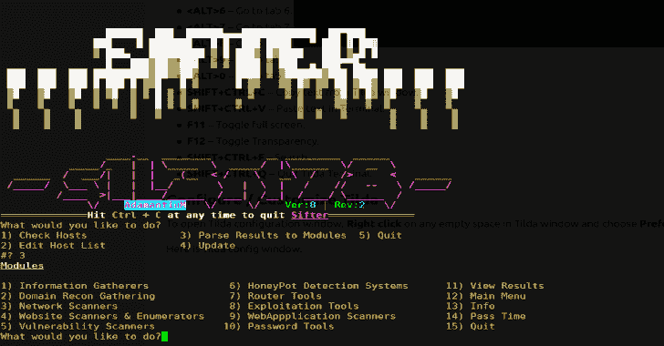

# Sifter : OSINT，Recon &漏洞扫描器

> 原文：<https://kalilinuxtutorials.com/sifter-osint-recon-vulnerability-scanner/>

S **ifter** 是一个 osint，recon &漏洞扫描器。它在不同的模块集中结合了大量的工具，以便快速执行侦察任务，检查网络防火墙，枚举远程和本地主机，并扫描 microsft 中的“蓝色”漏洞，如果没有修补，则利用它们。

它使用 blackwidow 和 konan 等工具进行 webdir 枚举，并使用 ASM 快速绘制攻击面。收集的信息保存到结果文件夹，这些输出文件可以很容易地解析到 TigerShark，以便在您的活动中使用。或者汇编成最终报告以结束渗透测试。

**设置视频**

https://www.youtube.com/watch?v=YU-LYLjyO6c&t=8s

**演示视频**

[https://www.youtube.com/embed/QgAfqbxqbK0?feature=oembed&enablejsapi=1](https://www.youtube.com/embed/QgAfqbxqbK0?feature=oembed&enablejsapi=1)

**被测操作系统**

*   **工作时间:**
    *   迦利
    *   鹦鹉
    *   人的本质
    *   Linux(任何发行版)

在 windows 上运行 linux 子系统，但请确保 docker 已按照 docker 网站上的说明正确安装和配置。

未在 mac 上测试，尽管理论上同样适用于 mac 和 windows——关于 docker 安装和工具

**注意！！**

如果一开始扫描工作不正常，请从目标中删除 web-protocol。target.com——而不是 http://target.com

**安装:**

这将下载并安装所有需要的工具
$ git 克隆 https://github.com/s1l3nt78/sifter.git
$ CD 筛选
$ chmod +x install.sh
$。/install.sh
**对于 oneliner 安装，将以下代码复制并粘贴到终端**
$ git 克隆 https://github.com/s1l3nt78/sifter.git&&CD sifter&&bash install . sh

**筛子帮助菜单**

$ sifter 运行程序，在 cli 环境中调出菜单
$ sifter -c 将检查主机列表中的现有主机
$ sifter-a‘target-IP’将主机名/IP 附加到主机文件
$ sifter -m 打开主模块菜单
$ sifter -e 打开开发模块
$ sifter -i 打开基于信息的模块菜单
$ sifter -d 打开专注于域的模块
$ sifter -n 打开网络映射模块菜单
$ sifter -w 打开以网站为中心的模块
$ sifter -b 打开以 Web-App 为中心的模块菜单
$ sifter -p 打开用于快速生成密码列表或哈希解密的密码工具
$ sifter -v 打开漏洞扫描模块菜单
$ sifter -r 打开结果文件夹以便于查看所有保存的结果
$ sifter -u 检查/安装更新
$ sifter -h 此帮助菜单

[**Download**](https://github.com/s1l3nt78/sifter)