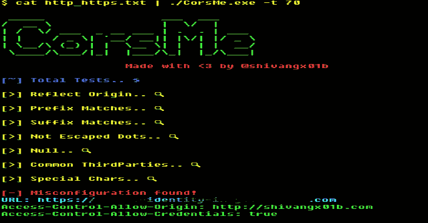

# 跨源资源共享错误配置扫描程序

> 原文：<https://kalilinuxtutorials.com/corsme/>

一个基于 golang 的错误配置扫描工具，考虑到了速度和精度！

**该扫描仪可以检查的错误配置类型**

*   反映来源检查
*   前缀匹配
*   后缀匹配
*   不是转义点
*   空
*   第三方(如=> github.io、repl.it 等。)
    *   摘自 [Chenjj 的 github 回购](https://github.com/chenjj/CORScanner/blob/master/origins.json)
*   特殊字符(如= >“}”、“(”等)。)
    *   详见[先进的 CORS 开采技术](https://www.corben.io/advanced-cors-techniques/)

**如何安装？**

**$ go get-u github.com/shivangx01b/CorsMe**

**用途**

*   单一 Url

**echo "https://example.com" |。/CorsMe**

*   多个 Url

**猫 http_https.txt |。/CorsMe -t 70**

*   允许通配符..现在，如果 Access-Control-Allow-Origin 为*，它将被打印出来

**猫 http_https.txt |。/CorsMe-t70–通配符**

*   如果需要，添加标题

**猫 http_https.txt |。/CorsMe-t 70-wild card-header " Cookie:Session = 12 bcx…"**

*   小费

**猫子域名. txt |。/http probe-c70-p 8080，8081，8089 | tee http _ https . txt cat http _ http**

**s.txt |。/CorsMe -t 70**

**注**

*   扫描器将错误结果存储为“error _ requests . txt”…其中包含无法请求的主机

[**Download**](https://github.com/Shivangx01b/CorsMe)