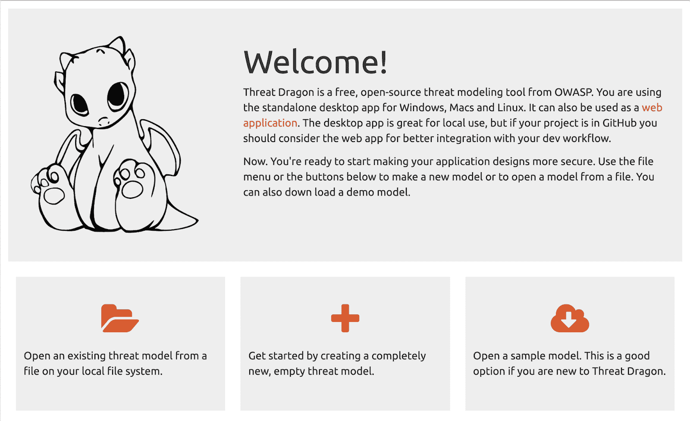
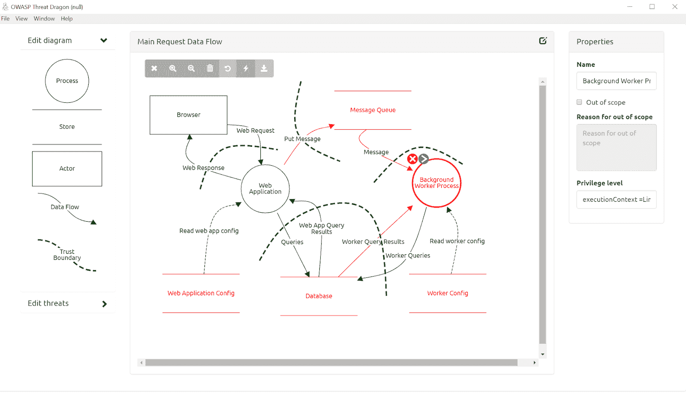
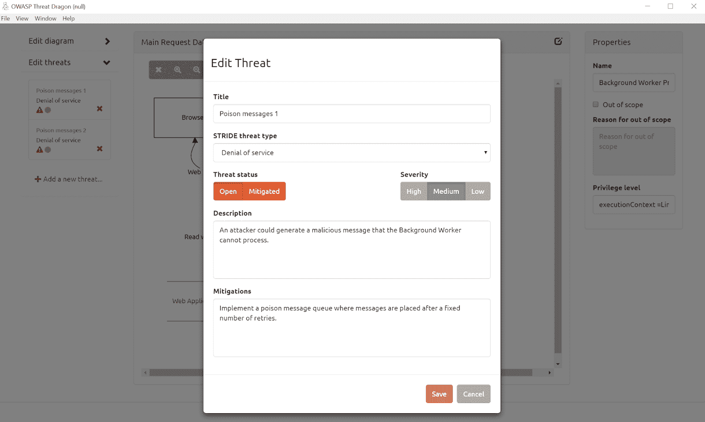

# OWASP 威胁龙桌面

> 原文：<https://kalilinuxtutorials.com/owasp-threat-dragon-desktop/>

Threat Dragon 是一个免费、开源、跨平台的[威胁建模](https://owasp.org/www-community/Threat_Modeling)应用程序，包括系统图表和自动生成威胁/缓解的规则引擎。

是一个 [OWASP 孵化器项目](https://owasp.org/www-project-threat-dragon/)。该项目的重点是伟大的 UX，一个强大的规则引擎和与其他开发生命周期工具的集成。

OWASP 对[威胁建模和风险评估](https://owasp.org/www-community/Application_Threat_Modeling)进行了很好的概述，并详细阐述了威胁 Dragon 将实现的目标:

*   设计数据流图
*   自动确定和排列威胁
*   建议的缓解措施
*   输入缓解措施和应对措施

该应用程序有两种版本:

1.  [**一个 web 应用**](https://github.com/mike-goodwin/owasp-threat-dragon) :对于 web 应用，模型文件存储在 GitHub 中(其他存储也将可用)。我们目前正在维护与主代码分支同步的工作原型[。](https://threatdragon.org)
2.  [**一个桌面应用**](https://github.com/mike-goodwin/owasp-threat-dragon-desktop) :这个是基于[电子](https://electron.atom.io/)。有适用于 Windows 和 Mac OSX 的安装程序，也有适用于 Linux 的 rpm 和 debian 软件包。对于桌面变体模型，存储在本地文件系统上。

[最终用户帮助](http://docs.threatdragon.org/)可用于两种变体。

该存储库包含桌面变体的文件。

**本地安装**

对于两个版本之间的最新代码版本，可以使用`npm`在本地安装和运行 Threat Dragon:

git 克隆 https://github.com/mike-goodwin/owasp-threat-dragon-desktop
NPM 安装

然后运行它:

npm 运行开始

OSX 和 Windows 的安装程序可以从[发布文件夹](https://github.com/mike-goodwin/owasp-threat-dragon-desktop/releases)下载。在那里你还可以找到在 AMD64 和 X86-64 位平台上 Debian 和 Fedora Linux 的包。

**截图**

这里有几个应用程序的截图，让你感受一下它的样子。首先，欢迎屏幕

图表屏幕:

和威胁编辑屏幕

**投稿**

PRs、特性请求、错误报告和任何类型的反馈都非常受欢迎。我们正试图保持相对较高的测试覆盖率，所以请尝试将测试包含在任何 PRs 中，并在开发分支上创建 PRs。

**漏洞泄露**

如果你在这个项目中发现一个漏洞，请尽快让我们知道，我们会优先修复它。为了安全披露，请使用以下 PGP 密钥向[mike.goodwin@owasp.org](mailto:mike.goodwin@owasp.org)发送电子邮件:

版本:flow crypt 5 . 1 . 8 Gmail encryption flow crypt . com
comment:sealesly send， 接收和搜索加密的电子邮件

【xsfnbfpij 5 sbac 6 ahzh 14 eywgqjzopaapkuyebejbeby 8 cykltkdvowp】
【fyprq 9ca 9fe 1x/xohmvxjpscmqo+b+ fjjjb 3he 1mgd 0x 0 xszy/fzaky】【xnoxssowkpbysmta 5 JPL xwqyagaewicminakqmbf 67 edz 6 zmcgwwaaceyeacpoaiw 3 和 ymcnouhmr
u5zj 45 t5 dlfakep 8 dbl 3hg 1 h1 m1 m0nt0 uggfyxgy 1 uoavypwv 7 m3 erlh+JL
i9x 06 w6 nzpsigaggregsz 7 kipjsqlzgu 6 lvscyxwysplwkd 2 qbj2hv

如果你不是 PGP 用户，你可以很容易地从[https://flowcrypt.com/me/mikegoodwin](https://flowcrypt.com/me/mikegoodwin)发送一封加密邮件

**项目负责人:**迈克·古德温([mike.goodwin@owasp.org](mailto:mike.goodwin@owasp.org)

[**Download**](https://github.com/mike-goodwin/owasp-threat-dragon-desktop)