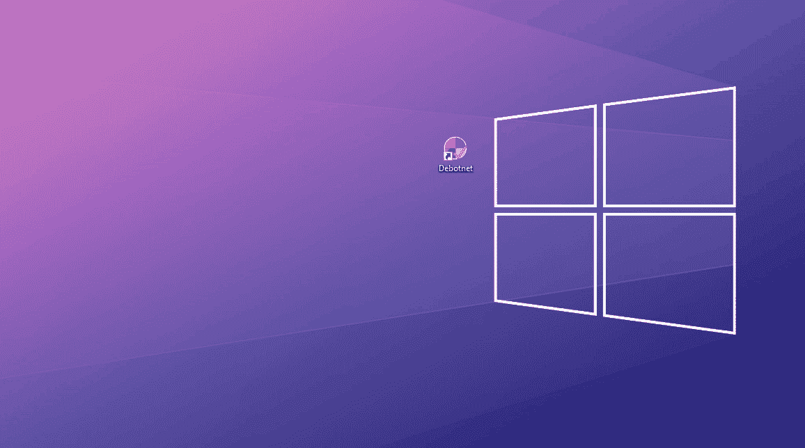

# Debotnet:控制 Windows 10 隐私相关设置的工具

> 原文：<https://kalilinuxtutorials.com/debotnet/>

[](https://1.bp.blogspot.com/-KJ4u_xXSXVs/XxQ4qwOi3aI/AAAAAAAAG7s/sV31VnaCfjslz0QzhK0d9d_3wCMDE3BdwCLcBGAsYHQ/s1600/Debotnet.gif)

**Debotnet** 是一款免费的便携式工具，用于控制 Windows 10 的许多隐私相关设置，并保护您的个人数据隐私。

**你的网前准备！**

Windows 10 的默认隐私设置在保护你和你的私人信息方面还有很多不足之处。每当我为我的家庭或工作设置一台新电脑或更新当前设置时，我总是仔细检查每次安装的隐私设置，确保将其锁定以尽可能保持隐私。

Windows 10 引发了一些关于隐私的担忧，因为它有很多遥测和在线功能，可以将你的数据(敏感和非敏感)发送给微软，并且不能被禁用，这意味着微软可以:

*   未经你的同意在你的电脑上运行软件
*   未经你的同意从你的电脑上获取数据
*   未经您的同意，从您的计算机中删除软件和文件

这将 Windows 10 定性为恶意软件，更具体地说，是僵尸网络。

Debotnet 需要包括 32 位和 64 位版本的 Windows 10。

**信息！Debotnet 的开发停止了。**

如果你有兴趣继续维护这个项目，你可以这样做。我已经发布了 Debotnet 的[源代码。该项目是用 Visual Basic 6。这不是每个人都喜欢的，也不是我喜欢的，但不管怎样，我觉得很有趣，而且效果很好。你可以在这里阅读整个背景故事](https://github.com/mirinsoft/debotnet/tree/master/src/Debotnet)。

你会发现 Debotnet 的替代工具有 [SharpApp](https://github.com/mirinsoft/sharpapp) 或 [Spydish](https://github.com/mirinsoft/spydish) ，这对没有经验的用户来说更好。

**特性**

*   禁用遥测和在线功能，这些功能会将您的数据(敏感和非敏感)发送到 Microsoft
*   选择您想要禁用的不需要的功能
*   Debotnet 会告诉你它在做什么。您拥有完全的控制权，因为执行代码不是硬编码的，可以在简单的文本编辑器中查看
*   用于添加自定义隐私规则的简单脚本引擎
*   调试模式。例如，测试模式让您看到哪些值在注册表中被扭曲或命令被执行
*   GitHub 上更新的脚本
*   支持 [Ninite](https://ninite.com) 服务，允许你下载和安装超过 70 个流行的 Windows 应用程序
*   支持 [Chocolatey 软件](https://chocolatey.org/)，它有一个巨大的社区安装包库(超过 4000 个包)
*   使用带有命令行开关的微软媒体创建工具下载 Windows 10 ISO 文件，也可以通过 [MCT 包装器](https://gist.github.com/AveYo/c74dc774a8fb81a332b5d65613187b15)或者只是一个 [PowerShell 脚本](https://github.com/pbatard/Fido)
*   集成定制的 PowerShell 解封层脚本，例如 [W4RH4WK /解封层-Windows-10](https://github.com/W4RH4WK/Debloat-Windows-10) 、[Sycnex/Windows 10 解封层](https://github.com/Sycnex/Windows10Debloater)
*   下载弃用的 Windows 应用程序，例如经典计算器
*   现代而熟悉的 UI，带有[主题支持](https://github.com/mirinsoft/debotnet/blob/master/themes/theme.md)
*   占地面积小。无需安装(便携式)

**用途**

如上所述，Debotnet 的主要工具(在这种情况下是 Debotnet 窗口的脚本)不是硬编码的。Debotnet 基于简单的. DS1 文件，这些文件精确地定义了哪些注册表项、文件和/或服务应该被禁用、阻止、删除等。并由程序保存。这些脚本文件允许您执行命令行工具和参数以及简单的 PowerShell 代码。

**例子**

```
[Info]
ID=No more forced updates
Ver=1.0
Desc=This will notify when updates are available, and you decide when to install them.\n\nThe values added to registry with this script will prevent forced updates.
Dev=Federico Dossena
DevURL=https://github.com/adolfintel/Windows10-Privacy
WinVer=Compatible with Windows 10
Evaluation=Recommended
EvaluationColor=009e5e

[Code]
Task1=Try,query "HKLM\SOFTWARE\Policies\Microsoft\Windows\WindowsUpdate\AU" /v NoAutoUpdate,STDOUT
Task2=Try,query "HKLM\SOFTWARE\Policies\Microsoft\Windows\WindowsUpdate\AU" /v AUOptions,STDOUT
Task3=Try,query "HKLM\SOFTWARE\Policies\Microsoft\Windows\WindowsUpdate\AU" /v ScheduledInstallDay,STDOUT
Task4=Try,query "HKLM\SOFTWARE\Policies\Microsoft\Windows\WindowsUpdate\AU" /v ScheduledInstallTime,STDOUT
File5=Reg,add "HKLM\SOFTWARE\Policies\Microsoft\Windows\WindowsUpdate\AU" /v NoAutoUpdate /t REG_DWORD /d 0 /f,STDOUT
File6=Reg,add "HKLM\SOFTWARE\Policies\Microsoft\Windows\WindowsUpdate\AU" /v AUOptions /t REG_DWORD /d 2 /f,STDOUT
File7=Reg,add "HKLM\SOFTWARE\Policies\Microsoft\Windows\WindowsUpdate\AU" /v ScheduledInstallDay /t REG_DWORD /d 0 /f,STDOUT
File8=Reg,add "HKLM\SOFTWARE\Policies\Microsoft\Windows\WindowsUpdate\AU" /v ScheduledInstallTime /t REG_DWORD /d 3 /f,STDOUT 
```

**下载**

*   (开发站点上的最新稳定版本)[https://www.mirinsoft.com/debotnet](https://www.mirinsoft.com/debotnet)
*   (GitHub 上的最新稳定版)[https://github.com/mirinsoft/debotnet/releases](https://github.com/mirinsoft/debotnet/releases)
*   (巧克力发布)[https://chocolatey.org/packages/debotnet](https://chocolatey.org/packages/debotnet)
*   (每夜构建)[https://www.mirinsoft.com/debotnet-nightly](https://www.mirinsoft.com/debotnet-nightly)

[**Download**](https://github.com/builtbybel/debotnet)