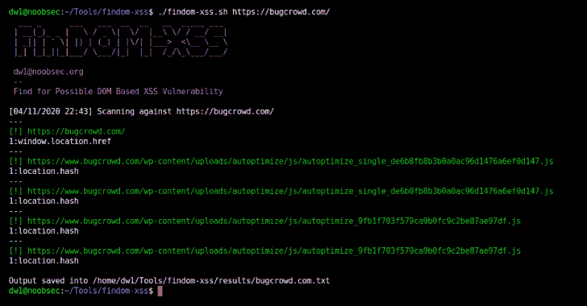

# FinDOM-XSS:一个简单快速的基于 DOM 的 XSS 漏洞扫描器

> 原文： [https://kalilinuxtutorials.com/findom-xss/](https://kalilinuxtutorials.com/findom-xss/)

FinDOM-XSS 是一个工具，可以让你快速找到可能的和/或潜在的基于 DOM 的 XSS 漏洞。

**安装**

**$ git 克隆 https://github.com/dwisiswant0/findom-xss.git**

**依赖:** [链接查找器](https://github.com/GerbenJavado/LinkFinder)

**配置**

用你的主 LinkFinder 文件改变`LINKFINDER`变量 *[(第 3 行)](https://github.com/dwisiswant0/findom-xss/blob/master/findom-xss.sh#L3)* 的值。

**用途**

要在目标上运行该工具，只需使用以下命令。

**$。/findom-XSS . sh https://target.host/about-us.html**

这将针对`**target.host**`运行工具。

URL 也可以通过管道传递给它，并在上面进行扫描。例如:

$ cat urls.txt | ./findom-xss.sh

第二个参数可用于指定输出文件。

**$。/findom-XSS . sh https://target.host/about-us.html/path/to/output . txt**

默认情况下，输出将被存储在名称为`**target.host.txt**`的存储库中的`**results/**`目录中。

**也读作-[evil DLL——DLL 劫持的恶意 DLL(反向 Shell)生成器](https://kalilinuxtutorials.com/evildll/)**

**执照**

It 是阿帕奇授权的。更多信息请看一下[执照](https://github.com/dwisiswant0/findom-xss/blob/master/LICENSE)。

**感谢**

*   [@ dark _ war Lord 14](https://twitter.com/dark_warlord14)——受 JSScanner 工具的启发，这也是制作这个工具的原因。
*   [@ Aslan ewre](https://twitter.com/aslanewre)–有可能的模式。
*   [所有贡献者](https://github.com/dwisiswant0/findom-xss/graphs/contributors)

[**Download**](https://github.com/dwisiswant0/findom-xss)